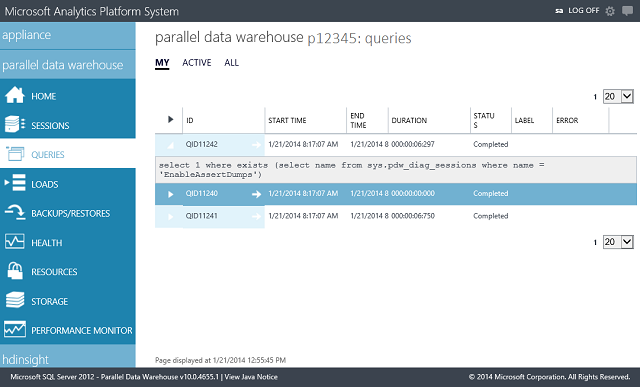

# Appliance monitoring for Analytics Platform System
This appliance monitoring guide describes the tools and tasks for monitoring the Analytics Platform System appliance.  
  
## Monitoring Basics and Tools  
The values and information that can be monitored on the SQL Server PDW appliance are extensive. For example, the following are typical monitoring tasks.  
  
-   Check for any alert issued by SQL Server PDW.  
  
-   Monitor for failed hardware.  
  
-   Monitor for network connectivity problems.  
  
-   Check for errors returned to users during query processing.  
  
-   View the number of currently active sessions and queries.  
  
-   Check the status of loads, backups, and restores.  
  
### Appliance Monitoring Tools  
There are multiple tools available to monitor the appliance.  
  
Admin Console  
SQL Server PDW has an Admin Console. This is a web-based tool that displays information about queries, loads, backup and restore, locks, sessions, alerts, and appliance state. The Admin Console runs on the appliance; users connect to the Admin Console through Internet Explorer. For more information, see:  
  
-   [Monitor the Appliance by Using the Admin Console &#40;Analytics Platform System&#41;](monitor-the-appliance-by-using-the-admin-console.md)  
  
  
  
System Views  
SQL Server PDW includes comprehensive system views that enable you to obtain detailed information about the appliance health, state, and performance. For a list of system views for monitoring tasks, see:  
  
-   [Monitor the Appliance by Using System Views &#40;Analytics Platform System&#41;](monitor-the-appliance-by-using-system-views.md)  
  
System Center Operations Manager (SCOM)  
SQL Server PDW has extensive integration with Systems Center Operations Manager. The management packs for SQL Server PDW are available as a free download. For more information about using System Center to monitor SQL Server PDW, see the following:  
  
-   [Monitor the Appliance by Using System Center Operations Manager &#40;Analytics Platform System&#41;](monitor-the-appliance-by-using-system-center-operations-manager.md)  
  
Custom Solutions  
For situations when System Center is not available with your data center monitoring tools, you can monitor the appliance by using a third-party monitoring solution. Installation of external software agents is currently not supported in PDW, but most monitoring solutions support Transact\-SQL integration, so the system administrator can implement direct Transact\-SQL queries against your PDW appliance.  
  
If your monitoring solution does not support direct Transact\-SQL queries, or you do not have a monitoring tool, then you can use scripts to perform monitoring tasks, such as sending email when an alert occurs.  The TechNet wiki contains a scripted monitoring solution example.  
  
-   [Power Shell Monitoring Example for SQL Server PDW](https://go.microsoft.com/fwlink/?LinkId=248020)  
   
## Related Monitoring Tasks  
  
|Monitoring Task|Description|  
|-------------------|---------------|  
|Monitor the appliance by using the Admin Console.|[Monitor the Appliance by Using the Admin Console &#40;Analytics Platform System&#41;](monitor-the-appliance-by-using-the-admin-console.md)|  
|Monitor the appliance by using System Views.|[Monitor the Appliance by Using System Views &#40;Analytics Platform System&#41;](monitor-the-appliance-by-using-system-views.md)|  
|Monitor the appliance by using System Center|[Monitor the Appliance by Using System Center Operations Manager &#40;Analytics Platform System&#41;](monitor-the-appliance-by-using-system-center-operations-manager.md)|  
|Monitor the state of the appliance.|[Monitor Appliance Health State &#40;Analytics Platform System&#41;](monitor-appliance-health-state.md)|  
|Heartbeat Monitoring.|[Send Telemetry Feedback to Microsoft &#40;SQL Server PDW&#41;](send-telemetry-feedback-to-microsoft-sql-server-pdw.md)|  
|Track appliance alerts.|[Track Appliance Alerts &#40;Analytics Platform System&#41;](track-appliance-alerts.md)|  
|Determine how much capacity is being used.|[View Capacity Utilization &#40;Analytics Platform System&#41;](view-capacity-utilization.md)|  
|Determine how often to poll the appliance.|[Determine Polling Frequency &#40;Analytics Platform System&#41;](determine-polling-frequency.md)|  
|When a cluster failure occurs, determine which cluster node failed.|[Determine Which Cluster Node Failed &#40;Analytics Platform System&#41;](determine-which-cluster-node-failed.md)|  

<!-- MISSING LINKS |Monitor loads.|[Monitor Loads &#40;SQL Server PDW&#41;](../sqlpdw/monitor-loads-sql-server-pdw.md)|  -->  
<!-- MISSING LINKS |Monitor backups and restores.|[Monitor Backups and Restores &#40;SQL Server PDW&#41;](../sqlpdw/monitor-backups-and-restores-sql-server-pdw.md)|  -->  
<!-- MISSING LINKS |Monitor the active queries.|[Monitoring Active Queries &#40;SQL Server PDW&#41;](../sqlpdw/monitoring-active-queries-sql-server-pdw.md)|  -->  
  
## See Also  
<!-- MISSING LINKS [Common Metadata Query Examples &#40;SQL Server PDW&#41;](../sqlpdw/common-metadata-query-examples-sql-server-pdw.md)  -->  
[Appliance Management Tasks &#40;Analytics Platform System&#41;](appliance-management-tasks.md)  
  
