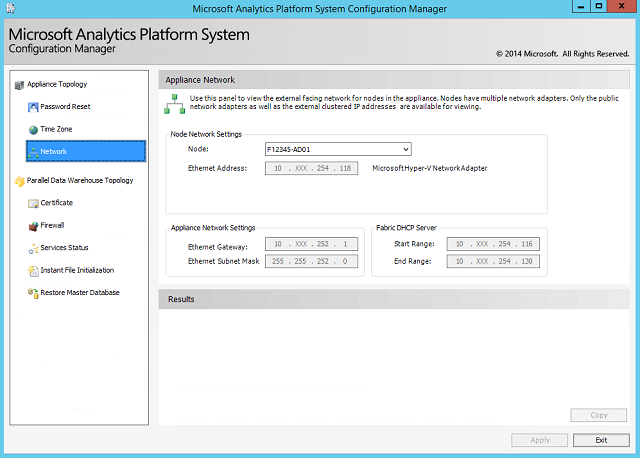

# Appliance Network configuration for Analytics Platform System
The Analytics Platform System (APS) appliance is built and configured with a fix set of IP addresses throughout all servers and applicable devices from the IHV's factory floor. Upon delivery of the appliance, the external (Ethernet) IP addressed must be reconfigured to match the specific customer's data center requirements.  
  
> [!NOTE]  
> PDW V1 required 8 IP external (*Customer Facing*) addresses to provide external connectivity to each of the control rack nodes. PDW 2012 (V2) enhanced network communications by exposing every component of the appliance externally via IP addresses. This approach provides a more robust design which reduces costs, and increases flexibility, and enhances data movement, data loading, and Hadoop integration. The number of IP addresses required depends upon the number of nodes in the appliance. To accommodate this larger block of IP addresses, the customer should set up a separate subnet for PDW. Within this subnet, there will be sufficient IP address space (up to 250 addresses) to accommodate the components of up to 5 PDW racks.  
  
The **Network Configuration** page enables you to view the externally facing network settings for the nodes on your Analytics Platform System appliance. This page is read-only.  
  
  
  
## To update the network configuration on your appliance  
Change the IP addresses of the fabric domain and workload domain by editing the **AplianceInfo.xml** file and then running setup. This is an offline operation. The PDW regions will be automatically stopped during the IP address change.  
  
> [!NOTE]  
> Domain names are provided during setup and are specified as up to 6 alphanumeric characters, starting with a letter. A frequent naming system creates a fabric domain starting with F, a PDW workload domain starting with P. This format is presumed throughout the help file topics but is not required. <!-- MISSING LINKS For more information about the domain structure, see [PDW Domain Security &#40;SQL Server PDW&#41;](../sqlpdw/pdw-domain-security-sql-server-pdw.md) and [Understanding the Security Model of the HDInsight Region &#40;Analytics Platform System&#41;](../hdinsight/understanding-the-security-model-of-the-hdinsight-region.md)  -->  
  
#### To change the IP addresses of the Analytics Platform System  
  
1.  Using the **Remote Desktop** application, connect to **HST01** using the workload domain administrator account.  
  
2.  On the HST01 node, open the appliance info file at **c:\pdwinst\media\AplianceInfo.xml**.  
  
    > [!NOTE]  
    > If the file is not present, a new file may need to be created.  
  
3.  Update the Ethernet IP values as needed, and save the file.  
  
4.  In a command prompt window, execute the following setup command to update the IP addresses for the PDW region, using the P/F/H domain names and the administrator passwords.  
  
    ```  
    c:\pdwinst\media\setup.exe /action="ConfigureEthernet" /DomainAdminPassword="<password>" /ApplianceInfoFile="C:\PDWINST\media\ApplianceInfo.xml"  
    ```  
  
## Manufacturer References  
For additional information about Dell appliances, see:  
  
-   PowerConnect Switch Instructions [Dell PowerConnect 6200 Series System CLI Reference Guide](https://downloads.dell.com/Manuals/all-products/esuprt_ser_stor_net/esuprt_powerconnect/powerconnect-6224f_Reference%20Guide_en-us.pdf)  
  
-   iDRAC/BMC [Integrated Dell Remote Access Controller 7 (iDRAC7) Version 1.30.30 User's Guide](https://downloads.dell.com/Manuals/all-products/esuprt_electronics/esuprt_software/esuprt_remote_ent_sys_mgmt/integrated-dell-remote-access-cntrllr-7-v1.30.30_User%27s%20Guide_en-us.pdf?c=us&l=en&cs=555&s=biz)  
  
-   PDU's **Dell Metered Rack PDU**`ftp://ftp.dell.com/Manuals/all-products/esuprt_ser_stor_net/esuprt_rack_infrastructure/dell-metered-pdu-led_User's%20Guide_en-us.pdf`  
  
## See Also  
[Launch the Configuration Manager &#40;Analytics Platform System&#41;](launch-the-configuration-manager.md)  
  
