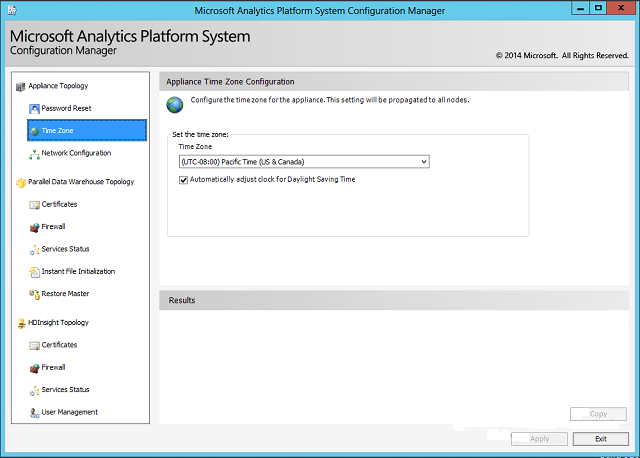

# Appliance time zone configuration in Analytics Platform System

The **Time Zone** page enables you to set the time zone for all nodes on your Analytics Platform System (APS) appliance.  
  
## To set the time zone  

1. Launch the Configuration Manager. For more information, see [Launch the Configuration Manager](launch-the-configuration-manager.md).  
  
1. Stop the appliance services by using the **Services Status** page in the Configuration Manager. See [PDW Services Status](pdw-services-status.md) for instructions.  
  
1. In the left pane of the Configuration Manager, select **Time Zone**. Select the desired time zone from the **Time Zone** drop-down menu. Depending on your location, you may also choose to select the box next to **Automatically adjust clock for Daylight Saving Time**.  
  
1. Select **Apply** to save your changes.  
  
1. Restart the appliance services by using the **Services Status** page in the Configuration Manager. If you're also planning to change the privileges, you can do that before restarting the appliance.  

     
  
## Next steps

[Launch the Configuration Manager](launch-the-configuration-manager.md)  
