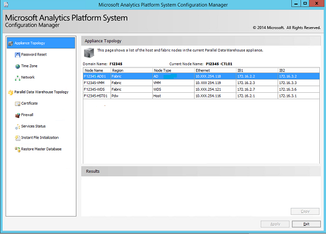

# Appliance topology - Analytics Platform System
Displays summary information on the entire Analytics Platform System.  
  
The page lists a read-only version of all the hosts and fabric nodes in the current appliance including their Ethernet and Infiniband IP addresses.  
  
  
  
## See Also  
[Launch the Configuration Manager &#40;Analytics Platform System&#41;](launch-the-configuration-manager.md)  
  
