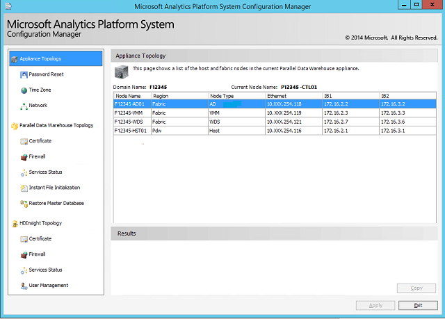

# Appliance topology - Analytics Platform System
Displays summary information on the entire Analytics Platform System.  
  
The page lists a read-only version of all the hosts and fabric nodes in the current appliance including their Ethernet and Infiniband IP addresses.  
  
  
  
## Related content

- [Launch the Configuration Manager in Analytics Platform System](launch-the-configuration-manager.md)
