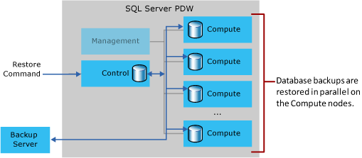

# Backup and restore

Describes how data backup and restore works for Parallel Data Warehouse (PDW). Backup and restore operations are used for disaster recovery. Backup and restore can also be used to copy a database from one appliance to another appliance.  
    
## Backup and restore basics

A PDW *database backup* is a copy of an appliance database, stored in a format so that it can be used to restore the original database to an appliance.  
  
A PDW database backup is created with the [BACKUP DATABASE](../t-sql/statements/backup-database-parallel-data-warehouse.md) t-sql statement and formatted for use with the [RESTORE DATABASE](../t-sql/statements/restore-database-parallel-data-warehouse.md) statement; it is unusable for any other purpose. The backup can only be restored to an appliance with the same number or a greater number of Compute nodes.  
  
<!-- MISSING LINKS
The [master database](master-database.md) is a SMP SQL Server database. It is backed up with the BACKUP DATABASE statement. To restore master, use the [Restore the Master Database](configuration-manager-restore-master-database.md) page of the Configuration Manager tool.  
-->
  
PDW uses SQL Server backup technology to backup and restore appliance databases. SQL Server backup options are preconfigured to use backup compression. You cannot set backup options such as compression, checksum, block size, and buffer count.  
  
Database backups are stored on one or more backup servers, which exist in your own customer network.  PDW writes a user database backup in parallel directly from the Compute nodes to one backup server and restores a user database backup in parallel directly from the backup server to the Compute nodes.  
  
Backups are stored on the backup server as a set of files in the Windows file system. A PDW database backup can only be restored to PDW. However, you can archive database backups from the backup server to another location by using standard Windows file backup processes. For more information about backup servers, see [Acquire and configure a backup server](acquire-and-configure-backup-server.md).  
  
## Database backup types

There are two types of data that require a backup: user databases and system databases (e.g., the master database). PDW does not backup the transaction log.  
  
A full database backup is a backup of an entire  PDW database. This is the default backup type. A full backup of a user database includes database users, and database roles. A backup of master includes logins.  
  
A differential backup contains all of the changes since the last full backup. A differential backup usually takes less time than a full backup and can be performed more frequently. When multiple differential backups are based on the same full backup, each differential includes all of the changes in the previous differential.  
  
For example, you could create a full backup weekly and a differential backup daily. To restore the user database, the full backup plus the last differential (if one exists) needs to be restored.  
  
A differential backup is only supported for user databases. A backup of master is always a full backup.  
  
To backup the entire appliance, you need to perform a backup of all user databases and a backup of the master database.  
  
## Database backup process

The following diagram shows the flow of data during a database backup.  
  
  
  
The backup process works as follows:  
  
1.  User submits a BACKUP DATABASE tsql statement to the Control node.  
  
    -   The backup is either a full or differential backup.  
  
2.  For user databases, the Control node (MPP Engine) creates a distributed query plan to perform a parallel database backup.  
  
3.  Each node involved in the backup copies its backup file to the backup server using SQL Server backup functionality.  
  
    -   Each node involved copies one backup file to the backup server.  
  
    -   The user database backup (full or differential) includes a backup of the portion of the database stored on each Compute node, and a backup of the database users and database roles.  
  
4.  The appliance performs the backup in parallel using the InfiniBand network.  
  
    -   PDW performs each full and differential backup in parallel. However, multiple database backups do not run concurrently. Each backup request must wait for previously submitted backups to finish.  
  
    -   A backup of the master database only backs up data from the Control node. This backup type is performed serially.  
  
5.  A PDW database backup is a group of files stored in a directory that resides off the appliance. The directory name is specified as a network path and directory name. The directory cannot be a local path, and it cannot be on the appliance.  
  
6.  After the backup is finished, you can use the Windows file system to copy the backup directory to another location, if desired.  
  
    -   A backup can only be restored to a PDW appliance that has an equal or greater number of Compute nodes.  
  
    -   You cannot change the name of the backup before performing a restore. The name of the backup directory must match the name of the original name of the backup. The original name of the backup is located in the backup.xml file within the backup directory. To restore a database to a different name, you can specify the new name in the restore command. For example: `RESTORE DATABASE MyDB1 FROM DISK = ꞌ\\10.192.10.10\backups\MyDB2ꞌ`.  
  
## Database restore modes

A full database restore re-creates the PDW database by using the data in the database backup. The database restore is performed by first restoring a full backup, and then optionally restoring one differential backup. The database restore includes the database users and database roles.  
  
A header only restore returns the header information for a database. It does not restore data to the appliance.  
  
An appliance restore is a restore of the entire appliance. This includes restoring all user databases and the master database.  
  
## Restore Process

The following diagram shows the flow of data during a database restore.  
  
  
  
## Restoring to an Appliance with the Same Number of Compute Nodes**  
  
When restoring data, the appliance detects the number of Compute nodes on the source appliance and the destination appliance. If both appliances have an equal number of Compute nodes, the restore process works as follows:  
  
1.  The database backup to be restored is available on a Windows file share on a non-appliance backup server. For best performance, this server is connected to the appliance InfiniBand network.  
  
2.  User submits a [RESTORE DATABASE](../t-sql/statements/restore-database-parallel-data-warehouse.md) tsql statement to the Control node.  
  
    -   The restore is either a full restore or a header restore. The full restore restores a full backup and then optionally restores a differential backup.  
  
3.  The Control node (MPP Engine) creates a distributed query plan to perform a parallel database restore.  
  
    -   SQL ServerPDW performs the restore of a user database in parallel. However, multiple database backups and restores are not run concurrently. The MPP Engine puts each restore statement into a queue; it must wait for previously submitted backup and restore requests to finish.  
  
    -   A restore of the master database only restores data to the Control node; the restore is performed serially.  
  
    -   A restore of the header information is a quick operation and does not restore any data to the Compute or Control nodes. Instead, the Control node returns the results as query output.  
  
4.  The backup files get copied to the correct Compute nodes in parallel, usually over the appliance InfiniBand network.  
  
5.  Each Compute node restores its portion of the user database. If any of the restores do not finish successfully, all of the databases get removed and the restore completes unsuccessfully.  
  
## Restoring to an Appliance With a Larger Number of Compute Nodes  
  
Restoring a backup to an appliance with a larger number of Compute nodes grows the allocated database size in proportion to the number of Compute nodes.  
  
For example, when restoring a 60 GB database from a 2-node appliance (30 GB per node) to a 6-node appliance, SQL Server PDW creates a 180-GB database (6 nodes with 30 GB per node) on the 6-node appliance. SQL Server PDW initially restores the database to 2 nodes to match the source configuration, and then redistributes the data to all 6 nodes.  
  
After the redistribution, each Compute node will contain less actual data and more free space than each Compute node on the smaller source appliance. Use the additional space to add more data to the database. If the restored database size is larger than you need, you can use [ALTER DATABASE](../t-sql/statements/alter-database-transact-sql.md?tabs=sqlpdw) to shrink the database file sizes.  
  
## Related Tasks  
  
|Backup and Restore Task|Description|  
|---------------------------|---------------|  
|Prepare a server as a backup server.|[Acquire and configure a backup server ](acquire-and-configure-backup-server.md)|  
|Backup a database.|[BACKUP DATABASE](../t-sql/statements/backup-database-parallel-data-warehouse.md)|  
|Restore a database.|[RESTORE DATABASE](../t-sql/statements/restore-database-parallel-data-warehouse.md)|    

<!-- MISSING LINKS
|Create a disaster recovery plan.|[Create a Disaster Recovery Plan](create-disaster-recovery-plan.md)|
|Restore the master database.|To restore the master database, use the [Restore the master database](configuration-manager-restore-master-database.md) page in the Configuration Manager tool.| 
|Copy a database from one appliance to another appliance.|[Copy a PDW database to another appliance](copy-pdw-database-to-another-appliance.md).|  
|Monitor backups and restores.|[Monitor backups and restores](monitor-backup-and-restore.md)|  
-->
