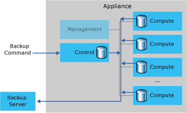
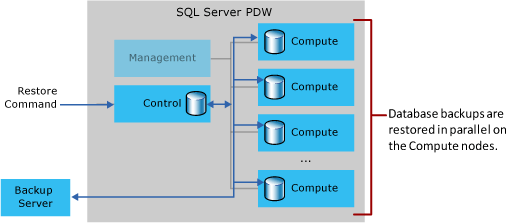

# Backup and restore

This article describes how data backup and restore works for Parallel Data Warehouse (PDW). Use backup and restore operations for disaster recovery. You can also use backup and restore to copy a database from one appliance to another appliance.  
    
## Backup and restore basics

A PDW *database backup* is a copy of an appliance database, stored in a format so that you can use it to restore the original database to an appliance.  
  
Create a PDW database backup by using the [BACKUP DATABASE](../t-sql/statements/backup-transact-sql.md?view=aps-pdw-2016&preserve-view=true) T-SQL statement. The backup is formatted for use with the [RESTORE DATABASE](../t-sql/statements/restore-statements-transact-sql.md?view=aps-pdw-2016&preserve-view=true) statement. You can't use the backup for any other purpose. You can only restore the backup to an appliance with the same number or a greater number of Compute nodes.  
  
<!-- MISSING LINKS
The [master database](master-database.md) is a SMP SQL Server database. It is backed up with the BACKUP DATABASE statement. To restore master, use the [Restore the Master Database](configuration-manager-restore-master-database.md) page of the Configuration Manager tool.  
-->
  
PDW uses SQL Server backup technology to backup and restore appliance databases. SQL Server backup options are preconfigured to use backup compression. You can't set backup options such as compression, checksum, block size, and buffer count.  
  
Store database backups on one or more backup servers, which exist in your own customer network.  PDW writes a user database backup in parallel directly from the Compute nodes to one backup server. It restores a user database backup in parallel directly from the backup server to the Compute nodes.  
  
Store backups on the backup server as a set of files in the Windows file system. You can only restore a PDW database backup to PDW. However, you can archive database backups from the backup server to another location by using standard Windows file backup processes. For more information about backup servers, see [Acquire and configure a backup server](acquire-and-configure-backup-server.md).  
  
## Database backup types

You need to back up two types of data: user databases and system databases, such as the master database. PDW doesn't back up the transaction log.    
  
A full database backup is a backup of an entire PDW database. This type is the default backup type. A full backup of a user database includes database users and database roles. A backup of the master database includes authentication information.  
  
A differential backup contains all of the changes since the last full backup. A differential backup usually takes less time than a full backup and can be performed more frequently. When multiple differential backups are based on the same full backup, each differential includes all of the changes in the previous differential.  
  
For example, you could create a full backup weekly and a differential backup daily. To restore the user database, you need to restore the full backup plus the last differential, if one exists.  
  
A differential backup is only supported for user databases. A backup of the master database is always a full backup.  
  
To back up the entire appliance, you need to back up all user databases and back up the master database.  
  
## Database backup process

The following diagram shows the flow of data during a database backup.  
  
  
  
The backup process works as follows:  
  
1.  You submit a BACKUP DATABASE T-SQL statement to the control node.  
  
    -   The backup is either a full or differential backup.  
  
1.  For user databases, the control node (MPP Engine) creates a distributed query plan to perform a parallel database backup.  
  
1.  Each node involved in the backup uses SQL Server backup functionality to copy its backup file to the backup server.  
  
    -   Each node involved copies one backup file to the backup server.  
  
    -   The user database backup (full or differential) includes a backup of the portion of the database stored on each Compute node, and a backup of the database users and database roles.  
  
1.  The appliance performs the backup in parallel by using the InfiniBand network.  
  
    -   PDW performs each full and differential backup in parallel. However, multiple database backups don't run concurrently. Each backup request must wait for previously submitted backups to finish.  
  
    -   A backup of the master database only backs up data from the control node. This backup type is performed serially.  
  
1.  A PDW database backup is a group of files stored in a directory that resides off the appliance. You specify the directory name as a network path and directory name. The directory can't be a local path, and it can't be on the appliance.  
  
1.  After the backup finishes, you can use the Windows file system to copy the backup directory to another location, if desired.  
  
    -   A backup can only be restored to a PDW appliance that has an equal or greater number of Compute nodes.  
  
    -   You can't change the name of the backup before performing a restore. The name of the backup directory must match the original name of the backup. The original name of the backup is located in the backup.xml file within the backup directory. To restore a database to a different name, you can specify the new name in the restore command. For example: `RESTORE DATABASE MyDB1 FROM DISK = ꞌ\\10.192.10.10\backups\MyDB2ꞌ`.  
  
## Database restore modes

A full database restore re-creates the PDW database by using the data in the database backup. The database restore process first restores a full backup, and then optionally restores one differential backup. The database restore process includes the database users and database roles.  
  
A header-only restore returns the header information for a database. It doesn't restore data to the appliance.  
  
An appliance restore is a restore of the entire appliance. This restore operation includes restoring all user databases and the master database.  
  
## Restore process

The following diagram shows the flow of data during a database restore.  
  
  
  
## Restoring to an Appliance with the Same Number of Compute Nodes**  
  
When restoring data, the appliance detects the number of Compute nodes on the source appliance and the destination appliance. If both appliances have an equal number of Compute nodes, the restore process works as follows:  
  
1.  The database backup to be restored is available on a Windows file share on a non-appliance backup server. For best performance, this server is connected to the appliance InfiniBand network.  
  
2.  User submits a [RESTORE DATABASE](../t-sql/statements/restore-statements-transact-sql.md?view=aps-pdw-2016&preserve-view=true) tsql statement to the Control node.  
  
    -   The restore is either a full restore or a header restore. The full restore restores a full backup and then optionally restores a differential backup.  
  
3.  The Control node (MPP Engine) creates a distributed query plan to perform a parallel database restore.  
  
    - Analytics Platform System (PDW) performs the restore of a user database in parallel. However, multiple database backups and restores are not run concurrently. The MPP Engine puts each restore statement into a queue; it must wait for previously submitted backup and restore requests to finish.  
  
    -   A restore of the master database only restores data to the Control node; the restore is performed serially.  
  
    -   A restore of the header information is a quick operation and does not restore any data to the Compute or Control nodes. Instead, the Control node returns the results as query output.  
  
4.  The backup files get copied to the correct Compute nodes in parallel, usually over the appliance InfiniBand network.  
  
5.  Each Compute node restores its portion of the user database. If any of the restores do not finish successfully, all of the databases get removed and the restore completes unsuccessfully.  
  
## Restoring to an Appliance With a Larger Number of Compute Nodes  
  
Restoring a backup to an appliance with a larger number of Compute nodes grows the allocated database size in proportion to the number of Compute nodes.  
  
For example, when restoring a 60 GB database from a 2-node appliance (30 GB per node) to a 6-node appliance, SQL Server PDW creates a 180-GB database (6 nodes with 30 GB per node) on the 6-node appliance. SQL Server PDW initially restores the database to 2 nodes to match the source configuration, and then redistributes the data to all 6 nodes.  
  
After the redistribution, each Compute node will contain less actual data and more free space than each Compute node on the smaller source appliance. Use the additional space to add more data to the database. If the restored database size is larger than you need, you can use [ALTER DATABASE](../t-sql/statements/alter-database-transact-sql.md?tabs=sqlpdw) to shrink the database file sizes.  
  
## Related tasks  
  
| Backup and restore task | Description |  
|---------------------------|---------------|  
|Prepare a server as a backup server.|[Acquire and configure a backup server](acquire-and-configure-backup-server.md)|  
|Backup a database.|[BACKUP DATABASE](../t-sql/statements/backup-transact-sql.md?view=aps-pdw-2016&preserve-view=true)|  
|Restore a database.|[RESTORE DATABASE](../t-sql/statements/restore-statements-transact-sql.md?view=aps-pdw-2016&preserve-view=true)|    

<!-- MISSING LINKS

|Create a disaster recovery plan.|[Create a Disaster Recovery Plan](create-disaster-recovery-plan.md)|
|Restore the master database.|To restore the master database, use the [Restore the master database](configuration-manager-restore-master-database.md) page in the Configuration Manager tool.| 
|Copy a database from one appliance to another appliance.|[Copy a PDW database to another appliance](copy-pdw-database-to-another-appliance.md).|  
|Monitor backups and restores.|[Monitor backups and restores](monitor-backup-and-restore.md)|  

-->
