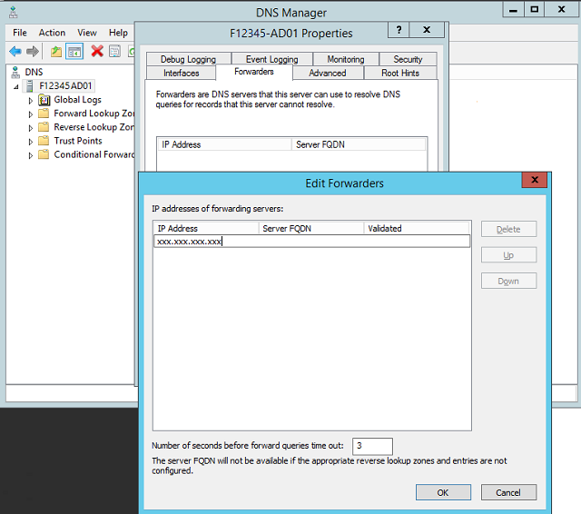
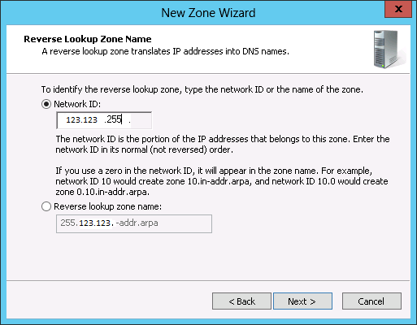
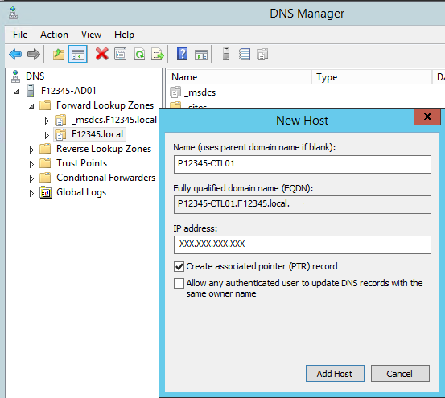
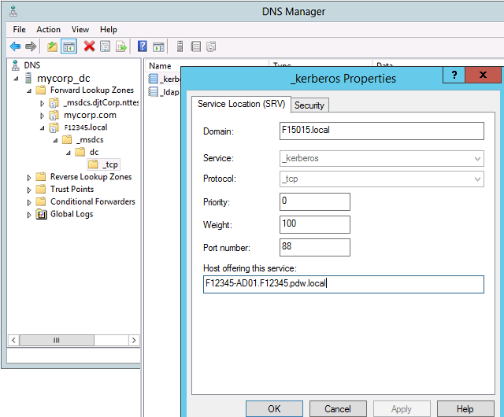
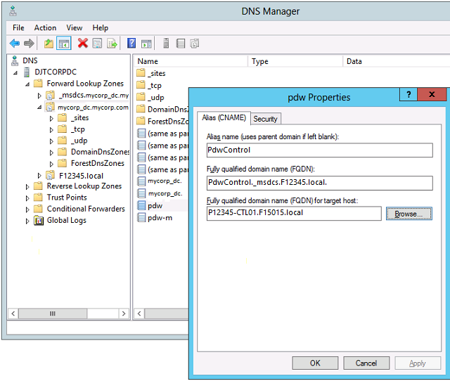
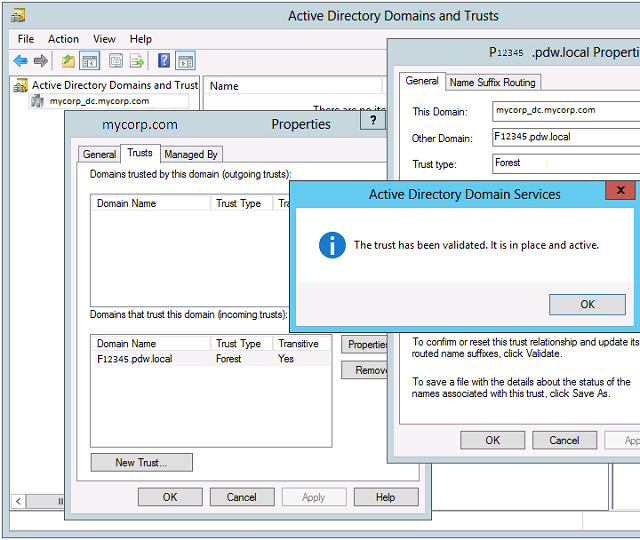

# Configure domain trusts in Analytics Platform System

This article shows you how to configure Analytics Platform System, also known as SQL Server Parallel Data Warehouse (PDW), to accept Windows authentication sign-ins from a corporate domain. You'll also see how to configure a corporate DNS server to provide authentication to Analytics Platform System. For all the steps, sign in as a domain administrator or other high-privileged user.

## Configure a forwarder on SQL Server PDW

Follow these steps to configure a forwarder on SQL Server PDW DNS.

1. Sign in to appliance_domain-HST01 as the appliance domain administrator.
1. Open the Hyper-V Manager program (`virtmgmt.msc`), and then you'll:
   1. Connect to appliance_domain-HST01, if not connected by default.
   1. In the **Virtual Machines** pane, right-click **appliance_domain-AD01**, and select **Connect**.
   1. Sign in to appliance_domain-AD01 as the appliance domain administrator.

1. While on appliance_domain-AD01, open the DNS Manager (`dnsmgmt.msc`).
1. Right-click your DNS server (appliance_domain-AD01), and then select **Properties**.
1. On the **Advanced** tab, clear the checkbox for **Disable recursion** (also disables forwarders) to permit forwarders. Then select **Apply**.
1. On the **Forwarders** tab, select **Edit**.
1. In the **Edit Forwarders** dialog box, enter the IP address of the DNS server for the corporate domain that provides authentication.
1. Select **OK** to close the **Edit Forwarders** dialog box. Select **OK** to close **DNS Properties**.
1. While on appliance_domain-HST01, go back to the Hyper-V Manager, and then you'll:
   1. Connect to appliance_domain-HST02, if not connected by default.
   1. Right-click in the **Virtual Machines** pane.
   1. Sign in to appliance_domain-AD02 as the appliance domain administrator.
   1. While on appliance_domain-AD02, perform the preceding steps 3 through 8.

   

## Configure a forward lookup zone on the corporate DNS

1. Open the DNS Manager (`dnsmgmt.msc`) on a corporate domain controller of the domain that will provide authentication.
1. In the left pane, expand the DNS server for the authenticating domain, right-click **Forward Lookup Zones**, and then select **New Zone**.
1. Complete the **New Zone Wizard** to create a Primary zone by using the name of the appliance domain as the **Zone Name**. The name will be in the format `F12345.pdw.local`, where *F12345* is the appliance domain. See your domain administrator for the preferred selection for the other options.

> [!TIP]
> At this point, you should be able to successfully use ping to connect to the IP addresses of the SQL Server PDW management and control nodes, in the format ping xxx.xxx.xxx.xxx.

## Configure a reverse lookup zone on the corporate DNS

1. Continue using the DNS Manager on a corporate domain controller of the domain that will provide authentication. In the left pane, expand the DNS server for the authenticating domain, right-click **Reverse Lookup Zones**, and select **New Zone**.

1. Complete the **New Zone Wizard** to create a Primary zone, and specify an IPv4 reverse lookup zone. In the **Network ID** box, provide enough of the IP address to indicate the IP addresses that belong to this zone.

   Typically, the first three octets of the SQL Server PDW IP addresses are enough. See your domain administrator for the preferred selection for the other options or if your IP addresses aren't typical.

   

## Add records for CTL and appliance Active Directory nodes on the corporate DNS

1. Continue using the DNS Manager on a corporate domain controller of the domain that will provide authentication. In the left pane, expand **Forward Lookup Zones**. Right-click the new forward lookup zone of SQL Server PDW that you created in a previous step. Select **New Host (A or AAAA)**, and then:
   1. In the **New Host** dialog box, in the **Name** box, enter the name of the SQL Server PDW control node in the format *PDW_region-ctl01*, such as *P12345-ctl01*.
   1. In the **IP address** box, enter the external IP address of the control node.
   1. Select the **Create associated pointer (PTR) record** checkbox.
   1. Select **Add Host** to create a reverse lookup entry for the control node.

1. Repeat the New Host process to create a pointer record for both appliance_domain-AD01 and appliance_domain-AD02.

   

> [!TIP]
> At this point, you should be able to successfully use ping to connect to the FQDNs of the SQL Server PDWControl node, appliance_domain-AD01, and appliance_domain-AD02 by using the following ping commands:
> - ping PDW_region-CTL01.appliance_domain.local
> - ping appliance_domain-AD01.appliance_domain.local
> - ping appliance_domain-AD02.appliance_domain.local

## Add the SRV records needed for Kerberos on the corporate DNS

1. Continue using the DNS Manager on a corporate domain controller of the domain that will provide authentication. Right-click the forward lookup zone for SQL Server PDW that you created earlier. Then select **New Domain**.
1. In the **New DNS Domain** dialog box, enter *dc._msdcs*, and then select **OK**.
1. In the left pane, expand **Forward Lookup Zones**, expand your SQL Server PDW zone name, expand the **_msdcs** node, right-click **dc**, and select **Other New Records**.
1. In the **Resource Record Type** dialog box, select **Service Location (SRV)**. Then select **Create Record**.
1. In the **Service** box, select **_ldap**. In the **Host offering this service** box, enter the full DNS name of the appliance_domain-AD01 node, suffixed by a dot. An example is *F12345-AD01.F12345.pdw.local.* Select **OK**.
1. In the **Resource Record Type** dialog, select **Service Location (SRV)**, and then select **Create Record**.
1. In the **Service** box, select **_kerberos**. In the **Host offering this service** box, enter the full DNS name of the appliance_domain-AD01 node, suffixed by a dot. An example is F12345-AD01.F12345.pdw.local. Select **OK**.
1. To close the **Resource Record Type** dialog box, select **Done**.
1. Repeat steps 4 through 8 to create _ldap and _kerberos records for appliance_domain-AD02.

   

## Add aliases for the CTL and Active Directory nodes to the corporate DNS

1. Continue using the DNS Manager on a corporate domain controller of the domain that provides authentication. Right-click the forward lookup zone of the authenticating corporate domain, and then select **New Alias (CNAME)**.
1. In the **New Resource Record** dialog box, in the **Alias name** box, enter the name that you want to use for the control node. This example uses *PdwControl*.
1. In the **Fully qualified domain name (FQDN) for target host** box, enter the full internal name of the control node. You can also select **Browse** to find it on the DNS in the forward lookup zone with the SQL Server PDW appliance domain name.
1. In the **New Resource Record** dialog box, in the **Alias name** box, enter the name that you want to use for appliance_domain-AD01. This example uses FabAd01.
1. In the **Fully qualified domain name (FQDN) for target host** box, enter the full internal name of appliance_domain-AD01. You can also select **Browse** to find it on the DNS in the forward lookup zone with the SQL Server PDW appliance domain name.
1. Repeat steps 4 through 6 to create a FabAd02 alias for appliance_domain-AD02.

   > [!NOTE]
   > These aliases should be used when you access the PDW from the corporate domain.

   

> [!TIP]
> At this point, you should be able to successfully use ping to connect to the alias names of the SQL Server PDW control and Active Directory nodes in the format `ping PdwControl` and `ping FabAd01` and `ping FabAD02`.

## Create a trust

1. On a corporate domain controller, open **Active Directory Domains and Trusts** (`domain.msc`).
1. In the left pane, right-click the domain name, and then select **Properties**.
1. On the **Trusts** tab, select **New Trust**. Complete the **New Trust Wizard**. Provide appliance domain administrator credentials when asked, for example:
   1. For **Trust Name**, enter the FQDN in the format *F1234.pdw.local*.
   1. Select **Forest trust**.
   1. Select **One-way: incoming**.
   1. Select **Both this domain and the specified domain**. You'll be prompted for administrator credentials on the appliance domain.
   1. In most cases, select **Forest-wide authentication**. Choose **Selective**.

> [!NOTE]
> You can create a two-way trust, but it isn't necessary.

Use this procedure to validate a trust.

1. Select the new trust in the list of incoming trusts, and then select **Properties**. Select **Validate**.
1. Select **Yes**, validate the incoming trust, and then enter appliance domain administrator credentials.

   

## Next steps

[Appliance management tasks for Analytics Platform System](appliance-management-tasks.md)
