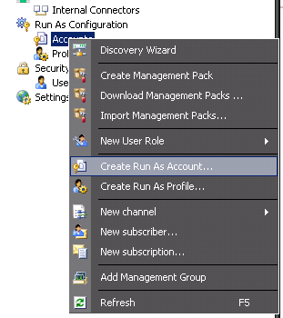
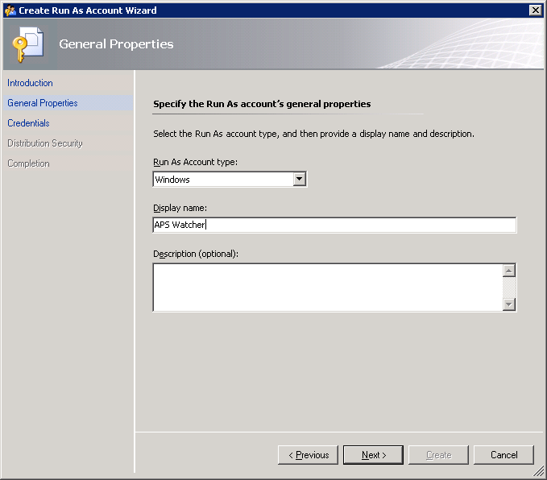
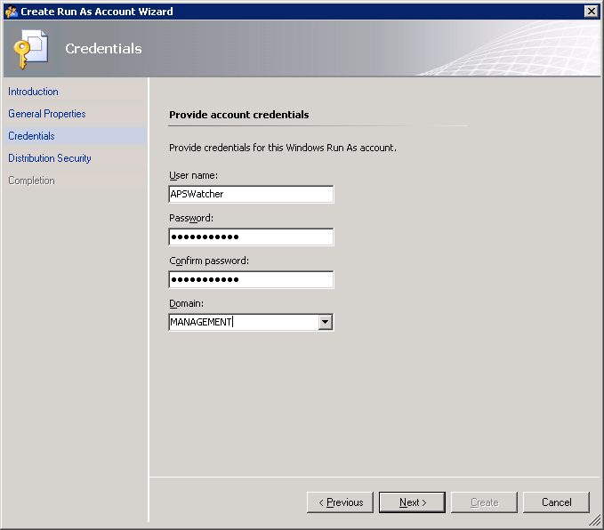
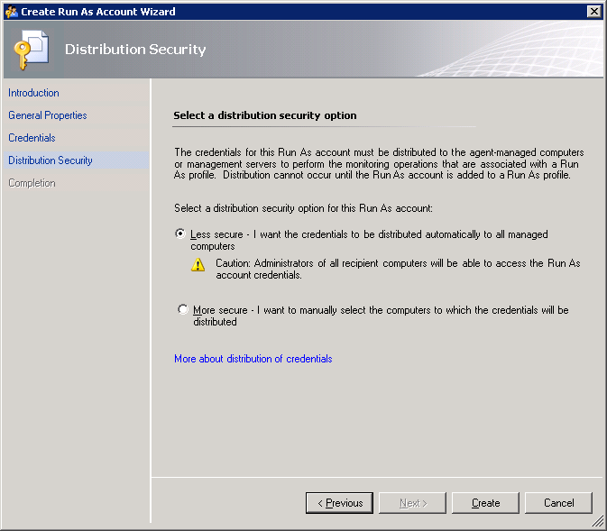
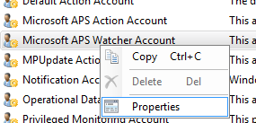
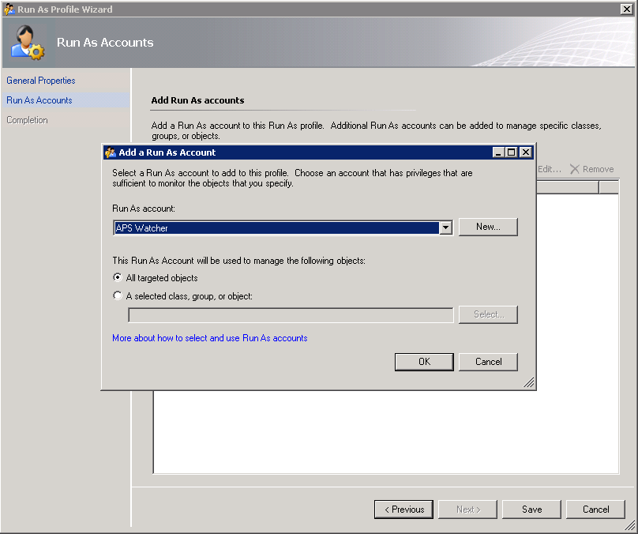
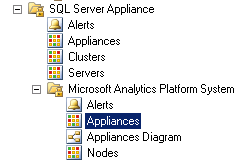
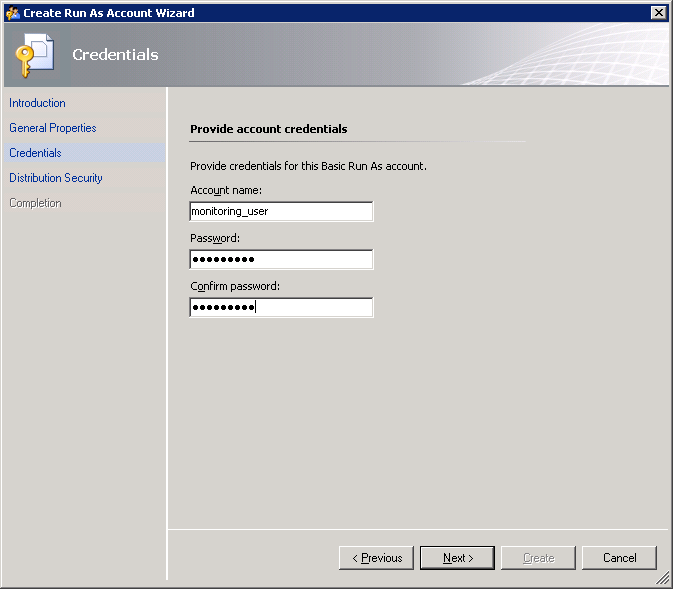
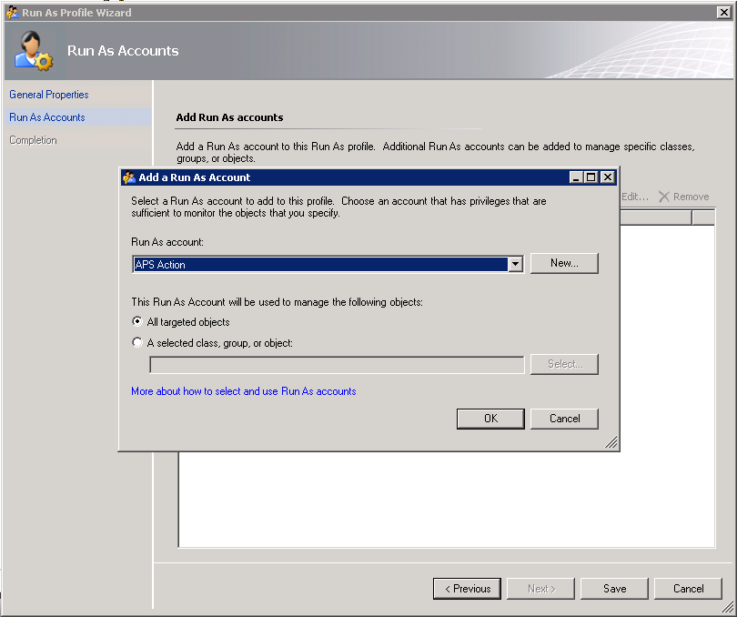

# Configure System Center Operations Manager (SCOM) to Monitor Analytics Platform System
Follow these steps to configure the System Center Operations Manager (SCOM) Management Packs for Analytics Platform System. The Management Packs are required to monitor Analytics Platform System from SCOM.  
  
## Before You Begin  
**Prerequisites**  
  
System Center Operations Manager 2007 R2 must be installed and running.  
  
The management packs must be installed and configured. See [Install the SCOM Management Packs &#40;Analytics Platform System&#41;](install-the-scom-management-packs.md) and [Import the SCOM Management Pack for PDW &#40;Analytics Platform System&#41;](import-the-scom-management-pack-for-pdw.md).  
  
## Configure Run-As Profile in System Center  
To configure System Center, you have to perform following steps:  
  
-   Create Run As account for the **APS Watcher** domain user and map it to the **Microsoft APS Watcher Account.**  
  
-   Create Run As account for the **monitoring_user** APS user and map it to the **Microsoft APS Action Account**.  
  
Here are detailed instructions on how to do the tasks:  
  
1.  Create the **APS Watcher** Run As account with **Windows** account type for the **APS Watcher** domain user.  
  
    1.  Navigate to the **Administration** pane, right-click on **Run As Configuration** -> **Accounts** and select **Create Run As Account...**  
  
          
  
    2.  The **Create Run As Account Wizard** dialog will open. On the **Introduction** page, click **Next**.  
  
    3.  On the **General Properties** page, select **Windows** from **Run As Account type** and specify "APS Watcher" as the **Display name**.  
  
          
  
    4.  On the **Credentials** page,
          
  
    5.  On the **Distribution Security** page, select **Less secure** and click the **Create** button to finish.  
  
          
  
        1.  If you decide to use the **More secure** option, you have to manually specify computers to which credentials will be distributed. To do this, after creating the Run As account, right-click on it and select **Properties**.  
  
        2.  Navigate to the **Distribution** tab and **Add** desired computers.  
  
              
  
2.  Set the **Microsoft APS Watcher Account** profile to use **APS Watcher** Run As account.  
  
    1.  Navigate to **Administration** -> **Run As Configuration** -> **Profiles**.  
  
          
  
    2.  Right click on **Microsoft APS Watcher Account** from the list and select **Properties**.  
  
          
  
    3.  The **Run As Profile Wizard** dialog will open. Skip the **Introduction** page by clicking **Next**.  
  
    4.  On the **General Properties** page, click **Next**.  
  
    5.  On the **Run As Accounts** page, click the **Add...** button and select the previously created **APS Watcher** Run As account.  
  
          
  
    6.  Click **Save** to finish profile assignment.  
  
3.  Wait until APS appliances discovery completes.  
  
    1.  Navigate to the **Monitoring** pane and open the **SQL Server Appliance** -> **Microsoft Analytics Platform System** -> **Appliances** state view.  
  
          
  
    2.  Wait until the appliance appears in the list. The name of the appliance should be equal to one specified in the registry. After discovery completes you should see all appliances listed but not monitored. To enable monitoring, follow the next steps.  
  
    > [!NOTE]  
    > The next steps can be completed in parallel while you are waiting for the initial appliance discovery to finish.  
  
4.  Create another new Run As account to query APS for health data retrieval.  
  
    1.  Begin creating a new Run As account as described in step 1.  
  
    2.  On the **General Properties** page, select **Basic Authentication** account type.  
  
          
  
    3.  On the **Credentials** page, supply valid credentials to access APS health state DMVs.  
  
          
  
5.  Configure the **Microsoft APS Action Account** profile to use the newly created Run As account for the APS instance.  
  
    1.  Navigate to the **Microsoft APS Action Account** properties as described in step 2.  
  
    2.  On the **Run As Accounts** page, click **Add...** and 
    3.  select the newly created Run As account.  
  
          
  
## Next Step  
Now that you have configured the Management Packs, you are ready to start monitoring the appliance. For more information, see [Monitor the Appliance by Using System Center Operations Manager &#40;Analytics Platform System&#41;](monitor-the-appliance-by-using-system-center-operations-manager.md).  
  
<!-- MISSING LINKS ## See Also  
[Common Metadata Query Examples &#40;SQL Server PDW&#41;](../sqlpdw/common-metadata-query-examples-sql-server-pdw.md)  -->  
  
