# Configure Windows Server Update Services (WSUS) in Analytics Platform System
These instructions walk you through the steps for using the Windows Server Update Services (WSUS) Configuration Wizard to configure WSUS for Analytics Platform System. You need to configure WSUS before you can apply software updates to the appliance. WSUS is already installed on the VMM virtual machine of the appliance.  
  
For more information about configuring WSUS, see the [WSUS Step-by-Step Installation Guide](/windows/deployment/deploy-whats-new) on the WSUS website. After configuring WSUS, see [Download and Apply Microsoft Updates &#40;Analytics Platform System&#41;](download-and-apply-microsoft-updates.md) to initiate an update.  
  
> [!WARNING]  
> If you encounter any errors during this configuration process, stop and contact support for assistance. Do not ignore errors or continue in the process after errors are received.  
  
## Before You Begin  
To configure WSUS, you need to:  
  
-   Have the Analytics Platform System appliance domain administrator account login information.  
  
-   Have a Analytics Platform System login with permissions to access the **Admin Console** and view appliance state information.  
  
-   Know the IP address of the upstream WSUS server if you are planning to synchronize updates from an upstream WSUS server instead of synchronizing updates directly from Microsoft Update. Make sure your upstream WSUS server is set to allow anonymous connections and supports SSL.  
  
-   Know the IP address of the proxy server if your appliance will be using a proxy server to access the upstream server or Microsoft Update.  
  
-   In most cases, WSUS needs to access servers outside of the appliance. To support this usage scenario the Analytics Platform System DNS can be configured to support an external name forwarder that will allow the Analytics Platform System hosts and Virtual Machines (VMs) to use external DNS servers to resolve names outside of the appliance. For more information, see [Use a DNS Forwarder to Resolve Non-Appliance DNS Names &#40;Analytics Platform System&#41;](use-a-dns-forwarder-to-resolve-non-appliance-dns-names.md).  
  
## To configure Windows Server Update Services (WSUS)  
  
1.  Log into the **Admin Console**. On the **Appliance State** tab, verify that the **Cluster** and **Network** columns show green (or **NA**) for all nodes. Verify the status indicators for all nodes on the **Appliance State**.  
  
    -   It is safe to continue with green or NA indicators.  
  
    -   Evaluate non-critical (yellow) warning errors. In some cases warning messages will not block updates. If there is a non-critical disk volume error that is not on the C:\ drive, you can proceed to the next step before resolving the disk volume error.  
  
    -   Most red indicators must be resolved before continuing. If there are disk failures, use the **Admin Console Alerts** page to verify there is no more than one disk failure within each server or SAN array. If there is no more than one disk failure within each server or SAN array, you can proceed to the next step before fixing the disk failures. Be sure to contact Microsoft support to fix the disk failures as soon as possible.  
  
2.  Log on to the VMM virtual machine as an appliance domain administrator.  
  
3.  Launch the configuration wizard.  
  
    #### To launch the configuration wizard  
  
    1.  In the **Server Manager Dashboard**, on the **Tools** menu, click **Windows Server Update Services**.  
  
    2.  In the left pane of the **Update Services** window, click to expand the Virtual Machine Management node server (**_appliance_domain_-VMM**), and then click **Options**.  
  
    3.  In the **Options** pane, click **WSUS Server Configuration Wizard** to launch the configuration wizard.  
  
        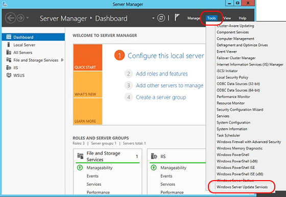  
  
    4.  If this is the first time you have run the WSUS wizard, you may be asked to configure a directory for storing the updates. `C:\wsus` is an appropriate location; however you may provide a different path.  
  
          
  
    5.  Review the **Before You Begin** list of items to complete before you complete the wizard.  
  
        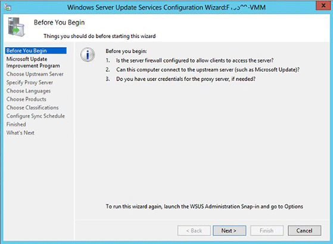  
  
    6.  On the **Join the Microsoft Update Improvement Program** page, select **Yes, I would like to join the Microsoft Update Improvement Program**, and then click **Next**.  
  
        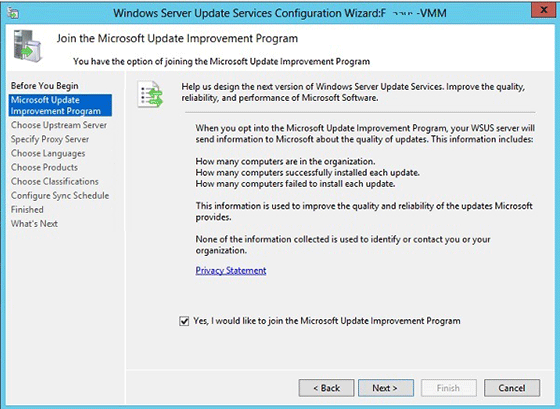  
  
    You should now see the **Choose Upstream Server** page. The following screenshot is the starting point of the configuration wizard.  
  
    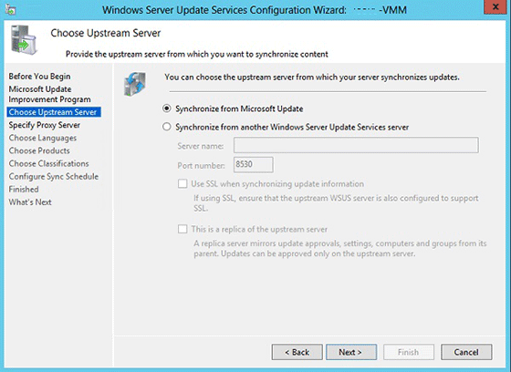  
  
4.  Choose the upstream server.  
  
    On the **Choose Upstream Server** page of the WSUS configuration wizard, you will select how WSUS on the Virtual Machine Management node will connect to an upstream server to obtain software updates. Your two choices are to synchronize the upstream server with [Microsoft Update](https://go.microsoft.com/fwlink/?LinkId=133349) or to synchronize updates with another Windows Server Update Services server.  
  
    #### To update by using Microsoft Update  
  
    1.  If you choose to synchronize with Microsoft Update, you do not need to make any changes to the **Choose Upstream Server** page. Click **Next**.  
  
          
  
    #### To update from another WSUS server  
  
    1.  If you choose to synchronize with a source other than Microsoft Update (an upstream server), specify the server (enter the IP address) and the port on which this server will communicate with the upstream server.  
  
          
  
    2.  To use Secure Sockets Layer (SSL), select the **Use SSL when synchronizing update information** check box. In that case the servers will use port 443 for synchronization.  
  
        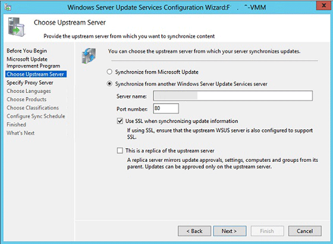  
  
    3.  If this is a replica server, select the **This is a replica of the upstream server** check box. It is possible to select both **Use SSL when synchronizing update information** and **This is a replica of the upstream server**.  
  
        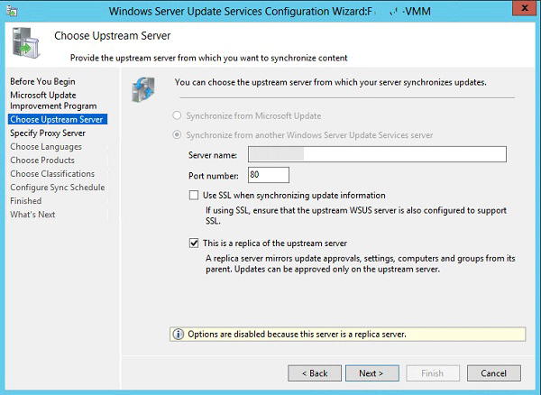  
  
    4.  At this point, you are finished with upstream server configuration. Click **Next**, or select **Specify proxy server** in the left navigation pane.  
  
5.  Specify the proxy server.  
  
    If this server requires a proxy server to access Microsoft Update or a different upstream server, you can configure the proxy server settings here; otherwise, click **Next**.  
  
      
  
    #### To configure proxy server settings  
  
    1.  On the **Specify Proxy Server** page of the configuration wizard, select the **Use a proxy server when synchronizing** check box, and then type the proxy server IP address (not name) and port number (port 80 by default) in the corresponding boxes.  
  
    2.  If you want to connect to the proxy server by using specific user credentials, select the **Use user credentials to connect to the proxy server** check box, and then type the user name, domain, and password of the user in the corresponding boxes. If you want to enable basic authentication for the user connecting to the proxy server, select the **Allow basic authentication (password is sent in cleartext)** check box.  
  
        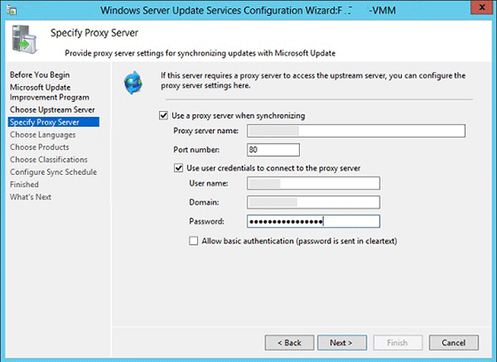  
  
    3.  At this point, you are finished with proxy server configuration. Click **Next** to go to the next page, where you can start to set up the synchronization process.  
  
6.  Start connecting.  
  
      
  
    Click **Start Connecting**.  
  
    After the connection has succeeded, click **Next** to go to the next page, where you can choose languages.  
  
7.  Choose languages.  
  
    Select **Download updates only in these languages**.  
  
    Select **English**, and then click **Next**.  
  
    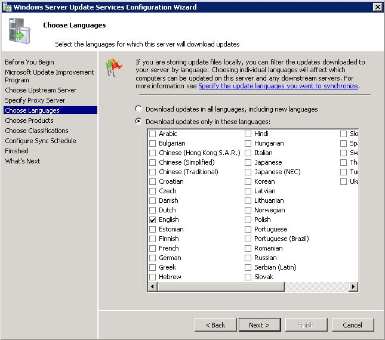  
  
8.  Choose products.  
  
    > [!NOTE]  
    > If you are using an Upstream Server, you may not be able to Choose Products. If this option is not available, skip this step.

    > [!WARNING]  
    > Please exclude any SQL Server 2016 updates.
  
    Unselect all selected updates.  
  
    Select **SQL Server 2012**, **SQL Server 2014**, **Windows Server 2012 R2**, **System Center 2012 R2 - Virtual Machine Manager**, **Windows Server 2016**,  and **System Center 2016 - Virtual Machine Manager** and then click **Next**.  
  
9. Choose classifications.  
  
    > [!NOTE]  
    > If you are using an Upstream Server, you may not be able to Choose Classifications.  If this option is not available, skip this step.  
  
    Unselect all previously selected updates.  
  
    Select **Critical Updates**, **Security Updates** and **Update Rollups** for the updates that will be synchronized for the Analytics Platform System appliance, and then click **Next**.  
  
    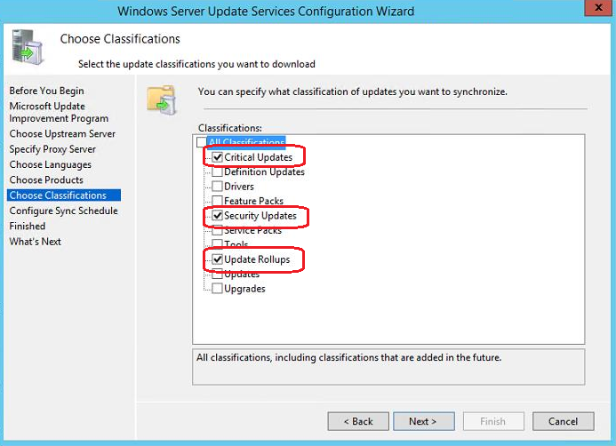  
  
10. Configure the synchronization schedule.  
  
    Select **Synchronize Manually**, and then click **Next**.  
  
    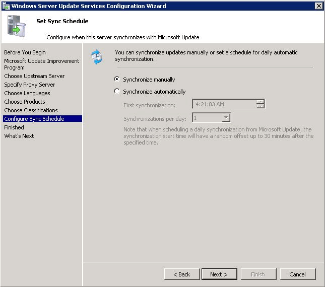  
  
11. Begin initial synchronization.  
  
    Select **Begin initial synchronization**, then click **Next**.  
  
12. Finish.  
  
    Click **Finish**.  
  
## Group the Appliance Servers in WSUS  
After configuring WSUS for Analytics Platform System, the next step is to group the appliance servers. By adding all of the appliance servers to a group, WSUS will be able to apply software updates to all servers in the appliance.  
  
> [!NOTE]  
> The WSUS system is designed to run asynchronously. Initiating activity does not always result in an immediately update. Therefore, you might need to wait a while until computers will be visible in the WSUS dialog boxes. Running the `setup.exe /action=ReportMicrosoftUpdateClientStatus /DomainAdminPassword="<password>"` command described at the end of the topic [Download and Apply Microsoft Updates &#40;Analytics Platform System&#41;](download-and-apply-microsoft-updates.md) can help refresh the dialog boxes.  
  
#### To group the appliance servers  
  
1.  Open the WSUS console, right-click **All Computers** and then click **Add Computer Group**.  
  
      
  
2.  Enter the name "APS" for the computer group, and then click **Add**.  
  
      
  
3.  Click **All Computers** again, change the status in the **Status** drop-down menu to **Any**, and then click **Refresh**. You may need to expand **All Computers** by clicking it on the tree control on the left in order to see the new group you just added.  
  
    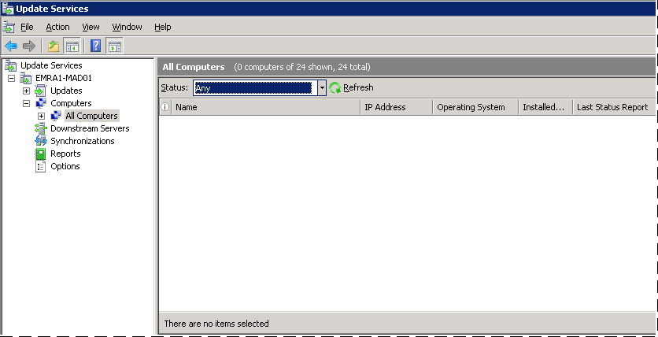  
  
4.  Select all computers that are part of the appliance, right-click, and then click **Change Membership**.  
  
    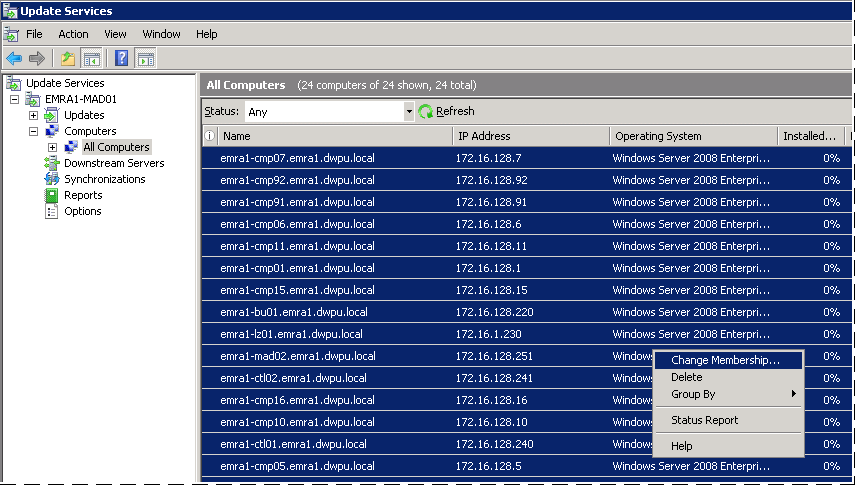  
  
5.  Select the new computer group that you created by clicking the check box and then clicking **OK**.  
  
    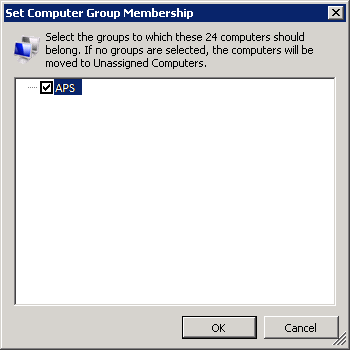  
  
6.  Select the new computer group, change its **Status** to **Any**, and then click **Refresh**. All computers should now be assigned to this group and listed in the right pane. It is generally safe to continue when nodes show warnings such as **This node has not reported status yet**.  
  
    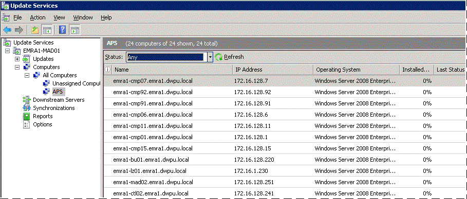  
