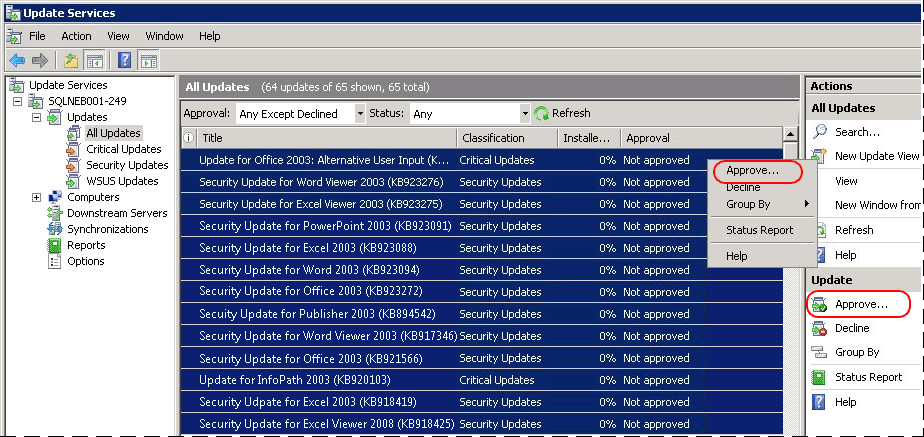
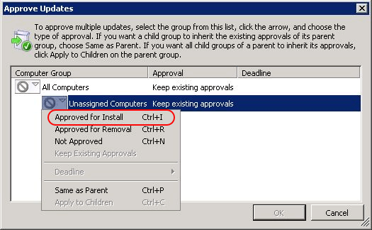
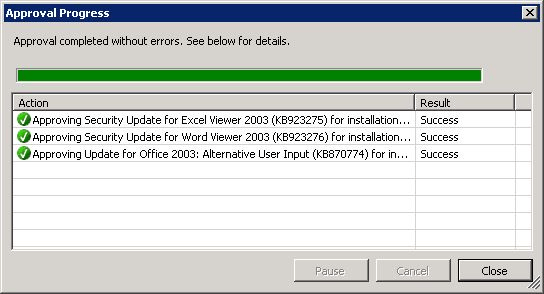
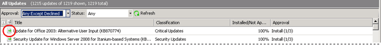
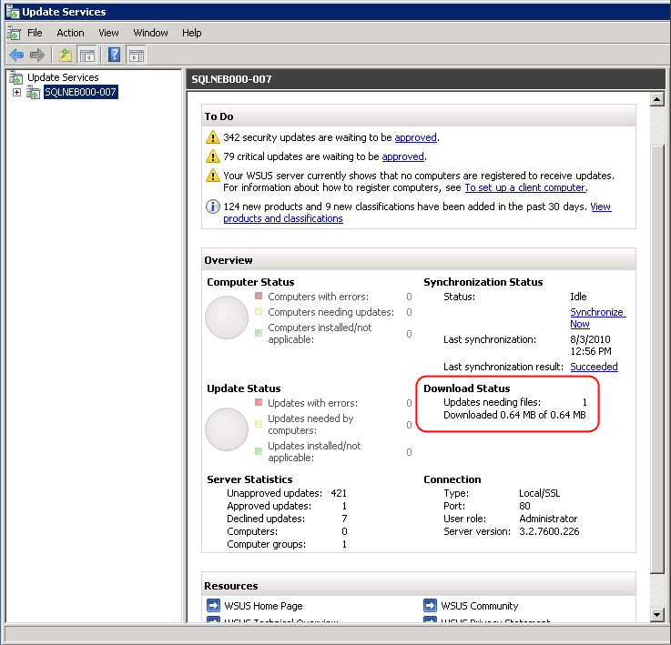

# Download and apply Microsoft updates for Analytics Platform System
This topic discusses how to download updates from the Microsoft Update Catalog to Windows Server Update Services (WSUS) and apply those updates to the Analytics Platform System appliance servers. Microsoft Update will install all applicable updates for Windows and SQL Server. WSUS is installed on the VMM virtual machine of the appliance.  
  
## <a name="TOP"></a>Before You Begin  
  
> [!WARNING]  
> Do not attempt to apply updates if your appliance or any appliance component is down or in a failed over state. In that case, contact support for assistance.  
>   
> Do not apply Microsoft Updates while the appliance is in use. Applying updates can cause appliance nodes to reboot. The updates should be applied during a maintenance window when the appliance is not being used.  
  
### Prerequisites  
Before performing these steps, you need to:  
  
-   Configure WSUS on your appliance by following the instructions in [Configure Windows Server Update Services &#40;WSUS&#41; &#40;Analytics Platform System&#41;](configure-windows-server-update-services-wsus.md).  
  
-   Knowledge of a Fabric Domain Administrator account login information.  
  
-   Have a login with permissions to access the Analytics Platform System Admin Console and view appliance state information.  
  
-   In most cases, WSUS needs to access servers outside of the appliance. To support this usage scenario the Analytics Platform System DNS can be configured to support an external name forwarder that will allow the Analytics Platform System hosts and Virtual Machines (VMs) to use external DNS servers to resolve names outside of the appliance. For more information, see [Use a DNS Forwarder to Resolve Non-Appliance DNS Names &#40;Analytics Platform System&#41;](use-a-dns-forwarder-to-resolve-non-appliance-dns-names.md).  
  
## <a name="bkmk_ImportUpdates"></a>To download and apply Microsoft updates  
  
#### Verify the appliance state indicators  
  
1.  Open the Admin Console and navigate to the Appliance State page. For more information, see [Monitor the Appliance by Using the Admin Console &#40;Analytics Platform System&#41;](monitor-the-appliance-by-using-the-admin-console.md)  
  
2.  Verify the status indicators for all nodes on the Appliance State.  
  
    -   It is safe to continue with green or NA indicators.  
  
    -   Evaluate non-critical (yellow) warning errors. In some cases warning messages will not block updates. If there is a non-critical disk volume error that is not on the C:\ drive, you can proceed to the next step before resolving the disk volume error.  
  
    -   Most red indicators must be resolved before continuing. If there are disk failures, use the Admin Console Alerts page to verify there is no more than one disk failure within each server or SAN array. If there is no more than one disk failure within each server or SAN array, you can proceed to the next step before fixing the disk failures. Be sure to contact Microsoft support to fix the disk failures as soon as possible.  
  
#### Synchronize the WSUS server  
  
1.  Log on to the VMM virtual machine as a domain administrator.  
  
2.  In the **Server Manager Dashboard**, on the **Tools** menu, click **Windows Server Update Services** (**wsus.msc**).  
  
3.  In the WSUS Admin Console, click on **Synchronizations**.  
  
4.  If synchronization is not running, click **Synchronize Now** in the right pane. In the bottom pane, there will be a synchronization status. Wait until the synchronization has completed.  
  
#### Approve Microsoft updates in WSUS  
  
1. Decline any Update Rollups that are not from **System Center**.

2. In the left pane, of the WSUS console, click **All Updates**.  
  
3.  In the **All Updates** pane, click the **Approval** drop-down menu, set **Approval** to **Any Except Declined**. Click the **Status** drop-down menu, set **Status** to **Any**. Click **Refresh**.  
  
    Right-click the **Title** column and select **File Status** to verify the file status after the download completes.  
  
    You can also select **Critical Updates** or **Security Updates** in the left pane and view available updates for these categories.  
  
      
  
4.  Select all updates, and then click the **Approve** link in the right pane.  
  
    You can also right-click the selected updates, and then click **Approve**. You may be prompted to accept the "Microsoft Software License Terms". If so, click **I Accept** in the window to continue.  
  
      
  
5.  Select the appliance server group you created in [Configure Windows Server Update Services &#40;WSUS&#41; &#40;Analytics Platform System&#41;](configure-windows-server-update-services-wsus.md).  
  
6.  Click **Approved for Install**, and then click **OK**.  
  
      
  
7.  In the **Approval Progress** dialog box, when the approval process is complete, click **Close**.  
  
      
  
#### Verify that the updates are in WSUS  
  
-  Verify the file status of all updates. Each file needs to have a green arrow icon to the left of the title. This indicates the file is ready for installation.  
  
      
  
    Before installing the updates, make sure that they are all downloaded and available in the WSUS console.  
  
#### To verify that all updates are downloaded  
  
-  Check the **Download Status** of updates in the WSUS console as shown in the following screenshot. Check that **Updates needing files** is 0 to confirm that all updates are downloaded. If this number is more than zero, you may need to go back and approve additional updates.  
  
      
  
#### Apply Microsoft updates  
  
1.  Before you start, open the [Monitor the Appliance by Using the Admin Console &#40;Analytics Platform System&#41;](monitor-the-appliance-by-using-the-admin-console.md), click the **Appliance State** tab, and verify that the **Cluster** and **Network** columns show green (or NA) for all nodes. If any alerts exist in either of these columns, the appliance might not be able to install updates properly. Address all existing alerts in the **Cluster** and **Network** columns before proceeding.  
  
2.  Log on to the _<domain_name>_**-HST01** node as the Fabric Domain Administrator.  
  
3.  To apply all updates approved for WSUS, run the Update program. See [Run the Update Program](#RunUpdateWizard) below for instructions.  
  
#### Verify the updates on all nodes  
  
1.  From the VMM node, launch the WSUS Admin Console. This application can be found under **Start**, **Administrative Tools**, **Windows Server Update Services**.  
  
2.  Expand **Computers**.  
  
3.  Expand **All Computers**.  
  
4.  Select the appliance server group you created in [Configure Windows Server Update Services &#40;WSUS&#41; &#40;Analytics Platform System&#41;](configure-windows-server-update-services-wsus.md).  
  
5.  In the **Status** drop-down menu, select **Any** and click **Refresh**.  
  
6.  Expand **Update Services**, *\<appliance name\>*-VMM, **Updates**, **All Updates**, where *\<appliance name\>* is your appliance name.  
  
7.  In the **All Updates** window set **Approval** to **Any Except Declined**.  
  
8.  In the **All Updates** window, set **Status** to **Failed or Needed**.  
  
9. Click **Refresh**.  
  
10. If **Updates needed** is greater than zero, contact support for assistance.  
  
#### Ensure there are no critical alerts in the SQL Server PDW Admin Console  
  
1.  Open the Admin Console, click the Appliance State tab. See [Monitor the Appliance by Using the Admin Console &#40;Analytics Platform System&#41;](monitor-the-appliance-by-using-the-admin-console.md).  
  
2.  Verify that the **Cluster** and **Network** columns show green (or NA) for all nodes. If any alerts exist in either of these columns, the appliance might not be able to install updates properly. Contact support if there are any critical alerts.  
  
## <a name="RunUpdateWizard"></a>Run the Update Program  
Follow these instructions to run the Analytics Platform System Update program.  
  
> [!NOTE]  
> The WSUS system is designed to run asynchronously may take some time to fully apply all updates. Initiating an update schedules an update but does not guarantee immediate update activity.  
  
1.  Make sure you are logged into the HST01 node as the Fabric Domain Administrator.  
  
2.  Open a Command Prompt window and enter the following commands. Replace *\<parameter\>* with the designated information.  
  
**To Run the Microsoft Update:**  
  
```  
C:\pdwinst\media\setup.exe /action="MicrosoftUpdate" /DomainAdminPassword="<password>"  
```  
  
**To report the Microsoft Update status:**  
  
```  
C:\pdwinst\media\setup.exe /action="ReportMicrosoftUpdateClientStatus" /DomainAdminPassword="<password>"  
```  
  
## See Also  
[Uninstall Microsoft Updates &#40;Analytics Platform System&#41;](uninstall-microsoft-updates.md)  
[Apply Analytics Platform System Hotfixes &#40;Analytics Platform System&#41;](apply-analytics-platform-system-hotfixes.md)  
[Uninstall Analytics Platform System Hotfixes &#40;Analytics Platform System&#41;](uninstall-analytics-platform-system-hotfixes.md)  
[Software Servicing &#40;Analytics Platform System&#41;](software-servicing.md)  
  
