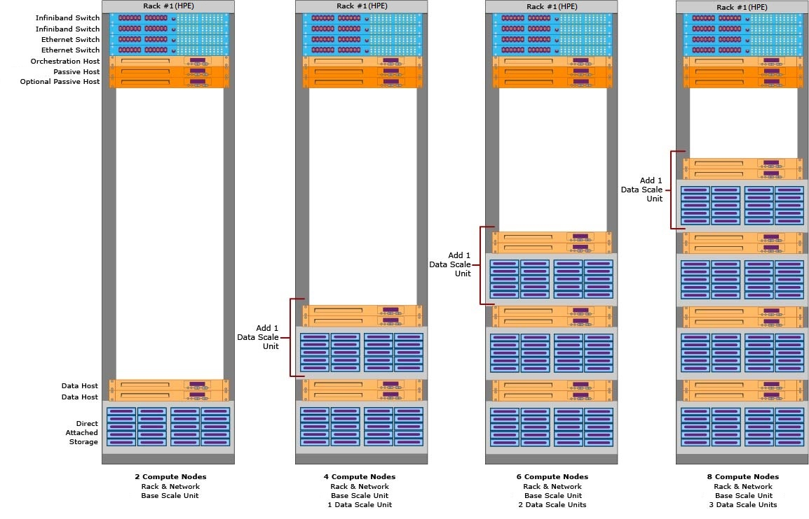
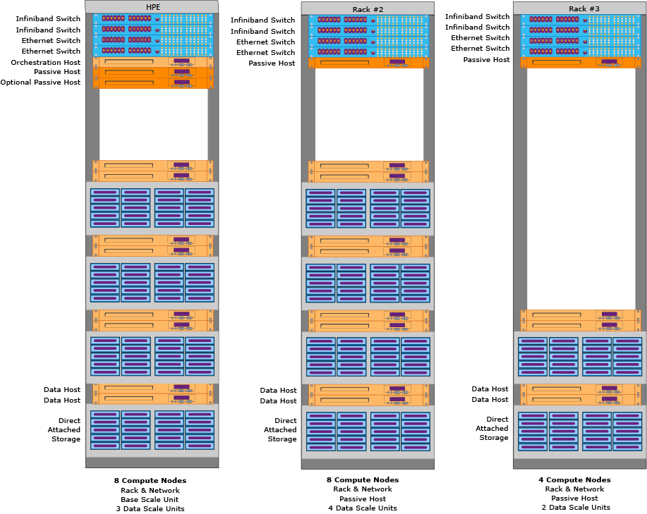
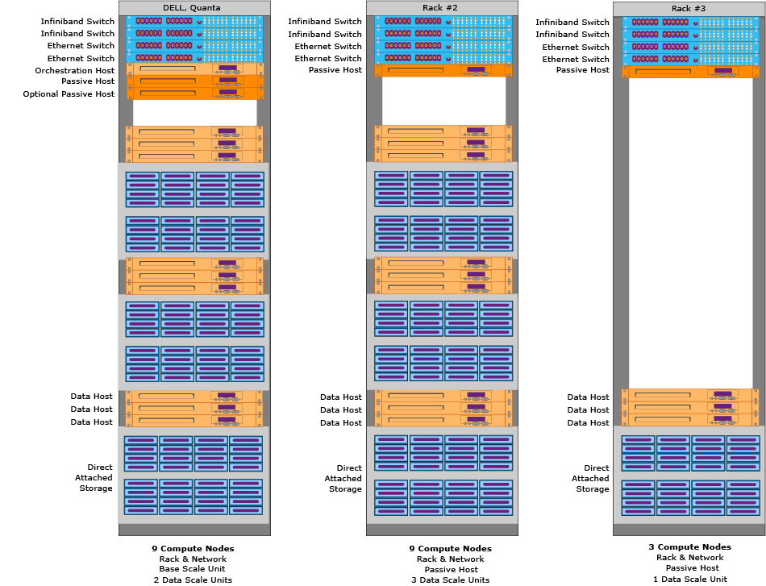

# Hardware configurations - Analytics Platform System
The Analytics Platform System (APS) hardware is architected with scalable units so that you buy the right amount of processing and storage according to your business requirements. The appliance scales storage for SQL Server Parallel Data Wareouse (PDW) from a few Terabytes to over 6 Petabytes of data.  
  
## Contents  
  
-   [One-Rack Configurations](#section1)  
  
-   [Multi-Rack Configurations](#section2)  

  
## One-Rack Configurations  
The first rack in the appliance contains the components required to run PDW. The minimum appliance configuration is a Rack and Network plus a Base Scale unit. These diagrams show ways that the first rack of the appliance can be configured. You can have between 2 and 9 Compute nodes in the first rack, depending on the hardware vendor.  
  
### First Rack Configurations - DELL  
The minimum configuration for a DELL appliance has 3 Compute nodes. You can add up to 2 Data Scale units to the first rack for a total of 9 Compute nodes.  
  
  
  
### First Rack Configurations - HPE  
The minimum configuration for an HPE appliance has 2 Compute nodes. You can add up to 3 Data Scale units to the first rack for a total of 8 Compute nodes.  
  
  
  
## Multi-rack configurations  
To add capacity to PDW you can add Data Scale Units, along with additional Rack & Network components as necessary to provide the proper power, networking, and rack infrastructure. Each additional Rack & Network requires a passive host.  
  
Each hardware vendor specifies the number of Data Scale units you can add given the capacity of your appliance. We recommend adding enough Data Scale units to see at least a 20 percent uplift in performance. For example, adding one Data Scale unit to an appliance that already has 20 Data Scale units might result in a negligible performance gain. The net gain wouldn't be worth the cost and effort.  
  
### Scale out example - HPE  
This diagram shows a 3 rack HP appliance that contains 20 Compute nodes.  
  
  
  
### Scale Out Example - DELL, Quanta  
This diagram shows a 3 rack DELL or Quanta appliance that contains 21 Compute nodes.  
  
  
 
