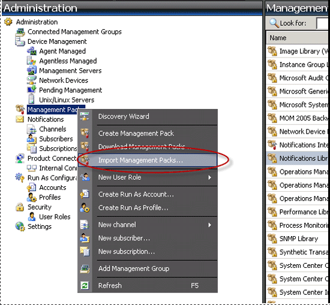
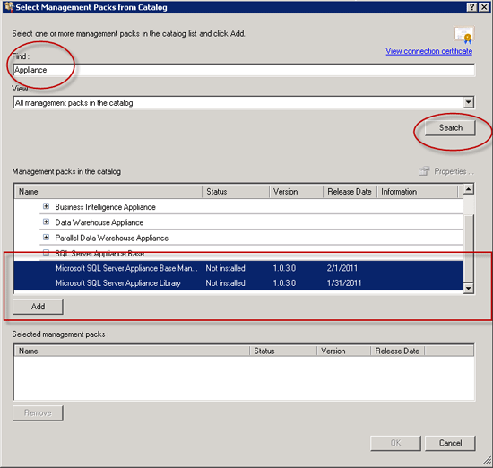
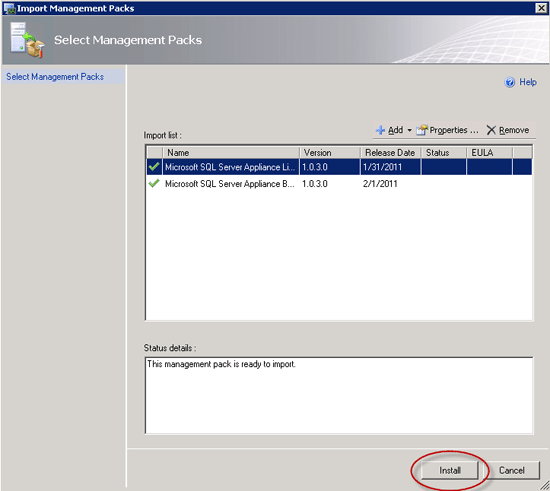
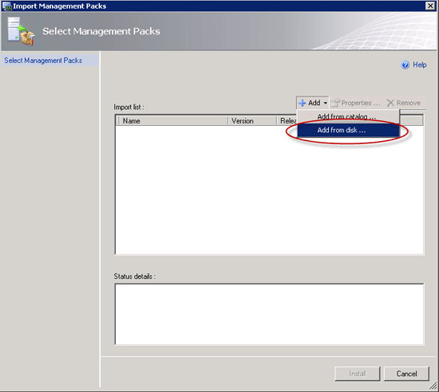
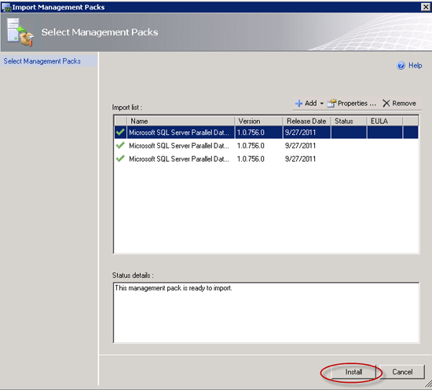

# Import the SCOM Management Pack - Analytics Platform System
Follow these steps to import the System Center Operations Manager (SCOM) Management Packs for Analytics Platform System (APS). The management packs are required to monitor Parallel Data Warehouse from SCOM. 
  
## Before You Begin  
**Prerequisites**  
  
System Center Operations Manager 2007 R2 must be installed and running.  
  
The management packs must be installed. See [Install the SCOM Management Packs &#40;Analytics Platform System&#41;](install-the-scom-management-packs.md).  
  
## Step 1: Import the SQL Server Appliance Base Management Pack  
  
1.  Log on to the computer with an account that is a member of the Operations Manager Administrators role for the Operations Manager 2007 management group.  
  
2.  In the Operations console, click **Administration**.  
  
3.  Right-click the **Management Packs** node, and then click **Import Management Packs**.  
  
      
  
4.  In the list of management packs, select the management pack that you want to import, click **Select**, and then click **Add**.  
  
      
  
5.  Search for **Appliance** and then drill down into SQL Server Appliance Base and then click **Add** the two choices.  
  
      
  
6.  Once the two Management Packs were in the bottom selected pane, then click **OK**.  
  
      
  
7.  Click **Install**.  
  
      
  
8.  Once Complete, click **Close**.  
  
      
  
## Import the Monitoring Pack for Microsoft SQL Server 2008 R2 Parallel Data Warehouse Appliance  
  
1.  Right-click the **Management Packs** node, and then click **Import Management Packs**.  
  
2.  Choose **Add from disk**....  
  
      
  
3.  Go to the location where you extracted the SQL Server PDW Management Packs and choose the three management packs that are in the "Selected Management packs to import" section. You can do this by selecting the first one, clicking Shift, and selecting the last one. Once they are all selected, click **Open**.  
  
      
  
4.  Click **Install**.  
  
      
  
5.  Click **Close**.  
  
      
  
## Next Step  
Now that you have imported the Management Packs, continue to the next step: [Configure SCOM to Monitor Analytics Platform System &#40;Analytics Platform System&#41;](configure-scom-to-monitor-analytics-platform-system.md).  
  
<!-- MISSING LINKS ## See Also  
[Common Metadata Query Examples &#40;SQL Server PDW&#41;](../sqlpdw/common-metadata-query-examples-sql-server-pdw.md)  -->  
  
