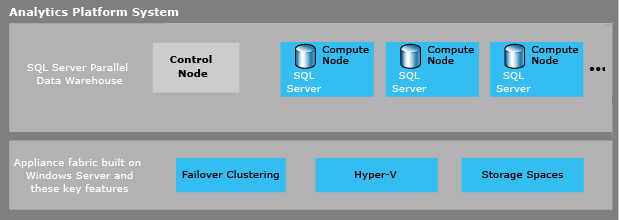

# Microsoft Analytics Platform System  
Microsoft Analytics Platform System (APS), a data platform designed for data warehousing and Big Data analytics, offers deep data integration, high-speed query processing, highly scalable storage, and simple maintenance for your end-to-end business intelligence solutions.  
  
  
  
Analytics Platform System hosts SQL Server Parallel Data Warehouse (PDW), which is the software that runs the massively parallel processing (MPP) data warehouse.  
  
PolyBase technology combines relational PDW data with Hadoop data from multiple sources including Hortonworks on Windows Server, Hortonworks on Linux, Cloudera on Linux and HDInsight's Windows Azure blob storage. These advanced data integration abilities, plus deep integration with Business Intelligence tools, allow Analytics Platform System to return integrated analysis that enables your business decision makers to make better and more insightful business decisions.  
  
Analytics Platform System ships to your data center as an appliance with hardware and software pre-installed and pre-configured to run multiple workloads. When you purchase Analytics Platform System, you purchase Compute nodes for PDW according to your business requirements.  
  
Analytics Platform System is not only fast and scalable, it is designed with high redundancy and high availability, making it a reliable platform you can trust with your most business critical data. Analytics Platform System is designed for simplicity which makes it easy to learn and to manage. PDW's PolyBase technology for analyzing Hadoop data, and its deep integration with Business Intelligence tools make it a comprehensive platform for building end-to- end solutions.  
  
  
## Parallel Data Warehouse, software designed for massively parallel processing
  
Use PDW as the core relational data warehousing component of your end-to-end business intelligence solutions. With PDW's massively parallel processing (MPP) design, queries commonly complete 50 times faster than traditional data warehouses built on symmetric multi-processing (SMP) database management systems.  
  
> [!NOTE]  
> 50 times faster means that queries complete in minutes instead of hours, or seconds instead of minutes. With this breakthrough performance, your business analysts can generate more extensive results faster, and can easily perform ad-hoc queries or drill down into the details. As a result, your business can make better decisions, faster.  
  
In addition to achieving breakthrough query performance, PDW makes it easy to:  
  
-   Grow your data warehouse to anywhere from a few terabytes to over 6 petabytes of data in a single appliance by adding "scale units" to your existing system  
  
-   Trust your data will be there when you need it because of the built- in high redundancy and high availability,  
  
-   Solve modern data challenges of loading and consolidating data  
  
-   Integrate Hadoop data with relational data for fast analysis by using PDW's highly parallelized PolyBase technology  
  
-   Use Business Intelligence tools to build comprehensive end-to-end solutions.  

## Next steps

For more information about the benefits of PDW, see the whitepaper [A Breakthrough Platform for Next-Generation Data Warehousing and Big Data Solutions](https://msdn.microsoft.com/library/dn520808.aspx) on MSDN.  
  

