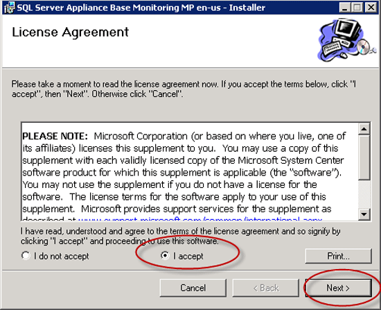
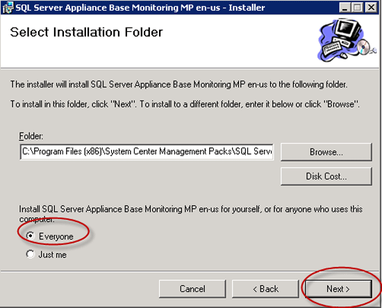
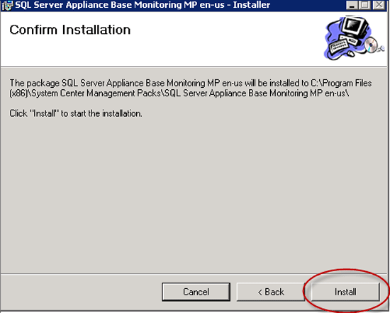
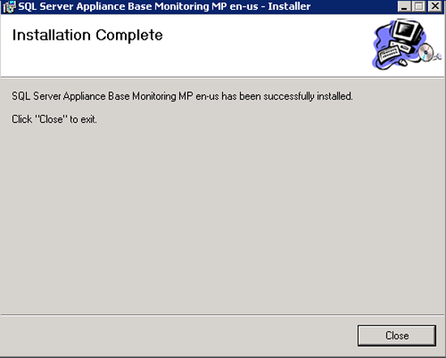
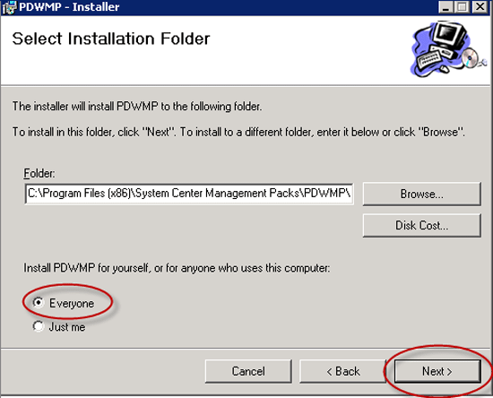
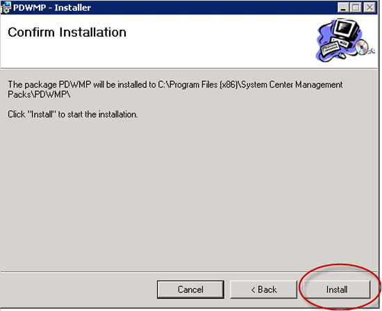
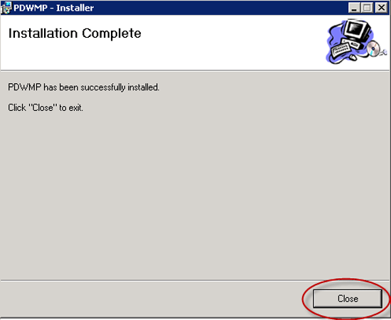

# Install SQL Server Operations Manager (SCOM) management packs for Analytics Platform System
Follow these steps to download and install the System Center Operations Manager (SCOM) Management Packs for SQL Server PDW. The Management Packs are required to monitor SQL Server PDW from SCOM.  
  
## Before You Begin  
**Prerequisites**  
  
System Center Operations Manager must be installed and running. SQL Server PDW 2012 requires System Center Operations Manager 2007 R2, System Center Operations Manager 2012, or System Center Operations Manager 2012 service pack 1.  
  
## Step 1: Download the Management Packs  
For the APS PDW workload, download the [System Center Management Pack for the Microsoft Analytics Platform System](https://go.microsoft.com/fwlink/?LinkId=396857).  
  
For the appliance management, download the [SQL Server Appliance Base Management Pack](/previous-versions/system-center/packs/gg602398(v=technet.10)).  
  
For older versions of PDW without APS, download the[System Center Monitoring Pack for Microsoft SQL Server 2012 Parallel Data Warehouse Appliance](./download-and-apply-microsoft-updates.md?view=aps-pdw-2016-au7&preserve-view=true).  
  
<!-- MISSING LINKS - For the HDInsight workload, download the [System Center Management Pack for HDInsight](https://go.microsoft.com/fwlink/?LinkId=390208).  -->
  
## Step 2: Install the Management Packs  
  
### Install the SQL Server Appliance Base Management Pack  
  
1.  To run the install, double-click on the downloaded SQL Server Appliance Base Management Pack.  
  
2.  Accept the License Agreement, and click **Next**.  
  
      
  
3.  Select your own installation folder, or use the default Management Pack Installation Folder.  
  
      
  
4.  Click **Install**.  
  
      
  
5.  Click **Close**.  
  
      
  
### Install the Monitoring Pack for SQL Server PDW Appliance  
  
1.  To run the install, double-click on the downloaded SQL Server PDW Appliance Management Pack.  
  
2.  Accept the License Agreement, and click **Next**.  
  
      
  
3.  Choose the directory that will hold the extracted files. The default Management Pack installation folder is shown by default. Select the default, or select your own installation folder.  
  
      
  
4.  Click **Install**.  
  
      
  
5.  Click **Close**.  
  
      
  
## Next Step  
Now that you have the Management Packs installed, continue to the next step: [Import the SCOM Management Pack for PDW &#40;Analytics Platform System&#41;](import-the-scom-management-pack-for-pdw.md).  
  
<!-- MISSING LINKS ## See Also  
[Common Metadata Query Examples &#40;SQL Server PDW&#41;](../sqlpdw/common-metadata-query-examples-sql-server-pdw.md)  -->
