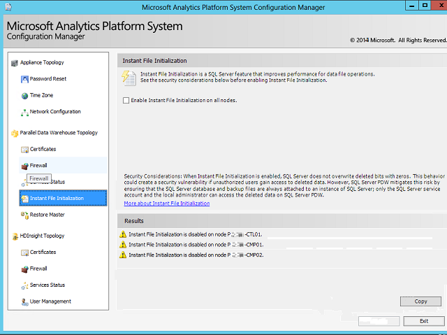

# Instant File Initialization Configuration
Instant file initialization is a SQL Server feature that allows data file operations to run more quickly. Checking the box to turn Instant File Initialization on will improve performance of SQL Server PDW. However, if this poses a security risk for you business, then leave the box unchecked.  
  
> [!IMPORTANT]  
> When instant file initialization is enabled, SQL Server does not overwrite deleted bits with zeros.  This behavior could create a security vulnerability if unauthorized users gain access to deleted data. However, SQL Server PDW mitigates this risk by ensuring that the SQL Server database and backup files are always attached to an instance of SQL Server; only the SQL Server service account and the local administrator can access the deleted data on SQL Server PDW.  
  
Instant file initialization is not available when TDE is enabled.  
  
## Add Permission for the Backup Account  
The backup process requires a network credential (Windows user account) that can access the backup storage location. You authorize PDW to use account by using the [sp_pdw_add_network_credentials](../relational-databases/system-stored-procedures/sp-pdw-add-network-credentials-sql-data-warehouse.md) procedure. See [BACKUP DATABASE](../t-sql/statements/backup-transact-sql.md) for the entire backup process. To use instant file initialization, the backup account must be granted the `Perform volume maintenance tasks` permission.  
  
1.  On the backup server, open the **Local Security Policy** application (`secpol.msc`).  
  
2.  In the left pane, expand **Local Policies**, and then click **User Rights Assignment**.  
  
3.  In the right pane, double-click **Perform volume maintenance tasks**.  
  
4.  Click **Add User or Group** and add any user accounts that are used for backups.  
  
5.  Click **Apply**, and then close all **Local Security Policy** dialog boxes.  
  
## To Turn Instant File Initialization On or Off  
  
1.  Launch the Configuration Manager. For more information, see [Launch the Configuration Manager &#40;Analytics Platform System&#41;](launch-the-configuration-manager.md).  
  
2.  In the left pane of the Configuration Manager, click **Instant File Initialization**.  
  
3.  To turn on instant file initialization, select the box next to **Enable Instant File Initialization on all nodes**. To turn off instant file initialization, clear the box next to **Enable Instant File Initialization on all nodes**.  
  
    > [!WARNING]  
    > When you turn instant file initialization off, the security consideration discussed above for the feature may still apply to files deleted while instant file initialization was enabled.  
  
4.  Click **Apply**. The change will propagate through the SQL Server instances on SQL Server PDW the next time the appliance services are restarted. To restart the appliance services now, see [PDW Services Status &#40;Analytics Platform System&#41;](pdw-services-status.md).  
  
5.  You might want to repeat the steps described above as **Add Permission for the Backup Account** to remove the **Perform volume maintenance tasks** permission.  
  
  
  
For more information about instant file initialization, see [Instant File Initialization](/previous-versions/sql/sql-server-2008-r2/ms175935(v=sql.105)).  
