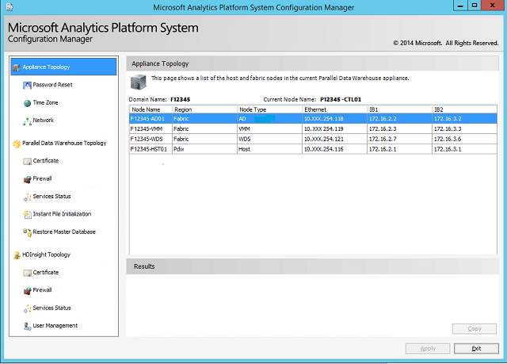

# Launch the Configuration Manager in Analytics Platform System
This topic provides instructions for launching the **Configuration Manager** for the Analytics Platform System appliance.  
  
## Before You Begin  
  
### Prerequisites  
The Analytics Platform System**Configuration Manager** can only be run by the appliance domain administrator. To run this tool, you need the password for the appliance domain administrator. To create additional APS administrators, see [Create an APS Domain Administrator &#40;APS&#41;](create-an-aps-domain-administrator-aps.md).  
  
## Launch the Configuration Manager Tool  
To run the Configuration Manager, use Remote Desktop to connect to the PDW Control node (**_PDW_region_-CTL01**)node, and log in as _appliance_domain_**\Administrator**. When starting the **Configuration Manager** program, use the **Run as Administrator** option to ensure that your administrator credentials are used.  
  
#### To launch from a browser window  
  
1.  Open a browser and navigate to the directory `C:\Program Files\Microsoft SQL Server Parallel Data Warehouse\100`.  
  
2.  Right-click `dwconfig.exe` and then click **Run as Administrator**.  
  
#### To launch from a command prompt  
  
1.  On the desktop, open the **Start** menu, click **Programs**, click **Accessories**, right-click **Command Prompt** and then click **Run as administrator**.  
  
2.  At the command prompt, enter the following command to change directories: `cd /d "C:\Program Files\Microsoft SQL Server Parallel Data Warehouse\100"`.  
  
3.  At the command prompt, enter `dwconfig.exe`.  
  
After the **Configuration Manager** is started, you will see all available functionality listed in the left pane. The remainder of this section discusses how to perform each action available in the tool.  
  
To close and exit **Configuration Manager**, click **Exit** in the lower-right corner of any screen.  
  
  
  
## See Also  
[Monitor the Appliance by Using the Admin Console &#40;Analytics Platform System&#41;](monitor-the-appliance-by-using-the-admin-console.md)  
  
