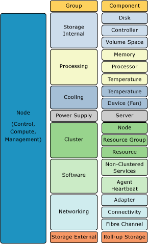
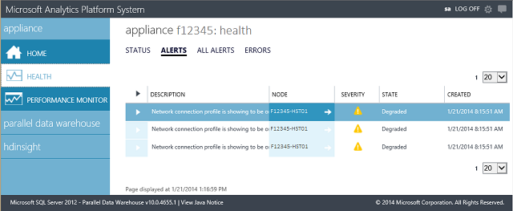

# Monitor Appliance Health State

This article explains how to monitor the state of an Analytics Platform System appliance by using the Admin Console, or by directly querying the Parallel Data Warehouse dynamic management views.

A system administrator can use the Admin Console or Dynamic Management Views (DMVs) in the SQL Server Parallel Data Warehouse (PDW) to retrieve the full hierarchy of nodes, components, and software. The following diagram gives a high level understanding of the components that SQL Server PDW monitors.  
  
  
  
## Monitor Component Status By Using the Admin Console

To retrieve component status by using the Admin Console:  
  
1. Select the **Appliance State** tab.  
  
1. On the Appliance State page, select a specific node to view the node details.  
  
     
  
## Monitor Component Status By Using System Views

To retrieve component status by using system views, use [sys.dm_pdw_component_health_status](../relational-databases/system-dynamic-management-views/sys-dm-pdw-component-health-status-transact-sql.md). For example, the following query retrieves the status for all components.  
  
```sql  
SELECT   
   s.[pdw_node_id],  
   n.[name] as [node_name],  
   n.[address] ,  
   g.[group_id] ,  
   g.[group_name] ,  
   c.[component_id] ,  
   c.[component_name] ,  
   s.[component_instance_id] ,   
   p.[property_name] ,  
   s.[property_value] ,  
   s.[update_time]  
FROM [sys].[dm_pdw_component_health_status] AS s  
JOIN sys.dm_pdw_nodes AS n   
   ON s.[pdw_node_id] = n.[pdw_node_id]  
JOIN [sys].[pdw_health_components] AS c   
   ON s.[component_id] = c.[component_id]  
JOIN [sys].[pdw_health_component_groups] AS g   
   ON c.[group_id] = g.[group_id]  
JOIN [sys].[pdw_health_component_properties] AS p   
   ON s.[property_id] = p.[property_id] AND s.[component_id] = p.[component_id]  
WHERE p.property_name = 'Status'  
ORDER BY  
   s.[pdw_node_id],  
   g.[group_name] ,   
   s.[component_instance_id] ,  
   c.[component_name] ,   
   p.[property_name];  
```  
  
Possible values returned for the Status property are:  
  
- Ok  
- NonCritical  
- Critical  
- Unknown  
- Unsupported  
- Unreachable  
- Unrecoverable  
  
To see all the properties for all components, remove the `WHERE  p.property_name = 'Status'` clause.  
  
The **[update_time]** column shows the last time the component was polled by the SQL Server PDW health agents.  
  
> [!CAUTION]  
> Be sure to investigate the issue when a component has not been polled for 5 minutes or longer; there could be an alert that indicates an issue with the software heartbeats.  
  
## Next steps

[Appliance Monitoring](appliance-monitoring.md)  
<!-- MISSING LINKS [Common Metadata Query Examples &#40;SQL Server PDW&#41;](../sqlpdw/common-metadata-query-examples-sql-server-pdw.md)  -->  
