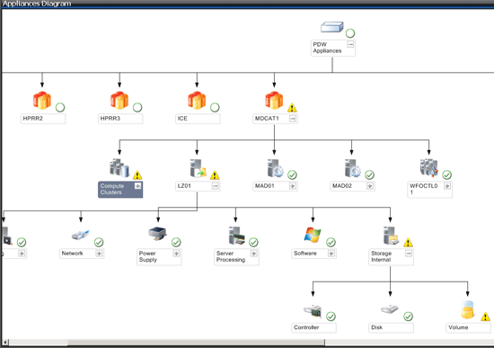

# Monitor with System Center Operations Manager - Analytics Platform System
Use System Center Operations Manager (SCOM) to monitor the Analytics Platform System (APS) appliance.
  
## Before You Begin  
  
### Prerequisites  
  
1.  System Center Operations Manager 2007 R2, 2012, or 2012 SP1 must be installed and running.  
  
2.  SQL Server 2008 R2 Native Client or SQL Server 2012 Native Client must be installed.  
  
3.  The management packs to monitor SQL Server PDW must be installed, imported, and configured. Use the following articles for instructions to perform these tasks.  
  
    -   [Install the SCOM Management Packs &#40;Analytics Platform System&#41;](install-the-scom-management-packs.md)  
  
    -   [Import the SCOM Management Pack for PDW &#40;Analytics Platform System&#41;](import-the-scom-management-pack-for-pdw.md) 
    
    -   [Configure SCOM to Monitor Analytics Platform System &#40;Analytics Platform System&#41;](configure-scom-to-monitor-analytics-platform-system.md)
  
<!-- MISSING LINKS    -   [Import the SCOM Management Pack for HDInsight &#40;Analytics Platform System&#41;](import-the-scom-management-pack-for-hdinsight.md)  -->  
   
  
## To Monitor SQL Server PDW with SCOM  
After configuring the SCOM Management Packs, click on the Monitoring Pane of SCOM and drill down to **SQL Server Appliance** and then **Microsoft SQL Server Parallel Data Warehouse**. Underneath Microsoft SQL Server Parallel Data Warehouse, there are four choices: Alerts, Appliances, Appliance Diagram, and nodes.  
  
### Alerts  
Alerts are where you can find the current alerts to manage.  
  
  
  
### Appliances  
Appliances are where you will find the currently discovered and monitored SQL Server PDW Appliances in your environment. If an appliance does not show up here and you have created the ODBC connection for it, then there may be something wrong with your PDWWatcher account. If they show up as "Not monitored", there may be something wrong with your PDWMonitor account. Be patient since SCOM does not make changes in real time, but periodically checks for new appliances to monitor and periodically sends queries to appliances for monitoring.  
  
  
  
### Appliances Diagram  
The Appliances Diagram Page is where you can get a look at the health of your appliance with a tree view:  
  
  
  
### Nodes  
Finally, the Nodes view allows you to see the health of your appliance through each node:  
  
  
  
## See Also  
<!-- MISSING LINKS [Common Metadata Query Examples &#40;SQL Server PDW&#41;](../sqlpdw/common-metadata-query-examples-sql-server-pdw.md)  -->  
[Understanding Admin Console Alerts &#40;Analytics Platform System&#41;](understanding-admin-console-alerts.md)  
  
