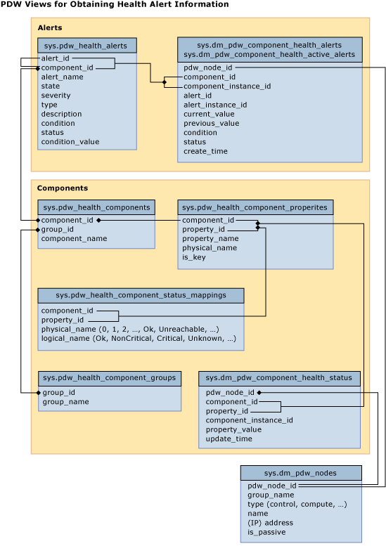

# Monitor the appliance with system views - Analytics Platform System
This article lists the system views that you can use for monitoring SQL Server PDW.  
  
## To Monitor the Appliance by Using System Views  
SQL Server PDW includes comprehensive system views that enable you to obtain detailed information about the appliance health, state, and performance. This table provides links to system views that can be used for each monitoring capability.  
  
  
  
|||  
|-|-|  
|**Information Type**|**Related System Views**|  
|Overall status of the appliance|[sys.dm_pdw_sys_info](../relational-databases/system-dynamic-management-views/sys-dm-pdw-sys-info-transact-sql.md)|  
|Alerts|[sys.pdw_health_alerts](../relational-databases/system-catalog-views/sys-pdw-health-alerts-transact-sql.md)  [sys.dm_pdw_component_health_alerts](../relational-databases/system-dynamic-management-views/sys-dm-pdw-component-health-alerts-transact-sql.md)  [sys.dm_pdw_component_health_active_alerts](../relational-databases/system-dynamic-management-views/sys-dm-pdw-component-health-active-alerts-transact-sql.md)  [sys.dm_pdw_component_health_status](../relational-databases/system-dynamic-management-views/sys-dm-pdw-component-health-status-transact-sql.md)|  
|Appliance components and their status|[sys.pdw_health_component_groups](../relational-databases/system-catalog-views/sys-pdw-health-component-groups-transact-sql.md)  [sys.pdw_health_components](../relational-databases/system-catalog-views/sys-pdw-health-components-transact-sql.md)  [sys.pdw_health_component_properties](../relational-databases/system-catalog-views/sys-pdw-health-component-properties-transact-sql.md)  [sys.pdw_health_component_status_mappings](../relational-databases/system-catalog-views/sys-pdw-health-component-status-mappings-transact-sql.md)  [sys.dm_pdw_nodes](../relational-databases/system-dynamic-management-views/sys-dm-pdw-nodes-transact-sql.md)|  
|Monitor requests (including queries, loads, backups, and restores)|[sys.dm_pdw_exec_sessions](../relational-databases/system-dynamic-management-views/sys-dm-pdw-exec-sessions-transact-sql.md)  [sys.dm_pdw_exec_requests](../relational-databases/system-dynamic-management-views/sys-dm-pdw-exec-requests-transact-sql.md)  [sys.dm_pdw_request_steps](../relational-databases/system-dynamic-management-views/sys-dm-pdw-request-steps-transact-sql.md)  [sys.dm_pdw_sql_requests](../relational-databases/system-dynamic-management-views/sys-dm-pdw-sql-requests-transact-sql.md)  [sys.dm_pdw_dms_workers](../relational-databases/system-dynamic-management-views/sys-dm-pdw-dms-workers-transact-sql.md)  [sys.dm_pdw_waits](../relational-databases/system-dynamic-management-views/sys-dm-pdw-waits-transact-sql.md)  [sys.dm_pdw_errors](../relational-databases/system-dynamic-management-views/sys-dm-pdw-errors-transact-sql.md)  [sys.pdw_distributions](../relational-databases/system-catalog-views/sys-pdw-distributions-transact-sql.md)|  
|Monitor additional information for loads, backups, and restores.|[sys.pdw_loader_backup_runs](../relational-databases/system-catalog-views/sys-pdw-loader-backup-runs-transact-sql.md)  [sys.pdw_loader_backup_run_details](../relational-databases/system-catalog-views/sys-pdw-loader-backup-run-details-transact-sql.md)  [sys.pdw_loader_run_stages](../relational-databases/system-catalog-views/sys-pdw-loader-run-stages-transact-sql.md)|  
|OS-level logs and performance information|[sys.dm_pdw_os_performance_counters](../relational-databases/system-dynamic-management-views/sys-dm-pdw-os-performance-counters-transact-sql.md)  [sys.dm_pdw_os_event_logs](../relational-databases/system-dynamic-management-views/sys-dm-pdw-os-event-logs-transact-sql.md)  [sys.dm_pdw_os_threads](../relational-databases/system-dynamic-management-views/sys-dm-pdw-os-threads-transact-sql.md)|  
  
## See Also  
<!-- MISSING LINKS [Common Metadata Query Examples &#40;SQL Server PDW&#41;](../sqlpdw/common-metadata-query-examples-sql-server-pdw.md)  -->  
[Appliance Monitoring &#40;Analytics Platform System&#41;](appliance-monitoring.md)  
  
