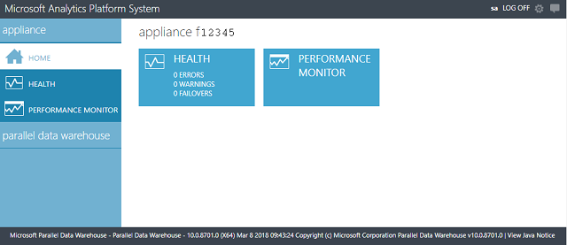

# Monitor the appliance with the Admin Console - Analytics Platform System
The Admin Console is a SQL Server PDW web application that surfaces the appliance state, health, and performance information. Users connect to the Admin Console through Internet Explorer.  
  
## About the Admin Console  
  
  
**Appliance**  
Home  
Provides a quick summary of the appliance state.  
  
Health  
Displays the appliance topology with indicators showing the health of each monitored component within each node. Allows you to view the current status of individual nodes and properties of the node components.  
  
Displays hardware and software alerts.  
  
Performance Monitor  
Displays performance monitor graphs.  
  
**Parallel Data Warehouse**  
Home  
Provides a quick summary of the PDW state.  
  
Sessions  
Displays active PDW user sessions. This can help for monitoring resource contention.  
  
Queries  
Displays a list of running queries and recently completed queries. It displays related errors, if any. Also provides the ability to view details of the query execution plan and node execution information.  
  
Loads  
Displays load plans, the current state of PDW loads, and related errors, if any.  
  
Backups/Restores  
Displays a log of PDW backup and restore operations.  
  
Health  
Displays the PDW topology with indicators showing the health of each monitored component within each node. Allows you to view the current status of individual nodes and properties of the node components.  
  
Displays hardware and software alerts.  
  
Resources  
Displays a list of PDW resource locks and their current status.  
  
Storage  
Summarizes the PDW storage utilization.  
  
Performance Monitor  
Displays PDW performance monitor graphs.  
 
> [!NOTE]  
> The admin console has a 1024x768 screen resolution. The admin console displays best with a screen resolution of 1280 X 1024 or higher.  
  
## Connect to the Admin Console  
To connect to the Admin Console, requires:  
  
-   At least Internet Explorer version 10.  
  
-   Permissions to access the Admin Console. <!-- MISSING LINKS See [Grant Permissions to Use the Admin Console &#40;SQL Server PDW&#41;](../sqlpdw/grant-permissions-to-use-the-admin-console-sql-server-pdw.md).  -->  
  
-   The IP address of the Control node cluster.  Obtain this from your SQL Server PDW administrator.  
  
To connect to the Admin Console, use Internet Explorer and https to browse to the IP address of the Control node cluster. For example, if the IP address of the Control node cluster is `10.192.63.102`, enter `https://10.192.63.102` in your browser address bar. The first screen will request your **LOGIN** and **PASSWORD**. Provide either a SQL Server Authentication login and password, or a Windows Authentication login and Windows password. If using a Windows Authentication login, the Admin Console will use impersonation.  
  
## Admin Console Tasks  
The Admin Console provides the ability to monitor the following:  
  
|Information Type|How to Access in the Admin Console|
|-|-|
|Overall status of the appliance|Click **Appliance State** in the top menu, or **Home**.|  
|Alerts|Click **Alerts**. For more information, see [Understanding Admin Console Alerts &#40;Analytics Platform System&#41;](understanding-admin-console-alerts.md).|  
|Appliance components and their status|Click **Appliance State** in the top menu, or **Home**.|  
|Monitor requests (including queries, loads, backups, and restores)|Click **Sessions** to see currently active or recent sessions.  Click **Queries** to see currently active or recent queries. The information displayed for queries includes loads, backups, and restores.  Click **Locks** to see active locks.|  
|Monitor additional information for loads, backups, and restores.|Click **Loads** or **Backups/Restores**.|  
|Performance information|Click **Performance Monitor**.|  
  
## See Also  
[Appliance Monitoring &#40;Analytics Platform System&#41;](appliance-monitoring.md)  
  
