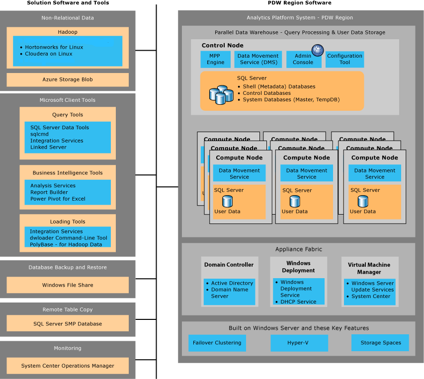

# Parallel Data Warehouse components - Analytics Platform System
This article explains the appliance software and the non-appliance software components of Analytics Platform System.  
  
<!-- MISSING LINKS

To learn more about Analytics Platform System, see:  
  
-   [Analytics Platform System architecture](architecture-overview.md)  
  
-   [Distributed and Replicated Tables &#40;SQL Server PDW&#41;](../sqlpdw/distributed-and-replicated-tables-sql-server-pdw.md)  
  
-   [PolyBase &#40;SQL Server PDW&#41;](../sqlpdw/polybase-sql-server-pdw.md)  
  
-   [Clustered Columnstore Indexes &#40;SQL Server PDW&#41;](../sqlpdw/clustered-columnstore-indexes-sql-server-pdw.md)  
  
-   [Query Process &#40;SQL Server PDW&#41;](../sqlpdw/query-process-sql-server-pdw.md)  
  
-   [Minimum and Maximum Values &#40;SQL Server PDW&#41;](../sqlpdw/minimum-and-maximum-values-sql-server-pdw.md)  

-->
   
  
  
  
## Appliance Software - Query Processing and User Data Storage  
  
### Control Node  
MPP Engine  
The MPP Engine is the brains of the Massively Parallel Processing (MPP) system. It does the following:  
  
-   Creates parallel query plans and coordinates parallel query execution on the Compute nodes.  
  
-   Stores and coordinates metadata and configuration data for all of the databases.  
  
-   Manages SQL Server PDW database authentication and authorization.  
  
-   Tracks hardware and software status.  
  
### Data Movement Service (DMS)  
Data Movement Service (DMS) is part of the "secret sauce" of PDW. It does the following:  
  
-   Transfers data to and from the SQL Server PDW nodes.  
  
-   Processes query operations that require transferring data among the nodes.  
  
-   Improves query performance by optimizing data transfer speeds.  
  
### Admin Console  
The Admin Console is a web application that presents the appliance state, health, and performance information.  
  
### Configuration Manager  
The Configuration Manager (dwconfig.exe), is the tool that appliance administrators use to configure Analytics Platform System.  
  
### Control node databases  
SQL Server manages all of the databases on the Control node.  
  
-   The Shell database manages the metadata for all distributed user databases.  
  
-   TempDB contains the metadata for all user temporary tables across the appliance.  
  
-   Master is the master table for SQL Server on the Control node.  
  
### Compute Node  
The Compute nodes are parallel data processing and storage units. They have direct attached storage and use SQL Server to manage user data.  
  
### Data Movement Service (DMS)  
Data Movement Service (DMS) runs on each Compute node to do the following:  
  
-   As part of processing parallel queries, DMS transfer data to and from other Computer nodes and the Control node.  
  
-   DMS, running on each Compute node, receives data loads in parallel. Data is loaded in parallel directly from the loading server to the Compute nodes  
  
-   DMS transfers data from each Compute node directly to the backup server.  
  
-   Using PolyBase, DMS transfers data to and from an external Hadoop cluster or Azure Storage Blob.  
  
### Compute node databases 
Each Compute node runs an instance of SQL Server to process queries and manage user data.  
  
## Appliance Fabric  
The appliance fabric provides the operating system, services, and network infrastructure for the appliance.  
  
### Domain Controller  
Active Directory (AD) Domain Services (DS)  
Analytics Platform System performs authentication among the Analytics Platform System nodes, and manages the authentication of SQL Server PDW Windows Authentication logins.  
  
DNS service  
Windows Domain Name Service (DNS) resolves domain names to IP addresses for the Analytics Platform System appliance.  
  
### Windows Deployment Service  
Windows Deployment Service (WDS) deploys the Windows Server operating system onto the appliance. It is deployed on every host and virtual machine across the appliance.  
  
The DHCP service creates IP addresses so that the hosts within the appliance domain can join the appliance network without having a pre-configured IP address.  
  
### Virtual Machine Manager  
Analytics Platform System uses virtualization to achieve high availability. The Virtual Machine Manager hosts System Center to deploy the operating system on the physical hosts.  
  
Windows Server Update Services (WSUS) to apply or remove Windows Updates across all of the hosts and virtual machines.  
  
### Windows Server  
All of the hosts and virtual machines in the appliance run Windows Server operating system.  
  
### Failover Clustering  
Windows Failover Clustering provides the ability to restart processes on a passive host in the event that a host fails.  
  
### Storage Spaces  
Windows Storage Spaces manages user data as a storage pool for a small group of Compute nodes. If a Compute node fails, the data is still accessible through another Compute node in the group.  
  
### Hyper-V  
Microsoft Hyper-V Server provides a simple and reliable virtualization solution. Analytics Platform System uses virtualizations to balance CPU resources and to provide high availability for the PDW nodes and appliance fabric components.  
  
## Non-relational data
PolyBase technology integrates SQL Server PDW data with external Hadoop data. The Hadoop data can be stored on any of these Hadoop Data sources:  
  
-   Hortonworks Hadoop Distribution  
  
-   Cloudera Distribution of Hadoop  
  
-   HDInsight data stored on Azure Storage Blob  
  
## Query Tools   
  
Queries are written with Transact\-SQL modified to fit the MPP nature of the queries. All queries are submitted to the Control node, which generates a parallel query plan to run the query across the Compute nodes.  
  
### SQL Server Data Tools (SSDT)  
SQL Server Data Tools runs inside of Visual Studio and is our recommended GUI tool for submitting queries to SQL Server PDW. It is similar to SQL Server Management Studio by allowing you to navigate through an object explorer.  
  
If you don't already have Visual Studio, you can download the tools that you need for free. 
<!-- MISSING LINKS
For more information, see [Install SQL Server database tooling  for Visual Studio &#40;SQL Server PDW&#41;](../sqlpdw/install-sql-server-database-tooling-for-visual-studio-sql-server-pdw.md).  
-->
  
### sqlcmd Command-Line Query Tool  
sqlcmd is the SQL Server command-line tool for running Transact\-SQL statements and system commands. It works with SQL Server PDW and is our recommended command-line tool for querying SQL Server PDW. With sqlcmd you can run Transact\-SQL statements interactively from the command-line, as a batch file, or from Windows PowerShell.  
  
<!-- MISSING LINKS

If you don't have SQL Server, you can download this as a standalone package. For more information, see [Install sqlcmd Command-Line Client &#40;SQL Server PDW&#41;](../sqlpdw/install-sqlcmd-command-line-client-sql-server-pdw.md) 
--> 
  
### Integration Services  
You can use Integration Services to query SQL Server PDW. 

<!-- MISSING LINKS
For more information, see [Connect With SQL Server Integration Services for Querying &#40;SQL Server PDW&#41;](../sqlpdw/connect-with-sql-server-integration-services-for-querying-sql-server-pdw.md). 

--> 
  
### Linked Server  
By using a SQL Server linked server connection, you can use SQL Server to submit Transact\-SQL statements to SQL Server PDW. 
<!-- MISSING LINKS
For more information, see [Connect With SQL Server Linked Server &#40;SQL Server PDW&#41;](../sqlpdw/connect-with-sql-server-linked-server-sql-server-pdw.md). 
--> 
  
## Business Intelligence Tools
  
### Analysis Services  
SQL Server PDW is a valid data source for Analysis Services databases and Excel PowerPivot models. Using the OLE DB provider, you can configure an Analysis Services cube to use either multidimensional online analytical processing (MOLAP) or relational online analytical processing (ROLAP) storage.  
  
<!-- MISSING LINKS
For more information, see [Connect With SQL Server Analysis Services &#40;SQL Server PDW&#41;](../sqlpdw/connect-with-sql-server-analysis-services-sql-server-pdw.md).  

-->
  
### Report Builder  
You can use SQL Server PDW as a SQL Server data source for reports that you develop for Reporting Services by using SQL Server Report Builder. You can also use SQL Server PDW as a SQL Server source for report models. By using Report Manager or the report server API, you can generate a model from a SQL Server PDW database.  
  
<!-- MISSING LINKS

For more information, see [Connect With SQL Server Report Builder &#40;SQL Server PDW&#41;](../sqlpdw/connect-with-sql-server-report-builder-sql-server-pdw.md) and [Connect With SQL Server Reporting Services &#40;SQL Server PDW&#41;](../sqlpdw/connect-with-sql-server-reporting-services-sql-server-pdw.md). 

--> 
  
### Power Pivot for Excel  
You can connect to SQL Server PDW with PowerPivot for Excel, a free download that significantly expands the data analysis capabilities of Excel.  
  
<!-- MISSING LINKS

For more information, see [Connect With PowerPivot for Excel &#40;SQL Server PDW&#41;](../sqlpdw/connect-with-powerpivot-for-excel-sql-server-pdw.md).  

-->
  
## Loading Tools 
  
### Integration Services  
Install PDW-specific destination adapters that allow you to use SQL ServerIntegration Services to load data into SQL Server PDW.  

<!-- MISSING LINKS
For more information, see [Install Integration Services Destination Adapters &#40;SQL Server PDW&#41;](../sqlpdw/install-integration-services-destination-adapters-sql-server-pdw.md). 
--> 
  
### dwloader Command-Line Loader  
dwloader is a command-line loading tool that loads data in parallel from your loading server to the SQL Server PDW Compute nodes. 

<!-- MISSING LINKS
For more information, see [Install dwloader Command-Line Loader &#40;SQL Server PDW&#41;](../sqlpdw/install-dwloader-command-line-loader-sql-server-pdw.md)  
-->
  
### PolyBase for Hadoop Integration  
With PolyBase technology, you can load non-relational data from a Hadoop Cluster into a relational table in SQL Server PDW. The Hadoop data can be located in an external Hadoop Cluster or in an Azure Storage Blob.  

<!-- MISSING LINKS
For more information, see [PolyBase &#40;SQL Server PDW&#41;](../sqlpdw/polybase-sql-server-pdw.md).
-->  
  
## Database Backup and Restore  
SQL Server PDW uses Transact-SQL database backup and restore commands to backup and restore user databases, in parallel, to and from a backup server. SQL Server PDW writes the backup to a directory in a Windows file share, and then likewise restores data from a Windows file share.  
  
For more information, see [Plan for Backup and Loading Hardware](backup-and-loading-hardware.md) and [Backup and Restore Overview](backup-and-restore-overview.md)  
  
## Remote Table Copy  
The Remote Table Copy feature allows you to copy tables from SQL Server PDW databases to remote (non-appliance) SMP SQL Server databases. This enables hub and spoke scenarios for SQL Server PDW.  
  
<!-- MISSING LINKS

For more information, see [Remote Table Copy &#40;SQL Server PDW&#41;](../sqlpdw/remote-table-copy-sql-server-pdw.md).  

-->
  
## Monitoring  
Analytics Platform System has several ways to monitor appliance activity  
  
### Admin Console  
The Admin Console allows you to view current status about the appliance health. This runs as a web application on the Control node and is accessible over https.  
  
For more information, see [Monitor the Appliance by Using the Admin Console &#40;Analytics Platform System&#41;](monitor-the-appliance-by-using-the-admin-console.md)  

### System Views  
The Admin Console is based on system view queries. You can query the system views individually to get the specific piece of information you need.  

For more information, see [Monitor the Appliance by Using System Views &#40;Analytics Platform System&#41;](monitor-the-appliance-by-using-system-views.md) 
  
### System Center Operations Manager  
There are System Center Operations Manager (SCOM) Management Packs for SQL Server PDW. 

To configure the appliance for SCOM, see [Monitor the Appliance by Using System Center Operations Manager &#40;Analytics Platform System&#41;](monitor-the-appliance-by-using-system-center-operations-manager.md)  
  
