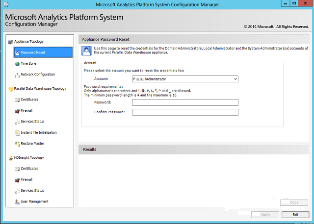

# Password reset - Analytics Platform System
The **Password Reset** page enables you to change the password for the administrator accounts used by Analytics Platform System.  
  
> [!WARNING]  
> Always use the **Configuration Manager** to update the appliance domain administrator password. Other methods might not update all components of Analytics Platform System and could cause appliance access problems.  
  
You are given the Analytics Platform System passwords when the appliance is delivered. Always change the passwords to new values when you take responsibility for your appliance. There are three passwords to update. The passwords do not have to be the same as each other.  
  
**F<*xxxx*>\Administrator**  
The **Administrator** of the appliance domain.  
  
**.\Administrator**  
The local **Administrator** account on the computers that host the virtual machines.  
  
> [!IMPORTANT]  
> For appliance update 1, **Configuration Manager** does not properly change the password of the local administrator accounts throughout the PDW VM's. If this is necessary, contact CSS for additional instructions.  
  
**sa**  
The **sa** login in SQL Server. **sa** is a member of the **sysadmin** fixed server role and is a SQL Server administrator. The password of the **sa** login can also be changed by using the **ALTER LOGIN** statement.  
  
## Password Requirements  
Both the domain administrator credentials and the system administrator credentials adhere to the password strength policies for each type of credential. When changing the domain administrator credentials, the new password is updated to the domain where needed throughout SQL Server PDW.  
  
> [!IMPORTANT]  
> SQL Server PDW does not support the dollar sign character (**$**) in the domain administrator or local administrator passwords. The characters **^ % &** are permitted in passwords, however PowerShell regards these as special characters. If any of these characters are used in passwords for the system administrator or SQL Server**sa** accounts (the **AdminPassword** and **PdwSAPassword** parameters during setup) then setup, including INSTALL, UPGRADE, REPLACENODE, and PATCHING, will fail. To ensure a successful upgrade when current passwords contain unsupported characters, change these passwords so that they do not contain such characters before running upgrade. After upgrade completes, you can set these passwords back to their original values. For more information about password requirements, see [ALTER LOGIN](../t-sql/statements/alter-login-transact-sql.md).  
  
## To reset a password  
  
1.  Connect to the Control node and launch the **Configuration Manager** (**dwconfig.exe**). For more information, see [Launch the Configuration Manager &#40;Analytics Platform System&#41;](launch-the-configuration-manager.md).  
  
2.  In the left pane of the **Configuration Manager**, click **Password Reset**.  
  
3.  Select the administrator type from the **Account** drop-down menu, and then enter the new password in the **Password** and **Confirm Password** boxes. Click **Apply** to save your changes.  
  
    Changes you make to these accounts do not affect any currently active sessions, but will be applied at the next logon attempt for each user.  
  
      
  
## See Also  
[Set Admin Password for Logging on to AD Nodes in Directory Services Restore Mode &#40;DSRM&#41; &#40;Analytics Platform System&#41;](set-admin-password-for-logging-on-to-ad-nodes-in-directory-services-restore-mode.md)  
[Launch the Configuration Manager &#40;Analytics Platform System&#41;](launch-the-configuration-manager.md)  
  
