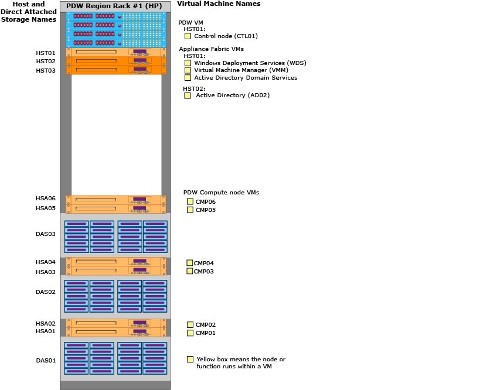

# Appliance physical components - Analytics Platform System
Names and descriptions for the PDW and appliance fabric physical components. 
  
<!-- MISSING LINKS See also [HDInsight Physical Components &#40;Analytics Platform System&#41;](hdinsight-physical-components.md).  -->  
  
## Component Diagrams  
This shows the names of the physical components and where they are located in the first rack of a 6-Compute node appliance.  
  
  
  
The actual name for PDW components is the PDW Region name, followed by a dash, followed by the component name. For example, if the PDW Region name is PDW123, the actual names are **PDW123-CTL01**, **PDW123-CMP01**, etc.  
  
Similarly, the actual name for appliance fabric components is the appliance domain, followed by a dash, followed by the component name. For example, if the appliance domain is FSW123, the appliance fabric VMs are **FSW123-WDS**, **FSW123-AD01**, **FSW123-VMM**, etc.  
  
Here is a consolidated view of a PDW Region with 6 Compute nodes.  
  
  
  
## PDW Components  
The PDW virtual machines are part of the PDW Region.  
  
*PDW_region*-CTL01  
A virtual machine that runs the Control node. This runs on HST01 and can fail over to HST02.  
  
> [!WARNING]  
> SQL Server PDW does not support the creation of a snapshot of the CTL01 virtual machine by using Hyper-V Manager. Snapshots rely upon local storage, which will cause errors if the virtual machine attempts to failover to its backup. Creating a snapshot can also cause reliability issues with the other VM's that failover to the passive server.  
  
*PDW_region*-CMP01 through *PDW_Region*-CMP06  
A virtual machine that runs the Compute node. In this 6-Compute node diagram, the hosts HSA01 through HSA06 run Compute node VMs CMP01 through CMP06 respectively.  
  
## Appliance Fabric Components  
These components are part of the appliance fabric.  
  
### Virtual Machines  
*appliance_domain*-WDS  
This virtual machine hosts Windows Deployment Services (WDS), which Analytics Platform System uses deploy Windows operating systems over the appliance network. It also hosts the DHCP service, which allows the appliance hosts to join the appliance network without having a pre-configured IP address.  
  
The *appliance_domain*-WDS virtual machine runs on HST01 and can fail over to HST02. The WDS virtual machine and the VMM virtual machine, deploy Windows on the physical hosts during the appliance install. During the appliance lifecycle, WDS and VMM perform operations such as replacing a host.  
  
*appliance_domain*-VMM  
The Virtual Machine Manager (VMM) runs in a virtual machine and can fail over to HST02. VMM hosts System Center to deploy the operating system on the physical hosts. The VMM also provides Windows Server Update Services (WSUS) to apply or remove Windows Updates across all of the hosts and virtual machines.  
  
*appliance_domain*-AD01, *appliance_domain*-AD02  
Active Directory Domain Services, which contains the Domain Name System (DNS), runs in a virtual machine on both HST01 and HST02. For high availability of the appliance, AD01 and AD02 are replicated domain controllers and they do not failover. If one fails, the other one is already available with the correct data.  
  
*appliance_domain*-ISCSI01  
One ISCSI virtual machine runs on each of the hosts with storage attached (HSA01-HSA06). This VM does not failover.  
  
### Hosts  
*appliance_domain*-HST01 through *appliance_domain*-HST06  
The hosts for the PDW Control node and appliance fabric virtual machines. HST03 is an optional passive host.  
  
*appliance_domain*-HSA01 through *appliance_domain*-HSA08  
The hosts with storage attached (HSA). Each HAS host runs one Compute node VM and one ISCSI VM.  
  
### Cluster for PDW  
*appliance_domain*-WFOHST01  
The PDW cluster is named WFOHST01. It manages all of the physical hosts and virtual machines that belong to PDW.  
  
### Direct Attached Storage  
*appliance_domain*-DAS01 through *appliance_domain*-DAS03  
This is the direct attached storage that is connected to the Compute nodes. HP has one DAS for every two Compute nodes. Dell and Quanta have one DAS for every three Compute nodes.  
  
## See Also  
<!-- MISSING LINKS [Hardware Configurations &#40;Analytics Platform System&#41;](../architecture/hardware-configurations.md)  -->  
[Appliance Configuration &#40;Analytics Platform System&#41;](appliance-configuration.md)  
[Appliance Management Tasks &#40;Analytics Platform System&#41;](appliance-management-tasks.md)  
  
