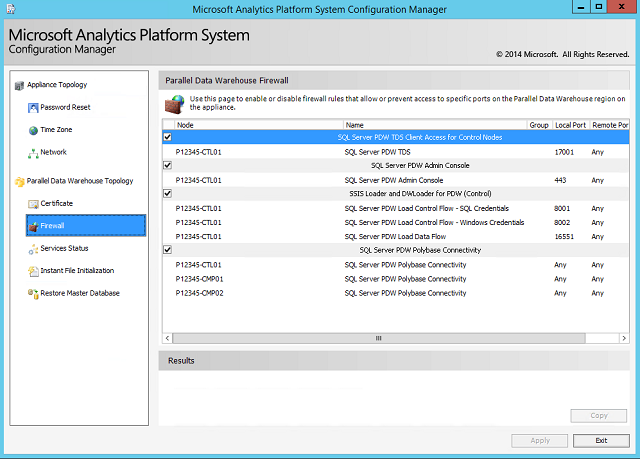

# Parallel Data Warehouse firewall configuration in Analytics Platform System
The **Firewall** page of the SQL Server PDW Configuration Manager enables you to enable or disable firewall rules that allow or prevent access to specific ports on the Analytics Platform System appliance.  
  
## To manage ports and firewall rules for appliance nodes  
  
1.  Launch the Configuration Manager. For more information, see [Launch the Configuration Manager &#40;Analytics Platform System&#41;](launch-the-configuration-manager.md).  
  
2.  In the left pane of the Configuration Manager, expand **Parallel Data Warehouse Topology**, and then click **Firewall**.  
  
3.  Locate the port or firewall rule to update in the configuration list, and then select or clear the box next to that item. Only SQL Server PDW admin-configurable options are shown in this list, including opening and closing ports on externally facing nodes.  
  
4.  Click **Apply** to save your changes.  
  
  
  
## External Ports  
The following ports are opened for client connections coming from outside of PDW.  
  
|Purpose|Port #|Nodes|  
|-----------|-----------|---------|  
|SQL Client access for PDW (TDS)|17001|CTL|  
|Loader Client access (dwloader & SSIS)|8001|CTL|  
|Remote desktop access|3389|CTL, CMP|  
|SSIS BinaryLoaderDataChannel|16551|CTL|  
|dwloader BinaryLoaderDataChannel|16551|CMP|  
|SSL encrypted connections (For internal communications, to access the Admin Console)|443|All nodes|  
|SQL Server PDW Load Control Flow - Windows Credentials|8002|CTL|  
|_Kerberos|88|AD01 and AD02,|  
|_ldap|389|AD01 and AD02|  
  
## Internal Ports  
The following ports are used by PDW for internal communication, but are not opened for connections coming from outside of the PDW appliance.  
  
|Purpose|Port #|Nodes|  
|-----------|-----------|---------|  
|DMS Control Channel traffic|16450|CTL, CMP|  
|DMS Data Channel traffic|16550|CTL, CMP|  
|Internal Diagnostics|16650|CTL, CMP|  
|Failover status (DMS)|15000|CTL, CMP|  
|Failover status (Engine)|15001|CMP|  
|Dynamic (ephemeral) port range|20000-65535|CTL, CMP|  
|SQL Server port ranges (TDS)|1433, 1500-1508|CTL, CMP|  
  
> [!NOTE]  
> Creating external tables or external data sources uses TCP port 8020 by default. These statements can be configured to use other ports instead. The Hortonworks JOB_TRACKER_LOCATION default port is 50300. Integrating with other systems and tools may require additional ports.  
  
<!-- MISSING LINKS ## See Also  
[HDInsight Firewall Configuration &#40;Analytics Platform System&#41;](hdinsight-firewall-configuration.md)  -->  
  
