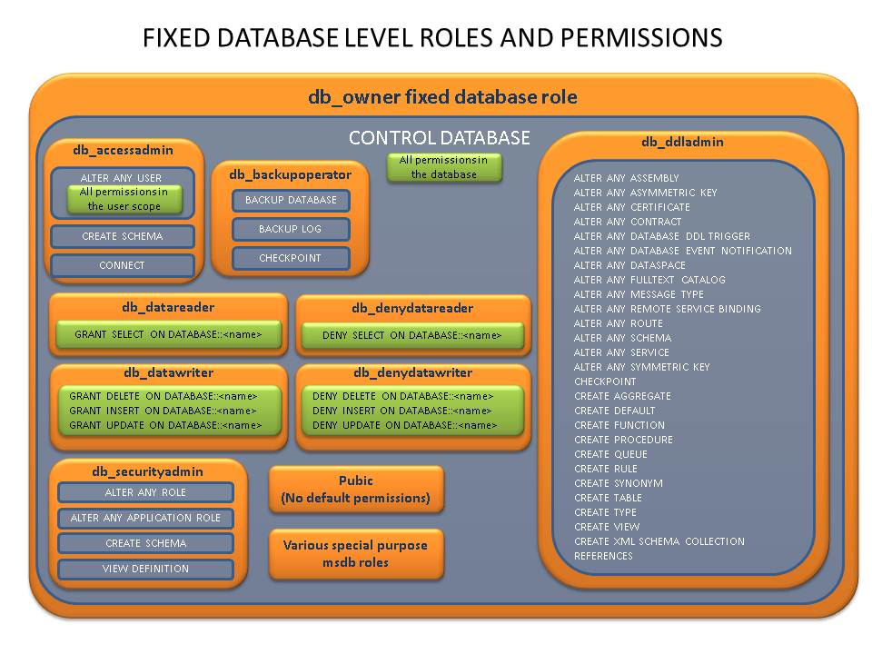

# Managing permissions in Parallel Data Warehouse
This article describes the requirements and options for managing database permissions for SQL Server PDW.

## <a name="BackupRestoreBasics"></a>Database Engine Permission Basics
Database Engine permissions on SQL Server PDW are managed at the server level through logins, and at the database level through database users and user-defined database roles.

**Logins**
Logins are individual user accounts for logging on to the SQL Server PDW. SQL Server PDW supports logins using Windows Authentication and SQL Server authentication.  Windows Authentication logins can be Windows users or Windows groups from any domain that is trusted by SQL Server PDW. SQL Server Authentication logins are defined and authenticated by SQL Server PDW and must be created by specifying a password.

Members of the **sysadmin** fixed server role (such as the **sa** login) can connect to a database without having being mapped to a database user. They are mapped to the **dbo** user. The owner of the database is also mapped as the **dbo** user.

**Server Roles**
There are four special server roles with a set of preconfigured roles that provide convenient group of server-level permissions. The **sysadmin**, **MediumRC**, **LargeRC**, and **XLargeRCfixed** server roles are the only server roles currently implemented in SQL Server PDW. The **sa** login is the only member of the **sysadmin** fixed server role, and additional logins cannot be added to the **sysadmin** role. Logins can be granted the **CONTROL SERVER** permission, which is similar, though not identical, to the **sysadmin** fixed server role. Use [ALTER SERVER ROLE](../t-sql/statements/alter-server-role-transact-sql.md) to add members to the other server roles. SQL Server PDW does not support user-defined server roles.

**Database Users**
Logins are granted access to a database by creating a database user in a database and mapping that database user to a login. Typically the database user name is the same as the login name, though it does not have to be the same. Each database user maps to a single login. A login can be mapped to only one user in a database, but can be mapped as a database user in several different databases.

**Fixed Database Roles**
Fixed database roles are a set of preconfigured roles that provide convenient group of database-level permissions. Database users and user-defined database roles can be added to the fixed database roles using the [sp_addrolemember](../relational-databases/system-stored-procedures/sp-addrolemember-transact-sql.md) procedure. For more information about fixed database roles, see [Fixed Database Roles](#fixed-database-roles).

**User-defined Database Roles**
Users with the **CREATE ROLE** permission can create new user-defined database roles to represent groups of users with common permissions. Typically permissions are granted or denied to the entire role, simplifying permissions management and monitoring.

Permissions are granted to security principals (logins, users, and roles) by using the **GRANT** statement. Permissions are explicitly denied by using the **DENY** command. A previously granted or denied permission is removed by using the **REVOKE** statement. Permissions are cumulative, with the user receiving all the permissions granted to the user, login, and any group memberships; however any permission denial overrides all grants. <!-- MISSING LINKS (For information, syntax, and available permissions with these commands, see [Permissions: GRANT, DENY, REVOKE &#40;SQL Server PDW&#41;](../sqlpdw/permissions-grant-deny-revoke-sql-server-pdw.md)).  -->

The following example represents a common and recommended method of configuring permissions.

1.  If using Windows Authentication, create a login for each Windows user or Windows group who will connect to SQL Server PDW. If using SQL Server Authentication, create a login for each person who will connect to SQL Server PDW.

2.  Create a database user for each login in all necessary databases.

3.  Create one or more user-defined database roles, each representing a similar function. For example financial analyst, and sales analyst.

4.  Add database users to one or more user-defined database roles.

5.  Grant permissions to the user-defined database roles.

Logins are server-level objects and can be listed by viewing [sys.server_principals](../relational-databases/system-catalog-views/sys-server-principals-transact-sql.md). Only server-level permissions can be granted to server principals.

Users and database roles are database-level objects and can be listed by viewing [sys.database_principals](../relational-databases/system-catalog-views/sys-database-principals-transact-sql.md). Only database-level permissions can be granted to database principals.

## <a name="BackupTypes"></a>Default Permissions
The following list describes the default permissions:

-   When a login is created by usings **CREATE LOGIN** statement, the login receives the **CONNECT SQL** permission allowing the login to connect to the SQL Server PDW.

-   When a database user is created by using the **CREATE USER** statement, the user receives the **CONNECT ON DATABASE::**_<database_name>_ permission, allowing the login to connect to that database as a user.

-   All principals, including the PUBLIC role, have no explicit or implicit permissions by default because implicit permissions are inherited from explicit permissions. Therefore, when no explicit permissions are present, there can also be no implicit permissions.

-   When a login becomes the owner of an object or database, the login always has all permissions on the object or database. The ownership permissions are not visible as explicit permissions. The **GRANT**, **REVOKE**, and **DENY** statements have no effect on ownership permissions. Ownership can be changed by using the [ALTER AUTHORIZATION](../t-sql/statements/alter-authorization-transact-sql.md) statement.

-   The sa login has all permissions on the appliance. Similar to ownership permissions, the sa permissions cannot be changed and are not visible as explicit permissions. The **GRANT**, **REVOKE**, and **DENY** statements have no effect on sa permissions.

-   The PUBLIC server role receives no permissions by default and does not inherit permissions from other server roles. The PUBLIC server role can be given explicit permissions with the **GRANT**, **REVOKE**, and **DENY** statements.

-   Transactions do not require permissions. All principals can run the **BEGIN TRANSACTION**, **COMMIT**, and **ROLLBACK** transaction commands. However, a principal must have the appropriate permissions to run each statement within the transaction.

-   The **USE** statement does not require permissions. All principals can run the **USE** statement on any database, however to access a database they must have a user principal in the database or the guest user must be enabled.

### The PUBLIC Role
All new appliance logins automatically belong to the PUBLIC role. The PUBLIC server role has the following characteristics:

-   The PUBLIC server role has no permissions by default.

-   All principals are members of the PUBLIC server role, and the PUBLIC server role is not a member of another server role.

-   The PUBLIC server role cannot inherit implicit permissions. Any permissions given to the PUBLIC role must be explicitly granted.

## <a name="BackupProc"></a>Determining Permissions
Whether or not a login has permission to perform a specific action depends on the permissions granted or denied to login, user, and roles the user is a member of. Server-level permissions (such as **CREATE LOGIN** and **VIEW SERVER STATE**) are available to server-level principals (logins). Database-level permissions (such as **SELECT** from a table or **EXECUTE** on a procedure) are available to database-level principals (users and database roles).

### Implicit and Explicit Permissions
An *explicit permission* is a **GRANT** or **DENY** permission given to a principal by a **GRANT** or **DENY** statement. Database-level permissions are listed in the [sys.database_permissions](../relational-databases/system-catalog-views/sys-database-permissions-transact-sql.md) view. Server-level permissions are listed in the [sys.server_permissions](../relational-databases/system-catalog-views/sys-server-permissions-transact-sql.md) view.

An *implicit permission* is a **GRANT** or **DENY** permission that a principal (login or server role) has inherited. A permission can be inherited in the following ways.

-   A principal can inherit a permission from a role if the principal is a member of the role even if the principal does not have an explicit **GRANT** or **DENY** permission.

-   A principal can inherit a permission on a subordinate object (such as a table) if the principal has a permission on one of the objects parent scopes (such as the  schema of the table or the permission on the entire database).

-   A principal can inherit a permission by having a permission that includes a subordinate permission. For example the **ALTER ANY USER** permission includes the both the **CREATE USER** and the **ALTER ON USER::**_\<name\>_ permissions.

### Determining Permissions When Performing Actions
The process of determining which permission to assign to a principal is complex. The complexity occurs when determining implicit permissions because principals can be members of multiple roles and permissions can be passed through multiple levels in the role hierarchy.

The following list describes general rules for determining permissions:

-   Ownership implies permission.

    An object owner has all permissions on the object. Likewise, a database owner has all permissions on the database and all permissions on the objects in the database. These permissions cannot be changed.

-   Permissions can be inherited across multiple levels in the hierarchy of server role memberships.

    For example, suppose you have the following situation:

    -   Login David is a member of database role PerfAnalysts.

    -   PerfAnalysts is a member of database role Production.

    -   David and PerfAnalysts have no **SELECT** permission on the Customer table. The permission was either revoked or never explicitly granted.

    -   Production has **SELECT** permission on the Customer table.

    In this case, PerfAnalysts will inherit **GRANT** permission on the Customer table from Production, and David will inherit **GRANT** permission on the Customer table from Production.

-   **DENY** overrides **GRANT** when permissions conflict.

    For example, suppose login David has no permissions on the Customer table and is a member of two database roles -dbgroup1, which has **DENY** permission on the Customer table, and dbgroup2, which has **GRANT** permission on the Customer table. In this case, David will inherit the **DENY** permission on the Customer table. This is the case whether the roles gained their permissions explicitly or implicitly.

### Auditing Permissions
To research the permissions of a user check the following.

-   Execute the following query to determine which logins are system administrators.

    ```sql
    SELECT SPLogins.name, 'is a member of ', SPRoles.name 
    FROM sys.server_role_members AS SRM 
    JOIN sys.server_principals AS SPRoles 
        ON SRM.role_principal_id = SPRoles.principal_id 
    JOIN sys.server_principals AS SPLogins 
        ON SRM.member_principal_id = SPLogins.principal_id;
    ```

-   Execute the following query to determine which logins have been granted explicit permissions.

    ```sql
    SELECT name, 'has the ', state_desc , permission_name, ' permission'
    FROM sys.server_permissions AS SP
    JOIN sys.server_principals AS SPRoles 
        ON SP.grantee_principal_id = SPRoles.principal_id;
    ```

-   Execute the following query in a user database to determine which database users are members of a database role.

    ```sql
    SELECT DPUsers.name, 'is a member of ', DPRoles.name  
    FROM sys.database_role_members AS DRM
    JOIN sys.database_principals AS DPRoles 
        ON DRM.role_principal_id = DPRoles.principal_id
    JOIN sys.database_principals AS DPUsers
        ON DRM.member_principal_id = DPUsers.principal_id;
    ```

-   Execute the following query in a user database to determine which database users and roles have been granted or denied specific permissions. You will have to query additional views such as sys.objects and sys.schemas to identify the items described with the major_id.

    ```sql
    SELECT DPUsers.name, 'has the ', permission_name, 
    'permission on the item described as class = ', class, 'id = ', major_id
    FROM sys.database_permissions AS DP
    JOIN sys.database_principals AS DPUsers
        ON DP.grantee_principal_id = DPUsers.principal_id;
    ```

## <a name="RestoreProc"></a>Database Permissions Best Practices

-   Grant permissions at the most granular level that is practical. Granting permissions at the table or view level permissions could become unmanageable. But granting permissions at the database level could be too permissive. If the database is designed with schemas to define work boundaries, perhaps the granting permission to the schema is an appropriate compromise between the table level and the database level.

-   Grant permissions to roles, rather than to users or logins. Managing rights by using roles instead of users makes it easy to quickly grant or revoke a set of permissions for a user or login by moving them into or out of the role. When a function passes from one person to another, the permissions can remain intact at the role level while the role membership changes.

-   Grant permissions to roles based on job function, and on higher-level group roles that combine the job function roles based on the company group performing the actions.

-   Every end user should have a unique login. Do not allow users to share logins. Providing a login for each user ensures an audit trail and simplifies permission management.

## Fixed Database Roles
SQL Server provides pre-configured (fixed) database-level roles to help you manage the permissions on a server. The pre-configured roles are fixed in that you cannot change the permissions assigned to them. User-defined database roles can also be created. You can change the permissions assigned to user-defined database roles.

Roles are security principals that group other principals. Database roles are database-wide in their permissions scope. Database users and other database roles can be added as members of database roles. The fixed database roles cannot be added to each other. (*Roles* are like *groups* in the Windows operating system.)

There are 9 fixed database roles.

-   **db_owner**

-   **db_securityadmin**

-   **db_accessadmin**

-   **db_backupoperator**

-   **db_ddladmin**

-   **db_datawriter**

-   **db_datareader**

-   **db_denydatawriter**

-   **db_denydatareader**

### Permissions of the Fixed Database Roles
The system of fixed server roles and fixed database roles is a legacy system originated in the 1980's. Fixed roles are still supported and are useful in environments where there are few users and the security needs are simple. Beginning with SQL Server 2005, a more detailed system of granting permission was created. This new system is more granular, providing many more options for both granting and denying permissions. The extra complexity of the more granular system makes it harder to learn, but most enterprise systems should grant permissions instead of using the fixed roles. <!-- MISSING LINKS The permissions are discussed and listed in the topic [Permissions: GRANT, DENY, REVOKE &#40;SQL Server PDW&#41;](../sqlpdw/permissions-grant-deny-revoke-sql-server-pdw.md). -->The following chart shows the permissions that are associated with each fixed database role. All permissions in this SQL Server graphic are not available (or necessary) in APS.



### Related Content

-   To create user-defined roles, see [CREATE ROLE](../t-sql/statements/create-role-transact-sql.md).


## Fixed Server Roles
Fixed server roles are created automatically by SQL Server. SQL Server PDW has a limited implementation of SQL Server fixed server roles. Only the **sysadmin** and **public** have user logins as members. The **setupadmin** and **dbcreator** roles are used internally by SQL Server PDW. Additional members cannot be added or removed from any role.

### sysadmin Fixed Server Role
Members of the **sysadmin** fixed server role can perform any activity in the server. The **sa** login is the only member of the **sysadmin** fixed server role. Additional logins cannot be added to the **sysadmin** fixed server role. Granting the **CONTROL SERVER** permission approximates membership in the **sysadmin** fixed server role. The following example grants the **CONTROL SERVER** permission to a login named Fay.

```sql
USE master;
GO
GRANT CONTROL SERVER TO Fay;
```

> [!IMPORTANT]
> The **CONTROL SERVER** permission provides nearly complete control of SQL Server PDW. Whenever possible, provide more granular permissions to logins instead. For example, consider granting the **VIEW SERVER STATE**, **ALTER ANY LOGIN**, **VIEW ANY DATABASE**, or **CREATE ANY DATABASE** permissions.

### public Server Role
Every login that can connect to SQL Server PDW is a member of the **public** server role. All logins inherit the permissions granted to **public** on any object. Only assign **public** permissions on an object when you want the object to be available to all users. You cannot change membership in the **public** role.

> [!NOTE]
> **public** is implemented differently than other roles. Because all server principals are members of public, the membership of the **public** role is not listed in the **sys.server_role_members** DMV.

### Fixed Server Roles vs. Granting Permissions
The system of fixed server roles and fixed database roles is a legacy system originated in the 1980's. Fixed roles are still supported and are useful in environments where there are few users and the security needs are simple. Beginning with SQL Server 2005, a more detailed system of granting permission was created. This new system is more granular, providing many more options for both granting and denying permissions. The extra complexity of the more granular system makes it harder to learn, but most enterprise systems should grant permissions instead of using the fixed roles. <!-- MISSING LINKS The permissions are discussed and listed in the topic [Permissions: GRANT, DENY, REVOKE &#40;SQL Server PDW&#41;](../sqlpdw/permissions-grant-deny-revoke-sql-server-pdw.md).  -->

## Related Topics

- [Grant permissions](grant-permissions.md)

<!-- MISSING LINKS
## See Also
[Common Metadata Query Examples &#40;SQL Server PDW&#41;](../sqlpdw/common-metadata-query-examples-sql-server-pdw.md)
-->

