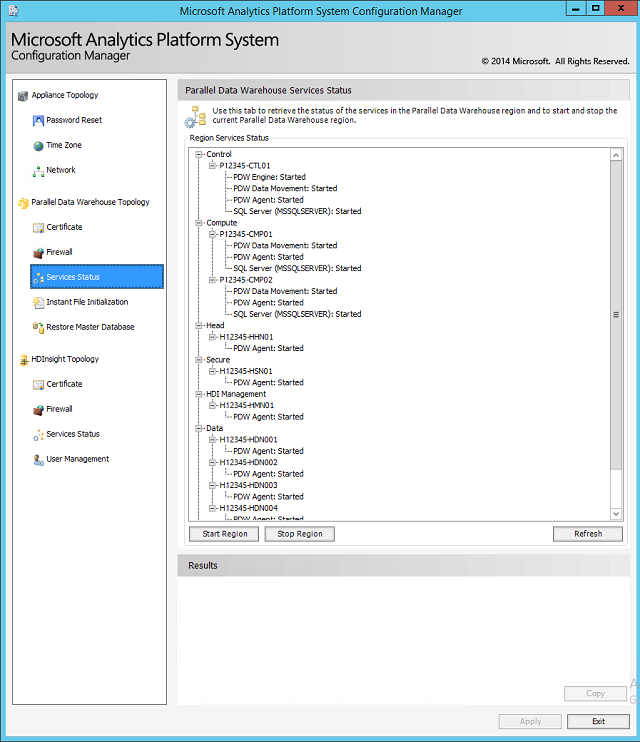

# Parallel Data Warehouse services status for Analytics Platform System
The Parallel Data Warehouse **Services Status** page in the Microsoft Analytics Platform System Configuration Manager shows the current status of all SQL Server PDW services, and provides the ability to stop and start the PDW services. This is the only supported method for starting and stopping the PDW services. Note that individual components or services cannot be started independently.  
  
#### To start or stop the appliance services  
  
1.  To start the appliance services, click **Start Appliance**.  
  
2.  To stop the appliance services, click **Stop Appliance**.  
  
It is not necessary to click **Apply** when starting and stopping the appliance services by using **Start Appliance** and **Stop Appliance**.  
  
  
  
> [!NOTE]  
> Stopping the PDW Region also stops the PDW agent (sqldwagent) on the nodes. The PDW agent requires the PDW control node to report health monitoring.  
  
## See Also  
[Power the APS Appliance On or Off &#40;Analytics Platform System&#41;](power-the-aps-appliance-on-or-off.md)  
  
