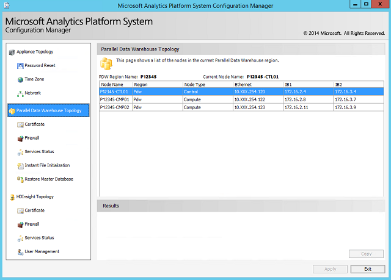

# PDW Topology
Displays name and network information about the SQL Server PDW components. Use the **Appliance Topology Network Configuration** page to change the network IP Addresses.  
  
  
  
## See Also  
[Launch the Configuration Manager &#40;Analytics Platform System&#41;](launch-the-configuration-manager.md)  
  
