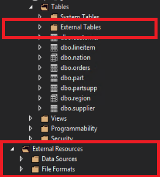

# Configure PolyBase to access external data in Azure Blob Storage

The article explains how to use PolyBase on a SQL Server instance to query external data in Azure Blob Storage.

> [!NOTE]
> APS currently only supports standard general purpose v1 locally redundant (LRS) Azure Blob Storage.

## Prerequisites

 - Azure Blob Storage in your subscription.
 - A container created in the Azure Blob Storage.

### Configure Azure Blob Storage connectivity

First, configure APS to use Azure Blob Storage.

1. Run [sp_configure](../relational-databases/system-stored-procedures/sp-configure-transact-sql.md) with 'hadoop connectivity' set to an Azure Blob Storage provider. To find the value for providers, see [PolyBase Connectivity Configuration](../database-engine/configure-windows/polybase-connectivity-configuration-transact-sql.md).

   ```sql  
   -- Values map to various external data sources.  
   -- Example: value 7 stands for Hortonworks HDP 2.1 to 2.6 on Linux,
   -- 2.1 to 2.3 on Windows Server, and Azure Blob Storage  
   sp_configure @configname = 'hadoop connectivity', @configvalue = 7;
   GO

   RECONFIGURE
   GO
   ```  

2. Restart APS Region using Service Status page on [Appliance Configuration Manager](launch-the-configuration-manager.md).
  
## Configure an external table

To query the data in your Azure Blob Storage, you must define an external table to use in Transact-SQL queries. The following steps describe how to configure the external table.

1. Create a master key on the database. It is required to encrypt the credential secret.

   ```sql
   CREATE MASTER KEY ENCRYPTION BY PASSWORD = 'S0me!nfo';  
   ```

1. Create a database scoped credential for Azure Blob Storage.

   ```sql
   -- IDENTITY: any string (this is not used for authentication to Azure storage).  
   -- SECRET: your Azure storage account key.  
   CREATE DATABASE SCOPED CREDENTIAL AzureStorageCredential
   WITH IDENTITY = 'user', Secret = '<azure_storage_account_key>';
   ```

1. Create an external data source with [CREATE EXTERNAL DATA SOURCE](../t-sql/statements/create-external-data-source-transact-sql.md)..

   ```sql
   -- LOCATION:  Azure account storage account name and blob container name.  
   -- CREDENTIAL: The database scoped credential created above.  
   CREATE EXTERNAL DATA SOURCE AzureStorage with (  
         TYPE = HADOOP,
         LOCATION ='wasbs://<blob_container_name>@<azure_storage_account_name>.blob.core.windows.net',  
         CREDENTIAL = AzureStorageCredential  
   );  
   ```

1. Create an external file format with [CREATE EXTERNAL FILE FORMAT](../t-sql/statements/create-external-file-format-transact-sql.md).

   ```sql
   -- FORMAT TYPE: Type of format in Azure Blob Storage (DELIMITEDTEXT,  RCFILE, ORC, PARQUET).
   -- In this example, the files are pipe (|) delimited
   CREATE EXTERNAL FILE FORMAT TextFileFormat WITH (  
         FORMAT_TYPE = DELIMITEDTEXT,
         FORMAT_OPTIONS (FIELD_TERMINATOR ='|',
               USE_TYPE_DEFAULT = TRUE)  
   ```

1. Create an external table pointing to data stored in Azure storage with [CREATE EXTERNAL TABLE](../t-sql/statements/create-external-table-transact-sql.md). In this example, the external data contains car sensor data.

   ```sql
   -- LOCATION: path to file or directory that contains the data (relative to HDFS root).  
   CREATE EXTERNAL TABLE [dbo].[CarSensor_Data] (  
         [SensorKey] int NOT NULL,
         [CustomerKey] int NOT NULL,
         [GeographyKey] int NULL,
         [Speed] float NOT NULL,
         [YearMeasured] int NOT NULL  
   )  
   WITH (LOCATION='/Demo/',
         DATA_SOURCE = AzureStorage,  
         FILE_FORMAT = TextFileFormat  
   );  
   ```

1. Create statistics on an external table.

   ```sql
   CREATE STATISTICS StatsForSensors on CarSensor_Data(CustomerKey, Speed)  
   ```

## PolyBase queries

There are three functions that PolyBase is suited for:  
  
- Ad hoc queries against external tables.  
- Importing data.  
- Exporting data.  

The following queries provide example with fictional car sensor data.

### Ad hoc queries  

The following ad hoc query joins relational with data in Azure Blob Storage. It selects customers who drive faster than 35 mph, joining structured customer data stored in SQL Server with car sensor data stored in Azure Blob Storage.  

```sql  
SELECT DISTINCT Insured_Customers.FirstName,Insured_Customers.LastName,
       Insured_Customers. YearlyIncome, CarSensor_Data.Speed  
FROM Insured_Customers, CarSensor_Data  
WHERE Insured_Customers.CustomerKey = CarSensor_Data.CustomerKey and CarSensor_Data.Speed > 35
ORDER BY CarSensor_Data.Speed DESC  
```  

### Importing data  

The following query imports external data into APS. This example imports data for fast drivers into APS to do more in-depth analysis. To improve performance, it leverages Columnstore technology in APS.  

```sql
CREATE TABLE Fast_Customers
WITH
(CLUSTERED COLUMNSTORE INDEX, DISTRIBUTION = HASH (CustomerKey))
AS
SELECT DISTINCT
      Insured_Customers.CustomerKey, Insured_Customers.FirstName, Insured_Customers.LastName,   
      Insured_Customers.YearlyIncome, Insured_Customers.MaritalStatus  
from Insured_Customers INNER JOIN   
(  
      SELECT * FROM CarSensor_Data where Speed > 35   
) AS SensorD  
ON Insured_Customers.CustomerKey = SensorD.CustomerKey  
```  

### Exporting data  

The following query exports data from APS to Azure Blob Storage. It can be used to archive relational data to Azure Blob Storage while still be able to query it.

```sql
-- Export data: Move old data to Azure Blob Storage while keeping it query-able via an external table.  
CREATE EXTERNAL TABLE [dbo].[FastCustomers2009] 
WITH (  
      LOCATION='/archive/customer/2009',  
      DATA_SOURCE = AzureStorage,  
      FILE_FORMAT = TextFileFormat
)  
AS
SELECT T.* FROM Insured_Customers T1 JOIN CarSensor_Data T2  
ON (T1.CustomerKey = T2.CustomerKey)  
WHERE T2.YearMeasured = 2009 and T2.Speed > 40;  
```  

## View PolyBase objects in SSDT  

In SQL Server Data Tools, external tables are displayed in a separate folder **External Tables**. External data sources and external file formats are in subfolders under **External Resources**.  
  
  

## Next steps

For more information about PolyBase, see the [What is PolyBase?](../relational-databases/polybase/polybase-guide.md). 

