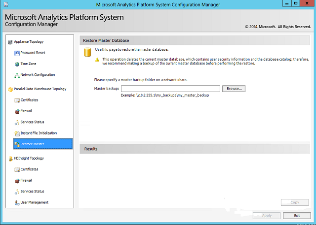

# Restore the master database in Analytics Platform System
The **Restore Master** page of the SQL Server PDW Configuration Manager enables you to restore the master database from a backup.  
  
## Before You Begin  
  
> [!IMPORTANT]  
> To perform the restore, SQL Server PDW must delete the current master database, which contains user security information and the database catalog. We recommend making a backup of the current master database before performing the restore.  
  
## To restore the master database  
  
1.  Launch the Configuration Manager. For more information, see [Launch the Configuration Manager &#40;Analytics Platform System&#41;](launch-the-configuration-manager.md).  
  
2.  In the left pane of the Configuration Manager, click **Restore Master**.  
  
3.  Select the master backup to restore.  
  
4.  Click **Apply**.  
  
5.  To perform the restore, SQL Server PDW will shut down all appliance services and disconnect all users. After the restore completes, SQL Server PDW will restart the appliance services.  
  
  
  
