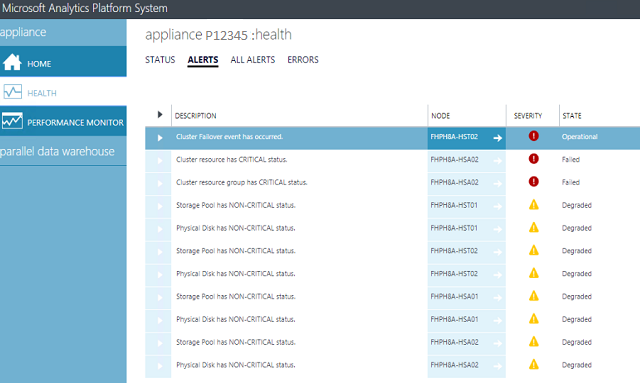

# Track appliance alerts in Analytics Platform System
This topic explains how to use the Admin Console and system views to track alerts in a SQL Server PDW appliance.  
  
## To Track Appliance Alerts  
SQL Server PDW creates alerts for hardware and software issues that need attention. Each alert contains a title and a description of the issue.  
  
SQL Server PDW logs alerts in the [sys.dm_pdw_component_health_alerts](../relational-databases/system-dynamic-management-views/sys-dm-pdw-component-health-alerts-transact-sql.md) DMV. The system retains a limit of 10,000 alerts and deletes the oldest alert first when the limit is exceeded.  
  
### View Alerts by Using the Admin Console  
There is an **Alerts** tab for the PDW region and for the fabric region of the appliance. After failover occurs, the failover event is included in the number of alerts on the page. There is a page for the PDW region and for the fabric region of the appliance. Each Health page has a tab. To learn more about an alert, click the **Health** page, the **Alerts** tab, and then click an alert.  
  
  
  
On the **Alerts** page:  
  
-   To view the alert history, click on the **Review Alert History** link.  
  
-   To view the alert component and its current property values, click on the alert row.  
  
-   To view details about the node that raised the alert, click on the node name.  
  
### View Alerts by Using the System Views  
To view alerts by using system views, query [sys.dm_pdw_component_health_active_alerts](../relational-databases/system-dynamic-management-views/sys-dm-pdw-component-health-active-alerts-transact-sql.md). This DMV shows alerts that have not been corrected. For help with triaging alerts and errors, use the [sys.dm_pdw_errors](../relational-databases/system-dynamic-management-views/sys-dm-pdw-errors-transact-sql.md) DMV.  
  
The following example is a common query for viewing the current alerts.  
  
```sql  
SELECT   
    aa.[pdw_node_id],  
    n.[name] AS [node_name],  
    g.[group_name] ,  
    c.[component_name] ,  
    aa.[component_instance_id] ,   
    a.[alert_name] ,  
    a.[state] ,  
    a.[severity] ,  
    aa.[current_value] ,  
    aa.[previous_value] ,  
    aa.[create_time] ,  
    a.[description]   
FROM [sys].[dm_pdw_component_health_active_alerts] AS aa  
    INNER JOIN sys.dm_pdw_nodes AS n   
        ON aa.[pdw_node_id] = n.[pdw_node_id]  
    INNER JOIN [sys].[pdw_health_components] AS c   
        ON aa.[component_id] = c.[component_id]  
    INNER JOIN [sys].[pdw_health_component_groups] AS g   
        ON c.[group_id] = g.[group_id]  
    INNER JOIN [sys].[pdw_health_alerts] AS a   
        ON aa.[alert_id] = a.[alert_id] and aa.[component_id] = c.[component_id]  
ORDER BY  
    a.alert_id ,  
    aa.[pdw_node_id];  
```  
  
## See Also  
<!-- MISSING LINKS [Common Metadata Query Examples &#40;SQL Server PDW&#41;](../sqlpdw/common-metadata-query-examples-sql-server-pdw.md)  -->
[Appliance Monitoring &#40;Analytics Platform System&#41;](appliance-monitoring.md)  
  
