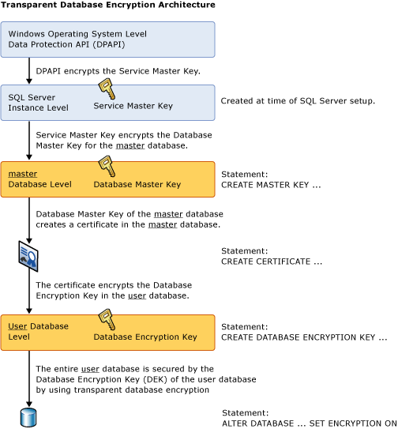

# Transparent Data Encryption
You can take several precautions to help secure the database such as designing a secure system, encrypting confidential assets, and building a firewall around the database servers. However, for a scenario in which the physical media (such as drives or backup tapes) are stolen, a malicious party can just restore or attach the database and browse the data. One solution is to encrypt the sensitive data in the database and protect the keys that are used to encrypt the data with a certificate. This prevents anyone without the keys from using the data, but this kind of protection must be planned in advance.  
  
*Transparent data encryption* (TDE) performs real-time I/O encryption and decryption of the data and transaction log files and the special PDW log files. The encryption uses a database encryption key (DEK), which is stored in the database boot record for availability during recovery. The DEK is a symmetric key secured by using a certificate stored in the master database of the SQL Server PDW. TDE protects data "at rest", meaning the data and log files. It provides the ability to comply with many laws, regulations, and guidelines established in various industries. This feature enables software developers to encrypt data by using AES and 3DES encryption algorithms without changing existing applications.  
  
> [!IMPORTANT]  
> TDE does not provide encryption for data traveling between the client and the PDW. For more information about how to encrypt data between the client and SQL Server PDW, see [Provision a certificate](provision-certificate.md).  
>   
> TDE does not encrypt data while it is moving or in use. Internal traffic between PDW components inside the SQL Server PDW is not encrypted. Data temporarily stored in memory buffers is not encrypted. To mitigate this risk, control physical access and connections to the SQL Server PDW.  
  
After it is secured, the database can be restored by using the correct certificate.  
  
> [!NOTE]  
> When you create a certificate for TDE, you should immediately back it up, together with the associated private key. If the certificate ever becomes unavailable or if you must restore or attach the database on another server, you must have backups of both the certificate and the private key or you will not be able to open the database. The encrypting certificate should be retained even if TDE is no longer enabled on the database. Even though the database is not encrypted, parts of the transaction log may still remain protected, and the certificate may be needed for some operations until the full backup of the database is performed. A certificate that has exceeded its expiration date can still be used to encrypt and decrypt data with TDE.  
  
Encryption of the database file is performed at the page level. The pages in an encrypted database are encrypted before they are written to disk and decrypted when read into memory. TDE does not increase the size of the encrypted database.  
  
The following illustration shows the hierarchy of keys for TDE encryption:  
  
  
  
## <a name="using-tde"></a>Using Transparent Data Encryption  
To use TDE, follow these steps. The first three steps are only done once, when preparing SQL Server PDW to support TDE.  
  
1.  Create a master key in the master database.  
  
2.  Use **sp_pdw_database_encryption** to enable TDE on the SQL Server PDW. This operation modifies the temporary databases in order to ensure the protection of future temporary data, and will fail if attempted when there are any active sessions that have temporary tables. **sp_pdw_database_encryption** turns on user data masking in PDW system logs. (For more information about user data masking in PDW system logs, see [sp_pdw_log_user_data_masking](../relational-databases/system-stored-procedures/sp-pdw-log-user-data-masking-sql-data-warehouse.md).)  
  
3.  Use [sp_pdw_add_network_credentials](../relational-databases/system-stored-procedures/sp-pdw-add-network-credentials-sql-data-warehouse.md) to create a credential that can authenticate and write to the share where the backup of the certificate will be stored. If a credential already exists for the intended storage server, you can use the existing credential.  
  
4.  In the master database, create a certificate protected by the master key.  
  
5.  Back up the certificate to the storage share.  
  
6.  In the user database, create a database encryption key and protect it by the certificate that is stored in the master database.  
  
7.  Use the `ALTER DATABASE` statement to encrypt the database using TDE.  
  
The following example illustrates encrypting the `AdventureWorksPDW2012` database using a certificate named `MyServerCert`, created in SQL Server PDW.  
  
**First: Enable TDE on the SQL Server PDW.** This action is only necessary once.  
  
```sql  
USE master;  
GO  
  
-- Create a database master key in the master database  
CREATE MASTER KEY ENCRYPTION BY PASSWORD = '<UseStrongPasswordHere>';  
GO  
  
-- Enable encryption for PDW  
EXEC sp_pdw_database_encryption 1;  
GO  
  
-- Add a credential that can write to the share  
-- A credential created for a backup can be used if you wish  
EXEC sp_pdw_add_network_credentials 'SECURE_SERVER', '<domain>\<Windows_user>', '<password>';  
```  
  
**Second: Create and backup a certificate in the master database.** This action is only required once. You can have a separate certificate for each database (recommended), or you can protect multiple databases with one certificate.  
  
```sql  
-- Create certificate in master  
CREATE CERTIFICATE MyServerCert WITH SUBJECT = 'My DEK Certificate';  
GO  
  
-- Back up the certificate with private key  
BACKUP CERTIFICATE MyServerCert   
    TO FILE = '\\SECURE_SERVER\cert\MyServerCert.cer'  
    WITH PRIVATE KEY   
    (   
        FILE = '\\SECURE_SERVER\cert\MyServerCert.key',  
        ENCRYPTION BY PASSWORD = '<UseStrongPasswordHere>'   
    )   
GO  
```  
  
**Last: Create the DEK and use ALTER DATABASE to encrypt a user database.** This action is repeated for each database that is protected by TDE.  
  
```sql  
USE AdventureWorksPDW2012;  
GO  
  
CREATE DATABASE ENCRYPTION KEY  
WITH ALGORITHM = AES_128  
ENCRYPTION BY SERVER CERTIFICATE MyServerCert;  
GO  
  
ALTER DATABASE AdventureWorksPDW2012 SET ENCRYPTION ON;  
GO  
```  
  
The encryption and decryption operations are scheduled on background threads by SQL Server. You can view the status of these operations using the catalog views and dynamic management views in the list that appears later in this article.  
  
> [!CAUTION]  
> Backup files of databases that have TDE enabled are also encrypted by using the database encryption key. As a result, when you restore these backups, the certificate protecting the database encryption key must be available. This means that in addition to backing up the database, you have to make sure that you maintain backups of the server certificates to prevent data loss. Data loss will result if the certificate is no longer available.  
  
## Commands and Functions  
The TDE certificates must be encrypted by the database master key to be accepted by the following statements.  
  
The following table provides links and explanations of TDE commands and functions.  
  
|Command or function|Purpose|  
|-----------------------|-----------|  
|[CREATE DATABASE ENCRYPTION KEY](../t-sql/statements/create-database-encryption-key-transact-sql.md)|Creates a key that is used to encrypt a database.|  
|[ALTER DATABASE ENCRYPTION KEY](../t-sql/statements/alter-database-encryption-key-transact-sql.md)|Changes the key that is used to encrypt a database.|  
|[DROP DATABASE ENCRYPTION KEY](../t-sql/statements/drop-database-encryption-key-transact-sql.md)|Removes the key that was used to encrypt a database.|  
|[ALTER DATABASE](../t-sql/statements/alter-database-transact-sql.md?tabs=sqlpdw)|Explains the **ALTER DATABASE** option that is used to enable TDE.|  
  
## Catalog Views and Dynamic Management Views  
The following table shows TDE catalog views and dynamic management views.  
  
|Catalog view or dynamic management view|Purpose|  
|-------------------------------------------|-----------|  
|[sys.databases](../relational-databases/system-catalog-views/sys-databases-transact-sql.md)|Catalog view that displays database information.|  
|[sys.certificates](../relational-databases/system-catalog-views/sys-certificates-transact-sql.md)|Catalog view that shows the certificates in a database.|  
|[sys.dm_pdw_nodes_database_encryption_keys](../relational-databases/system-dynamic-management-views/sys-dm-pdw-nodes-database-encryption-keys-transact-sql.md)|Dynamic management view that provides information for each node, about the encryption keys used in a database, and the state of encryption of a database.|  
  
## Permissions  
Each TDE feature and command has individual permission requirements, described in the tables shown earlier.  
  
Viewing the metadata involved with TDE requires the `CONTROL SERVER` permission.  
  
## Considerations  
While a re-encryption scan for a database encryption operation is in progress, maintenance operations to the database are disabled.  
  
You can find the state of the database encryption using the **sys.dm_pdw_nodes_database_encryption_keys** dynamic management view. For more information, see the *Catalog Views and Dynamic Management Views* section earlier in this article.  
  
### Restrictions  
The following operations are not allowed during the `CREATE DATABASE ENCRYPTION KEY`, `ALTER DATABASE ENCRYPTION KEY`, `DROP DATABASE ENCRYPTION KEY`, or `ALTER DATABASE...SET ENCRYPTION` statements.  
  
-   Dropping the database.  
  
-   Using an `ALTER DATABASE` command.  
  
-   Starting a database backup.  
  
-   Starting a database restore.  
  
The following operations or conditions will prevent the `CREATE DATABASE ENCRYPTION KEY`, `ALTER DATABASE ENCRYPTION KEY`, `DROP DATABASE ENCRYPTION KEY`, or `ALTER DATABASE...SET ENCRYPTION` statements.  
  
-   An `ALTER DATABASE` command is executing.  
  
-   Any data backup is running.  
  
When creating database files, instant file initialization is not available when TDE is enabled.  
  
### Areas Not Protected by TDE  
TDE does not protect external tables.  
  
TDE does not protect diagnostic sessions. Users should be careful not to queries with sensitive parameters while diagnostic sessions are in use. Diagnostic sessions that reveal sensitive information should be dropped as soon as they are no longer needed.  
  
Data protected by TDE is decrypted when placed in SQL Server PDW memory. Memory dumps are created when certain problems occur on appliance. Dump files represent the content of the memory at the time of the problem appearance and can contain sensitive data in an unencrypted form. The content of memory dumps should be reviewed before they are shared with others.  
  
The master database is not protected by TDE. Though the master database does not contain user data, it does contain information such as login names.  
  
### Transparent Data Encryption and Transaction Logs  
Enabling a database to use TDE has the effect of zeroing out the remaining part of the virtual transaction log to force the next virtual transaction log. This guarantees that no clear text is left in the transaction logs after the database is set for encryption. You can find the status of the log file encryption on each PDW node by viewing the `encryption_state` column in the `sys.dm_pdw_nodes_database_encryption_keys` view, as in this example:  
  
```sql  
WITH dek_encryption_state AS   
(  
    SELECT ISNULL(db_map.database_id, dek.database_id) AS database_id, encryption_state  
    FROM sys.dm_pdw_nodes_database_encryption_keys AS dek  
        INNER JOIN sys.pdw_nodes_pdw_physical_databases AS node_db_map  
           ON dek.database_id = node_db_map.database_id AND dek.pdw_node_id = node_db_map.pdw_node_id  
        LEFT JOIN sys.pdw_database_mappings AS db_map  
            ON node_db_map .physical_name = db_map.physical_name  
        INNER JOIN sys.dm_pdw_nodes AS nodes  
            ON nodes.pdw_node_id = dek.pdw_node_id  
    WHERE dek.encryptor_thumbprint <> 0x  
)  
SELECT TOP 1 encryption_state  
       FROM dek_encryption_state  
       WHERE dek_encryption_state.database_id = DB_ID('AdventureWorksPDW2012 ')  
       ORDER BY (CASE encryption_state WHEN 3 THEN -1 ELSE encryption_state END) DESC;  
```  
  
All data written to the transaction log before a change in the database encryption key will be encrypted by using the previous database encryption key.  
  
### PDW Activity Logs  
SQL Server PDW maintains a set of logs intended for troubleshooting. (Note, this is not the transaction log, the SQL Server error log, or the Windows event log.) These PDW activity logs can contain full statements in clear text, some of which can contain user data. Typical examples are **INSERT** and **UPDATE** statements. Masking of user data can be explicitly turned on or off by using **sp_pdw_log_user_data_masking**. Enabling encryption on SQL Server PDW automatically turns on the masking of user data in PDW activity logs in order to protect them. **sp_pdw_log_user_data_masking** can also be used to mask statements when not using TDE, but that is not recommended because it significantly reduces the ability of the Microsoft Support Team to analyze problems.  
  
### Transparent Data Encryption and the tempdb System Database  
The tempdb system database is encrypted when encryption is enabled by using [sp_pdw_database_encryption](../relational-databases/system-stored-procedures/sp-pdw-database-encryption-sql-data-warehouse.md). This is required before any database can use TDE. This might have a performance effect for unencrypted databases on the same instance of SQL Server PDW.  
  
## Key Management  
The database encryption key (DEK) is protected by the certificates stored in the master database. These certificates are protected by the database master key (DMK) of the master database. The DMK needs to be protected by the service master key (SMK) in order to be used for TDE.  
  
The system can access the keys without requiring human intervention (such as providing a password). If the certificate is not available, the system will output an error explaining that the DEK cannot be decrypted until the proper certificate is available.  
  
When moving a database from one appliance to another, the certificate used to protect its' DEK must be restored first on the destination server. Then the database can be restored as usual. For more information, see the standard SQL Server documentation, at [Move a TDE Protected Database to Another SQL Server](https://technet.microsoft.com/library/ff773063.aspx).  
  
Certificates used to encrypt DEKs should be retained as long as there are database backups that use them. Certificate backups must include the certificate private key, because without the private key a certificate cannot be used for database restore. Those certificate private key backups are stored in a separate file, protected by a password that must be provided for certificate restore.  
  
## Restoring the master Database  
The master database can be restored using **DWConfig**, as part of the disaster recovery.  
  
-   If the control node hasn't changed, that is if the master database is restored on the same and unchanged appliance from which the backup of master database was taken, the DMK and all the certificates will be readable without additional action.  
  
-   If the master database is restored on a different appliance, or if the control node has been changed since the backup of the master database, additional steps will be required in order to regenerate the DMK.  
  
    1.  Open the DMK:  
  
        ```sql  
        OPEN MASTER KEY DECRYPTION BY PASSWORD = '<password>';  
        ```  
  
    2.  Add the encryption by SMK:  
  
        ```sql  
        ALTER MASTER KEY   
            ADD ENCRYPTION BY SERVICE MASTER KEY;  
        ```  
  
    3.  Restart the appliance.  
  
## Upgrade and Replacing Virtual Machines  
If a DMK exists on the appliance on which Upgrade or Replace VM was performed, DMK password must be provided as a parameter.  
  
Example of the upgrade action. Replace `**********` with your DMK password.  
  
`setup.exe /Action=ProvisionUpgrade ... DMKPassword='**********'`  
  
Example of the action to replace a virtual machine.  
  
`setup.exe /Action=ReplaceVM ... DMKPassword='**********'`  
  
During upgrade, if a user DB is encrypted and the DMK password is not provided, the upgrade action will fail. During replace, if the correct password is not provided when a DMK exists, the operation will skip the DMK recovery step. All the other steps will be completed at the end of the replace VM action, however the action will report failure at the end to indicate that additional steps are required. In the setup logs (located in **\ProgramData\Microsoft\Microsoft SQL Server Parallel Data Warehouse\100\Logs\Setup\\<time-stamp>\Detail-Setup**), the following warning will be shown near the end.  
  
`*** WARNING \*\*\* DMK is detected in master database, but could not be recovered automatically! The DMK password was either not provided or is incorrect!`
  
Execute these statement manually in PDW and restart appliance after that in order to recover DMK:  
  
```sql
OPEN MASTER KEY DECRYPTION BY PASSWORD = '<DMK password>';  
ALTER MASTER KEY ADD ENCRYPTION BY SERVICE MASTER KEY;  
```
  
Use the steps in the **Restoring the master Database** paragraph to recover the database, and then restart the appliance.  
  
If the DMK existed before but was not recovered after the action, the following error message will be raised when a database is queried.  
  
```sql
Msg 110806;  
A distributed query failed: Database '<db_name>' cannot be opened due to inaccessible files or insufficient memory or disk space. See the SQL Server errorlog for details.
```  
  
## Performance Impact  
The performance impact of TDE varies with the type of data you have, how it is stored, and the type of workload activity on the SQL Server PDW. When protected by TDE, the I/O of reading and then decrypting data or the encrypting and then writing data is a CPU intensive activity and will have more impact when other CPU intensive activities are happening at the same time. Because TDE encrypts `tempdb`, TDE can affect the performance of databases that are not encrypted. To get an accurate idea of performance, you should test the entire system with your data and query activity.  
  
## Related Content  
The following links contain general information about how SQL Server manages encryption. These articles can help you understand SQL Server encryption, but these articles do not have information specific to SQL Server PDW and they discuss features that are not present in SQL Server PDW.  
  
-   [SQL Server Encryption](../relational-databases/security/encryption/sql-server-encryption.md)  
  
-   [Encryption Hierarchy](../relational-databases/security/encryption/encryption-hierarchy.md)  
  
-   [SQL Server and Database Encryption Keys](../relational-databases/security/encryption/sql-server-and-database-encryption-keys-database-engine.md)  

  
## See Also  
[ALTER DATABASE](../t-sql/statements/alter-database-transact-sql.md?tabs=sqlpdw)  
[CREATE MASTER KEY](../t-sql/statements/create-master-key-transact-sql.md)  
[CREATE DATABASE ENCRYPTION KEY](../t-sql/statements/create-database-encryption-key-transact-sql.md)  
[BACKUP CERTIFICATE](../t-sql/statements/backup-certificate-transact-sql.md)  
[sp_pdw_database_encryption](../relational-databases/system-stored-procedures/sp-pdw-database-encryption-sql-data-warehouse.md)  
[sp_pdw_database_encryption_regenerate_system_keys](../relational-databases/system-stored-procedures/sp-pdw-database-encryption-regenerate-system-keys-sql-data-warehouse.md)  
[sp_pdw_log_user_data_masking](../relational-databases/system-stored-procedures/sp-pdw-log-user-data-masking-sql-data-warehouse.md)  
[sys.certificates](../relational-databases/system-catalog-views/sys-certificates-transact-sql.md)  
[sys.dm_pdw_nodes_database_encryption_keys](../relational-databases/system-dynamic-management-views/sys-dm-pdw-nodes-database-encryption-keys-transact-sql.md)  
  
