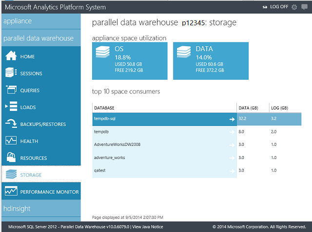

# View Capacity Utilization in Analytics Platform System

This article explains how to view capacity utilization in the SQL Server Parallel Data Warehouse (PDW) appliance.  
  
## To View Capacity Utilization By Using Admin Console

To view the space used, open the Admin Console, and select the **Storage** tab. There's a **Storage** tab for the PDW region.  
  
  
  
## To View Capacity Utilization By Using Queries

To understand if a node is running low on space, the SQL Server PDW health monitoring system already monitors the free space for all volumes within each node.  
  
If the free space within a volume drops below 30 percent, SQL Server PDW generates a **warning** alert in [sys.dm_pdw_component_health_active_alerts](../relational-databases/system-dynamic-management-views/sys-dm-pdw-component-health-active-alerts-transact-sql.md).  The alert remains until free space is made available.  
  
If the free space within a volume drops under 10 percent, SQL Server PDW generates a **critical** alert. This situation is considered critical because queries could fail if they cause the database to expand.  
  
To retrieve volume usage, see the following example.  
  
```sql  
SELECT   
    space.[pdw_node_id] ,  
    space.[node_name] ,  
    MAX(space.[volume_name]) AS 'volume_name' ,  
    MAX(space.[volume_size_mb]) AS 'volume_size_mb' ,  
    MAX(space.[free_space_mb]) AS 'free_space_mb' ,  
   (MAX(space.[volume_size_mb]) - MAX(space.[free_space_mb])) AS 'space_utilized'  
FROM (  
    SELECT   
        s.[pdw_node_id],  
        n.[name] AS [node_name],  
        (CASE WHEN p.property_name = 'volume_name'   
            THEN s.[property_value] ELSE NULL END) AS 'volume_name' ,  
        (CASE WHEN p.property_name = 'volume_size'   
            THEN (CAST(ISNULL(s.[property_value], '0') AS BIGINT)/1024/1024)   
            ELSE 0 END) AS 'volume_size_mb' ,  
        (CASE WHEN p.property_name = 'volume_free_space'   
            THEN (CAST(ISNULL(s.[property_value], '0') AS BIGINT)/1024/1024)   
            ELSE 0 END) AS 'free_space_mb' , s.[component_instance_id]  
    FROM [sys].[dm_pdw_component_health_status] AS s  
        JOIN sys.dm_pdw_nodes AS n   
            ON s.[pdw_node_id] = n.[pdw_node_id]  
        JOIN [sys].[pdw_health_components] AS c   
            ON s.[component_id] = c.[component_id]  
        JOIN [sys].[pdw_health_component_properties] AS p   
            ON s.[property_id] = p.[property_id] AND s.[component_id] = p.[component_id]  
    WHERE  
        c.[Component_name] = 'Volume'  
        AND p.[property_name] IN ('volume_name', 'volume_free_space', 'volume_size')  
    ) AS space  
GROUP BY space.[pdw_node_id] , space.[node_name] , space.[component_instance_id]  
ORDER BY space.[pdw_node_id], MAX(space.[volume_name]);  
```  
  
To retrieve the space used by databases across the appliance nodes, see the following example.  
  
```sql  
SELECT   
    [pdw_node_id],   
    [db_name],   
    SUM(CASE WHEN [file_type] = 'DATA' THEN [value_MB] ELSE 0 END) AS [DataSizeMB],  
    SUM(CASE WHEN [file_type] = 'LOG' THEN [value_MB] ELSE 0 END) AS [LogSizeMB],  
    SUM([value_MB]) AS [TotalMB]  
FROM (  
    SELECT   
        pc.[pdw_node_id],   
        RTRIM(pc.[counter_name]) AS [counter_name],   
        ISNULL(d.[name], pc.[instance_name]) AS [db_name],   
        pc.[cntr_value]/1024 AS [value_MB],  
        CASE   
            WHEN [counter_name] LIKE 'Data File(s) Size%'   
            THEN 'DATA'   
            ELSE 'LOG'   
        END AS [file_type]  
    FROM sys.dm_pdw_nodes_os_performance_counters AS pc  
        LEFT JOIN sys.pdw_database_mappings AS dm   
            ON pc.instance_name = dm.physical_name  
        INNER JOIN sys.databases AS d   
            ON d.database_id = dm.database_id  
    WHERE   
        ([counter_name] LIKE 'Log File(s) Size%'  
             OR [counter_name] LIKE 'Data File(s) Size%')  
        AND (d.[name] <> dm.[physical_name]   
             OR pc.[instance_name] = 'tempdb')  
) AS db  
GROUP BY [pdw_node_id], [db_name]  
ORDER BY [db_name], [pdw_node_id];  
```  
  
## Next steps

[Appliance Monitoring](appliance-monitoring.md)  
<!-- MISSING LINKS [Common Metadata Query Examples &#40;SQL Server PDW&#41;](../sqlpdw/common-metadata-query-examples-sql-server-pdw.md)  -->
