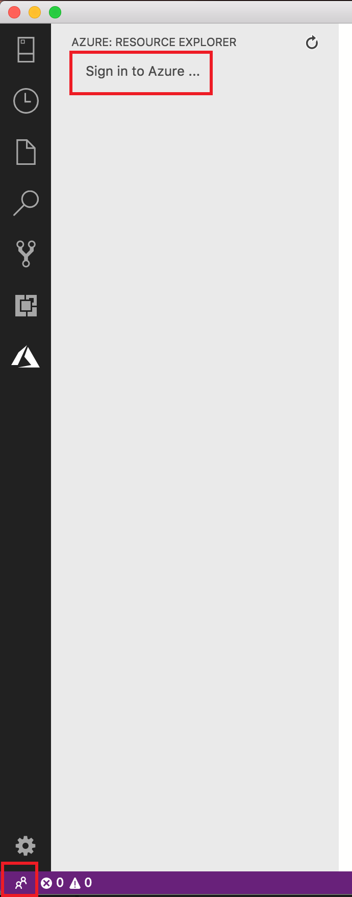
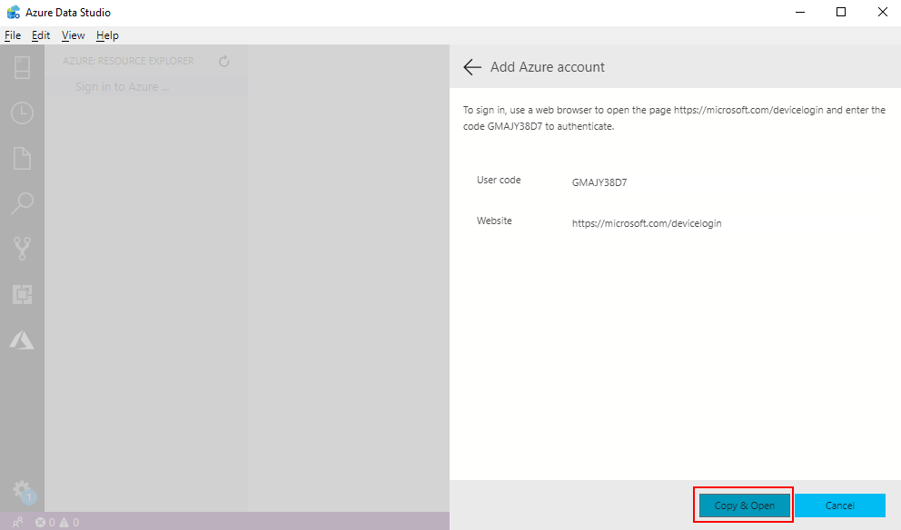
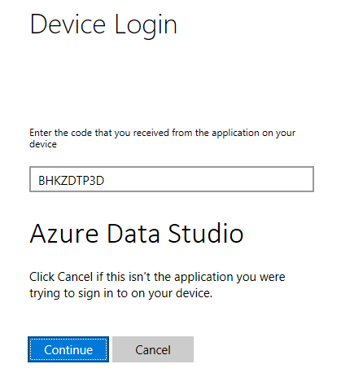
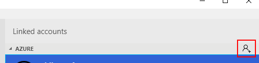
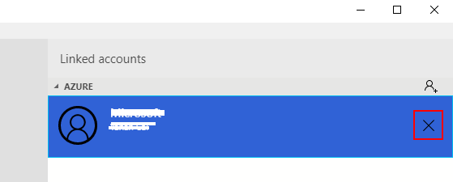
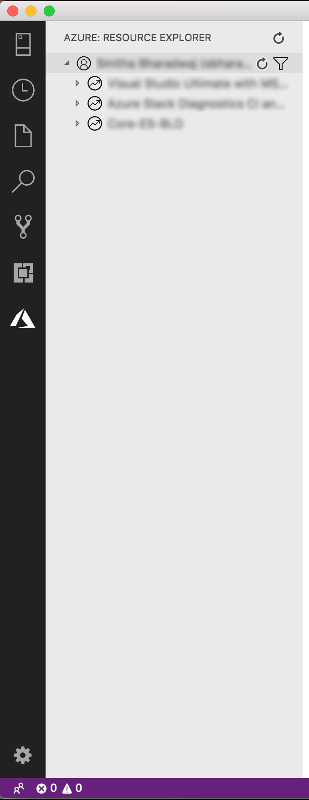
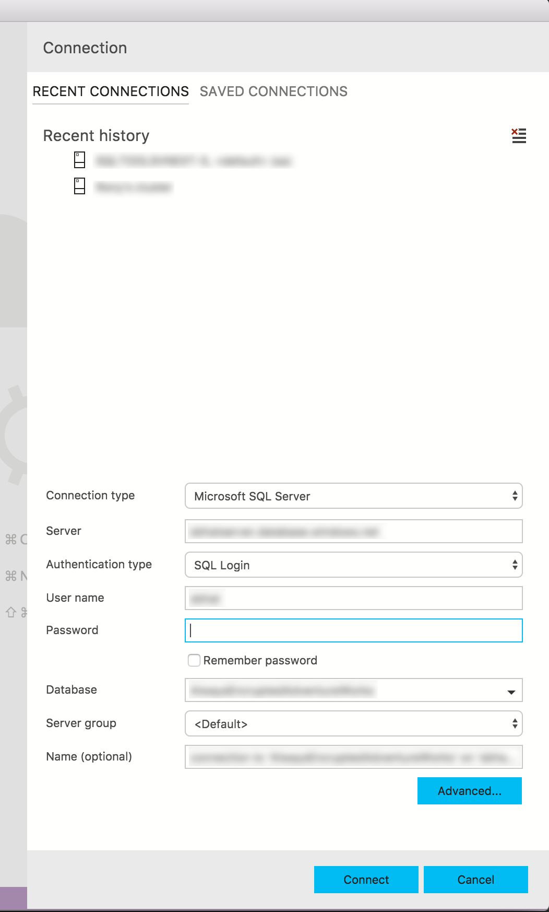

# Explore and manage Azure SQL resources with Azure Resource Explorer

In this document, you learn how you can explore and manage Azure SQL Server, Azure SQL database, and Azure SQL Managed Instance resources through Azure Resource Explorer in [!INCLUDE [Azure Data Studio](../includes/name-sos-short.md)].

>[!NOTE]
>The Azure Resource Explorer will be supported in SQL Server 2019 preview in October. After that, you can install the preview extension through [extension manager](extensions.md) or through **File** > **Install Package from VSIX Package**.

## Connect to Azure

After installing the SQL preview plugin, an Azure icon appears in the left menu bar. Click the icon to open Azure Resource Explorer. If you don't see the Azure icon, right click the left menu bar, and select **Azure Resource Explorer**.

### Add an Azure account

To view the SQL resources associated with an Azure account, you must first add the account to [!INCLUDE [Azure Data Studio](../includes/name-sos-short.md)].

1. Open **Linked Accounts** dialog through the account management icon on the left bottom, or through **Sign in to Azure...** link in Azure Resource Explorer.

    

2. In the **Linked Accounts** dialog, click **Add an account**.

    

3. Click **Copy and Open** to open the browser for authentication.

    

4. Paste the **User code** in the web page and click **Continue** to authenticate.

    

5. In [!INCLUDE [Azure Data Studio](../includes/name-sos-short.md)] you should now find the logged in Azure account in **Linked Accounts** dialog.

    

### Add more Azure accounts

Multiple Azure accounts are supported in [!INCLUDE [Azure Data Studio](../includes/name-sos-short.md)]. To add more Azure accounts, click the button on the right top of **Linked Accounts** dialog and follow the same steps with Add an Azure account section to add more Azure accounts.

### Remove an Azure account

To remove an existing logged in Azure account:

1. Open **Linked Accounts** dialog through the account management icon on the left bottom.
2. Click the **X** button at the right of the Azure account to remove it.

    

## Filter subscription

Once logged in to an Azure account, all subscriptions associated with that Azure account display in Azure Resource Explorer. You can filter subscriptions for each Azure account.

1. Click the **Select Subscription** button at right of the Azure account.

   

2. Select the check boxes for the account subscriptions you want to browse and then click **OK**.

   

## Explore Azure SQL resources

To navigate an Azure SQL resource in Azure Resource Explorer, expand the Azure accounts and resource type group.

Azure Resource Explorer supports Azure SQL Server, Azure SQL Database and Azure SQL Managed Instance currently.

## Connect to Azure SQL resources

Azure Resource Explorer provide quick access that helps you connect to SQL Servers and databases for query and management. 

1. Explore the SQL resource you would like to connect with from the tree view.
2. Right click the resource and select **Connect**, you can also find the connect button at the right of the resource.

   

3. In the opened **Connection** dialog, enter your password and click **Connect**.

   
4. The **Servers** window automatically opens with the new connected SQL server/database after connection succeeds.

## Next steps

- [Use [!INCLUDE[Azure Data Studio](../includes/name-sos-short.md)] to connect and query Azure SQL database](quickstart-sql-database.md)
- [Use [!INCLUDE[Azure Data Studio](../includes/name-sos-short.md)] to connect and query data in Azure SQL Data Warehouse](quickstart-sql-dw.md)