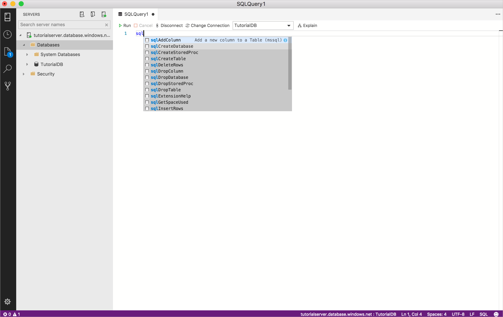
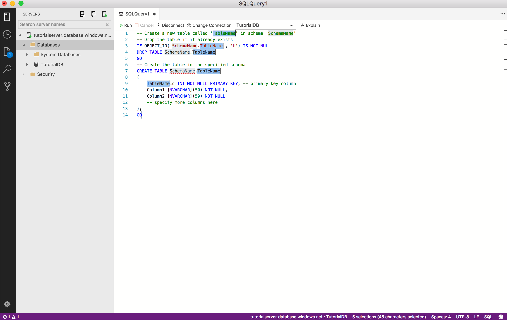
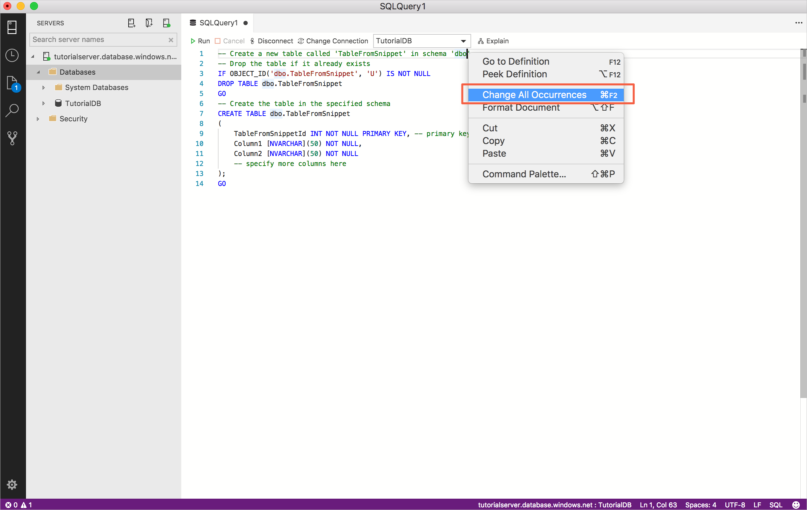
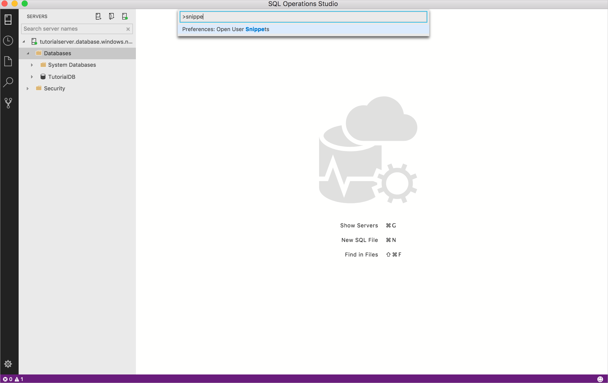
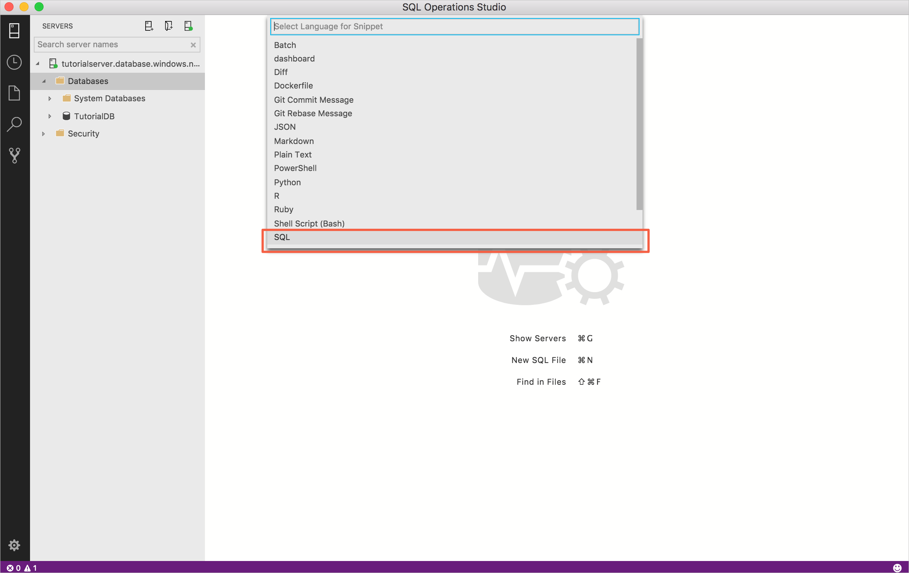

# Create and use code snippets to quickly create Transact-SQL (T-SQL) scripts in [!INCLUDE[name-sos](../includes/name-sos-short.md)]

Code snippets in [!INCLUDE[name-sos](../includes/name-sos-short.md)] are templates that make it easy to create databases and database objects. 

[!INCLUDE[name-sos](../includes/name-sos-short.md)] provides several T-SQL snippets to assist you with quickly generating the proper syntax. 

User-defined code snippets can also be created.

## Using built-in T-SQL code snippets

1. To access the available snippets, type *sql* in the query editor to open the list:

   

1. Select the snippet you want to use, and it generates the T-SQL script. For example, select *sqlCreateTable*:

   

1. Update the highlighted fields with your specific values. For example, replace *TableName* and *Schema* with the values for your database:

   

   If the field you want to change is no longer highlighted (this happens when moving the cursor around the editor), right-click the word you want to change, and select **Change all occurrences**:

   

1. Update or add any additional T-SQL you need for the selected snippet. For example, update *Column1*, *Column2*, and add more columns.


 
## Creating SQL code snippets 

You can define your own snippets. To open up the SQL snippet file for editing:

1. Open the *Command Palette* (**Shift+Ctrl+P**), and type *snip*, and select **Preferences: Open User Snippets**:

   

1. Select **SQL**:

   > [!NOTE]
   > [!INCLUDE[name-sos](../includes/name-sos-short.md)] inherits its code snippet functionality from Visual Studio Code so this article specifically discusses using SQL snippets. For more detailed information, see [Creating your own snippets](https://code.visualstudio.com/docs/editor/userdefinedsnippets) in the Visual Studio Code documentation. 

   

1. Paste the following code into *sql.json*:

   ```sql
   {
   "Select top 5": {
	"prefix": "sqlSelectTop5",
	"body": "SELECT TOP 5 * FROM ${1:TableName}",
	"description": "User-defined snippet example 1"
    },
    "Create Table snippet":{
	"prefix": "sqlCreateTable2",
    "body": [
	"-- Create a new table called '${1:TableName}' in schema '${2:SchemaName}'",
	"-- Drop the table if it already exists",
	"IF OBJECT_ID('$2.$1', 'U') IS NOT NULL",
	"DROP TABLE $2.$1",
	"GO",
	"-- Create the table in the specified schema",
	"CREATE TABLE $2.$1",
	"(",
	"   $1Id INT NOT NULL PRIMARY KEY, -- primary key column",
	"   Column1 [NVARCHAR](50) NOT NULL,",
	"   Column2 [NVARCHAR](50) NOT NULL",
	"   -- specify more columns here",
	");",
	"GO"
	],
   "description": "User-defined snippet example 2"
   }
   }
   ```

1. Save the sql.json file.
1. Open a new query editor window by clicking **Ctrl+N**.
2. Type **sql**, and you see the two user snippets you just added; *sqlCreateTable2* and *sqlSelectTop5*.

Select one of the new snippets and give it a test run!


## Additional resources

For information about the SQL editor, see [Code editor tutorial](tutorial-sql-editor.md).
