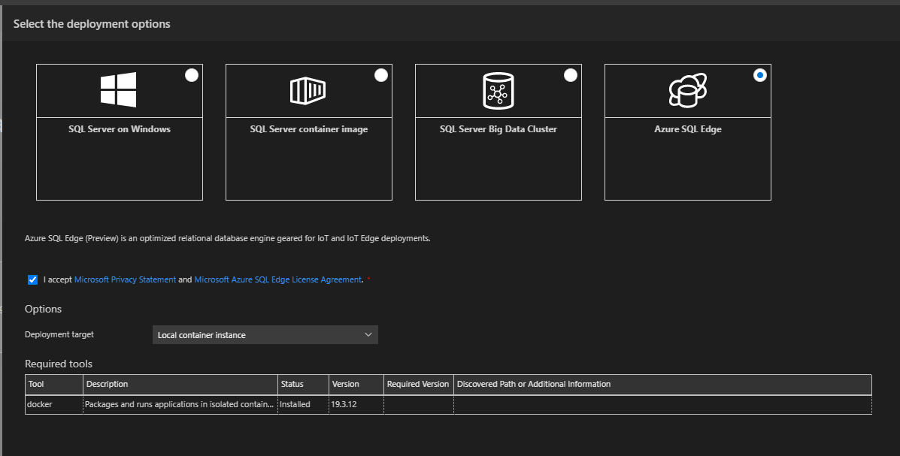

# Deploy Azure SQL Edge with Azure Data Studio (Preview)

[Azure SQL Edge](/azure/azure-sql-edge/overview) is a relational database engine optimized for IoT and Azure IoT Edge deployments. It provides capabilities to create a high-performance data storage and processing layer for IoT applications and solutions. This article shows you how to deploy an Azure SQL Edge instance with Azure Data Studio and the deployment scenarios that are supported with the deployment wizard.  

The following scenarios are supported by the deployment wizard in Azure Data Studio:

- Local container instance
- Remote container instance
- New Azure IoT Hub and VM
- Existing Device of an Azure IoT Hub
- Multiple Devices of an Azure IoT Hub

| Required tools | `Docker` | `Azure CLI` |
| ------------- | :---: | :---: |
| Local container instance | x | |
| Remote container instance | | |
| New Azure IoT Hub and VM | | x |
| Existing Device of an Azure IoT Hub |  | x |
| Multiple Devices of an Azure IoT Hub |   |  x |

> [!NOTE]
> Azure SQL Edge deployment (preview) is available through the extension "Azure SQL Edge Deployment Extension" while these features are in preview. To make the features available to you, please install the extension in Azure Data Studio.

To begin a deployment in Azure Data Studio, open the menu in the **Connections** view and select the **New Deployment...** option.  For all Azure SQL Edge scenarios, select **Azure SQL Edge** on the following screen and the desired scenario from the **Deployment target** drop-down. The deployment wizard generates a TSQL notebook that can be executed to complete the deployment. It should be noted that connection information, including the SQL admin password, is contained in the notebook by default.

## Local container instance

Azure SQL Edge can be deployed to a Docker container on the localhost by specifying the container name, `sa` user password, and the host port for Azure SQL Edge connectivity.  After completing the deployment, several links are available at the bottom of the notebook for further actions:

- **Select here to connect to the Azure SQL Edge instance**: Creates a connection in Azure Data Studio to the new Azure SQL Edge instance
- **Open the terminal window**: Opens a terminal (existing or new) in Azure Data Studio
- **Stop the container**: Copies a command into the terminal that stops the container when executed by the user
- **Remove the container**: Copies a command into the terminal that removes the container when executed by the user

## Remote container instance

Azure SQL Edge can be deployed to a Docker container on a remote host with Docker installed by specifying the container information and the target/host machine information.  After completing the deployment, a connection link is available at the bottom of the notebook.  Because of the remote container host environment, to stop or remove the container, commands must be copied to execute in a remote shell.

## New Azure IoT Hub and VM

The Azure SQL Edge deployment wizard can create several Azure resources needed to deploy an edge-enabled virtual machine (VM) connected to an Azure IoT hub. An active Azure subscription is required. This deployment creates:

- Resource group (if current resource group isn't selected)
- Network security group
- Virtual machine
- Static public IP address

Optionally, a dacpac file can be zipped in a folder and deployed to the new Azure SQL Edge instance as a part of the process.  If a dacpac file is provided, an Azure Blob Storage account is created in the same resource group.

## Existing Device of an Azure IoT Hub

If you have an existing IoT hub and a connected device, Azure SQL Edge can be deployed to the device based on the resource group, IoT hub name, and the device ID.
The IP address provided during the deployment wizard is utilized to generate a quick connect link at the bottom of the notebook.

Optionally, a dacpac file can be zipped in a folder and deployed to the new Azure SQL Edge instance as a part of the process.  If a dacpac file is provided, an Azure Blob Storage account is created in the same resource group.

## Multiple Devices of an Azure IoT Hub

If you have an existing IoT hub and connected devices, Azure SQL Edge can be deployed to the device based on the resource group, IoT hub name, and a [target condition](/azure/iot-edge/module-deployment-monitoring#target-condition) to select device(s).
The IP address provided during the deployment wizard is utilized to generate a quick connect link at the bottom of the notebook.

Optionally, a dacpac file can be zipped in a folder and deployed to the new Azure SQL Edge instance as a part of the process.  If a dacpac file is provided, an Azure Blob Storage account is created in the same resource group.

## Next steps

- [Learn more about Azure SQL Edge](/azure/azure-sql-edge/)
