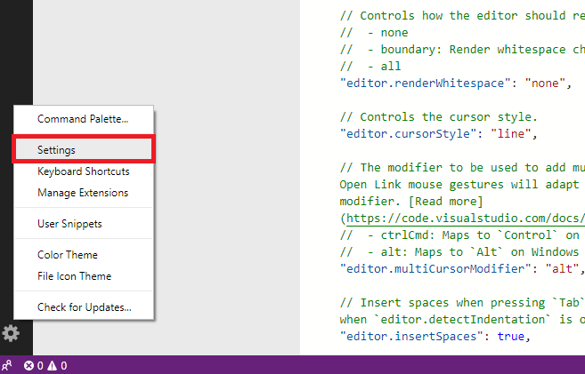
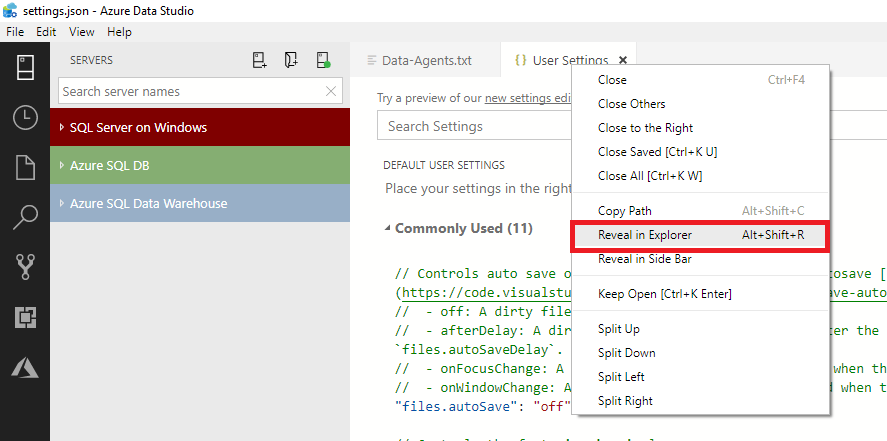
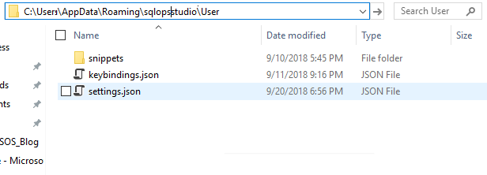

# Download and install Azure Data Studio

[!INCLUDE[name-sos](../includes/name-sos.md)] runs on Windows, macOS, and Linux.


Download and install the latest release, the *April Release*:

> [!NOTE]
> If you're updating from SQL Operations Studio and want to keep your settings, keyboard shortcuts, or code snippets, see [Move user settings](#move-user-settings).

|Platform|Download|Release date| Version |
|:---|:---|:---|:---|
|Windows|[User Installer (recommended)](https://go.microsoft.com/fwlink/?linkid=2087316)<br>[System Installer](https://go.microsoft.com/fwlink/?linkid=2087317)<br>[.zip](https://go.microsoft.com/fwlink/?linkid=2087318)|April 18, 2019 |1.6.0|
|macOS|[.zip](https://go.microsoft.com/fwlink/?linkid=2087170)|April 18, 2019 |1.6.0|
|Linux|[.deb](https://go.microsoft.com/fwlink/?linkid=2087415)<br>[.rpm](https://go.microsoft.com/fwlink/?linkid=2087171)<br>[.tar.gz](https://go.microsoft.com/fwlink/?linkid=2087414)|April 18, 2019 |1.6.0|

For details about the latest release, see the [release notes](release-notes.md).

## Get Azure Data Studio for Windows

This release of [!INCLUDE[name-sos](../includes/name-sos-short.md)] includes a standard Windows installer experience, and a .zip file.

The *user installer* is recommended because it does not require administrator privileges, which simplifies both installs and upgrades. The user installer does not require Administrator privileges as the location is under your user Local AppData (LOCALAPPDATA) folder. The user installer also provides a smoother background update experience. For more information, see [User setup for Windows](https://code.visualstudio.com/updates/v1_26#_user-setup-for-windows).


**User Installer** (recommended)

1. Download and run the [[!INCLUDE[name-sos](../includes/name-sos-short.md)] *user* installer for Windows](https://go.microsoft.com/fwlink/?linkid=2087316).
2. Start the [!INCLUDE[name-sos-short](../includes/name-sos-short.md)] app.

**System Installer**

1. Download and run the [[!INCLUDE[name-sos](../includes/name-sos-short.md)] *system* installer for Windows](https://go.microsoft.com/fwlink/?linkid=2087317).
2. Start the [!INCLUDE[name-sos-short](../includes/name-sos-short.md)] app.


**.zip file**

1. Download [[!INCLUDE[name-sos](../includes/name-sos-short.md)] .zip for Windows](https://go.microsoft.com/fwlink/?linkid=2087318).
2. Browse to the downloaded file and extract it.
3. Run `\azuredatastudio-windows\azuredatastudio.exe`


## Get Azure Data Studio for macOS

1. Download [[!INCLUDE[name-sos](../includes/name-sos-short.md)] for macOS](https://go.microsoft.com/fwlink/?linkid=2087170).
2. To expand the contents of the zip, double-click it.
3. To make [!INCLUDE[name-sos](../includes/name-sos-short.md)] available in the *Launchpad*, drag *Azure Data Studio.app* to the *Applications* folder.


## Get Azure Data Studio for Linux

1. Download [!INCLUDE[name-sos](../includes/name-sos-short.md)] for Linux by using one of the installers or the tar.gz archive:
    - [.deb](https://go.microsoft.com/fwlink/?linkid=2087415)
    - [.rpm](https://go.microsoft.com/fwlink/?linkid=2087171)
    - [.tar.gz](https://go.microsoft.com/fwlink/?linkid=2087414)
1. To extract the file and launch [!INCLUDE[name-sos](../includes/name-sos-short.md)], open a new Terminal window and type the following commands:

   **Debian Installation:**
   ```bash
   cd ~
   sudo dpkg -i ./Downloads/azuredatastudio-linux-<version string>.deb

   azuredatastudio
   ```

   **rpm Installation:**
   ```bash
   cd ~
   yum install ./Downloads/azuredatastudio-linux-<version string>.rpm

   azuredatastudio
   ```

   **tar.gz Installation:**
   ```bash 
   cd ~ 
   cp ~/Downloads/azuredatastudio-linux-<version string>.tar.gz ~ 
   tar -xvf ~/azuredatastudio-linux-<version string>.tar.gz 
   echo 'export PATH="$PATH:~/azuredatastudio-linux-x64"' >> ~/.bashrc
   source ~/.bashrc 
   azuredatastudio 
   ``` 

   > [!NOTE]
   > On Debian, Redhat, and Ubuntu, you may have missing dependencies. Use the following commands to install these dependencies depending on your version of Linux:
   

   **Debian:** 
   ```bash
   sudo apt-get install libunwind8
   ```

   **Redhat:** 
   ```bash
   yum install libXScrnSaver
   ```

   **Ubuntu:** 
   ```bash
   sudo apt-get install libxss1

   sudo apt-get install libgconf-2-4

   sudo apt-get install libunwind8
   ```


## Uninstall Azure Data Studio

If you installed [!INCLUDE[name-sos-short](../includes/name-sos-short.md)] using the Windows installer, then uninstall the same way you remove any Windows application.

If you installed [!INCLUDE[name-sos-short](../includes/name-sos-short.md)] with a .zip or other archive, then simply delete the files.

## Supported Operating Systems

[!INCLUDE[name-sos](../includes/name-sos-short.md)] runs on Windows, macOS, and Linux, and is supported on the following platforms:

### Windows
- Windows 10 (64-bit)
- Windows 8.1 (64-bit)
- Windows 8 (64-bit)
- Windows 7 (SP1) (64-bit) - Requires [KB2533623](https://www.microsoft.com/download/details.aspx?id=26767)
- Windows Server 2016
- Windows Server 2012 R2 (64-bit)
- Windows Server 2012 (64-bit)
- Windows Server 2008 R2 (64-bit)

### macOS
- macOS 10.13 High Sierra
- macOS 10.12 Sierra

### Linux
- Red Hat Enterprise Linux 7.4
- Red Hat Enterprise Linux 7.3
- SUSE Linux Enterprise Server v12 SP2
- Ubuntu 16.04

## Recommended System Requirements
For an optimal experience, please use the recommended system requirements.

|             | CPU Cores | Memory/RAM |
|:-----------:|:---------:|:----------:|
| Recommended |     4     |      8     |
|   Minimum   |     2     |      4     |
|             |           |            |

## Check for updates
To check for latest updates, click the gear icon on the bottom left of the window and click **Check for Updates**

## Supported SQL offerings

* This version of Azure Data Studio works with all [supported versions of SQL Server 2014 - [!INCLUDE[sql-server-2019](../includes/sssqlv15-md.md)]](https://support.microsoft.com/lifecycle?C2=1044) and provides support for working with the latest cloud features in Azure SQL Database and Azure SQL Data Warehouse. Azure Data Studio also provides preview support for Azure SQL Managed Instance.

## Upgrade from SQL Operations Studio

If you are still using SQL Operations Studio, you need to upgrade to Azure Data Studio. SQL Operations Studio was the preview name and preview version of Azure Data Studio. In September 2018, we [changed the name to Azure Data Studio](https://cloudblogs.microsoft.com/sqlserver/2018/09/25/azure-data-studio-for-sql-server/) and released the General Availability (GA) version. Because SQL Operations Studio is no longer being updated or supported, we ask all SQL Operations Studio users to download the latest version of Azure Data Studio to get the latest features, security updates, and fixes.
 
When upgrading from the old preview to the latest Azure Data Studio, you will lose your current settings and extensions. To move your settings, follow the instructions in the following *Move user settings* section:


## Move user settings

If you want to move your custom settings, keyboard shortcuts, or code snippets, follow the steps below. This is important to do if you are upgrading from SQL Operations Studio version to Azure Data Studio.

*If you already have Azure Data Studio, or you've never installed or customized SQL Operations Studio, then you can ignore this section.*


1. Open Settings by clicking the gear on the bottom left and clicking **Settings.**

   

2. Right-click the **User Settings** tab on top and click **Reveal in Explorer**

   

3. Copy all files in this folder and save in an easy to find location on your local drive, like your Documents folder.

   

4. In your new version of Azure Data Studio, follow steps 1-2, then for step 3 paste the contents you saved into the folder. You can also manually copy over the settings, keybindings, or snippets in their respective locations.

5. If overriding an existing installation, delete the old install directory before installation to avoid errors connecting to your Azure account for the resource explorer.

## Next Steps

See one of the following quickstarts to get started:
- [Connect & Query SQL Server](quickstart-sql-server.md)
- [Connect & Query Azure SQL Database](quickstart-sql-database.md)
- [Connect & Query Azure Data Warehouse](quickstart-sql-dw.md)

Contribute to [!INCLUDE[name-sos](../includes/name-sos-short.md)]:
- [https://github.com/Microsoft/azuredatastudio](https://github.com/Microsoft/azuredatastudio) 

[Microsoft Privacy Statement](https://go.microsoft.com/fwlink/?LinkId=521839) and [usage data collection](usage-data-collection.md).
