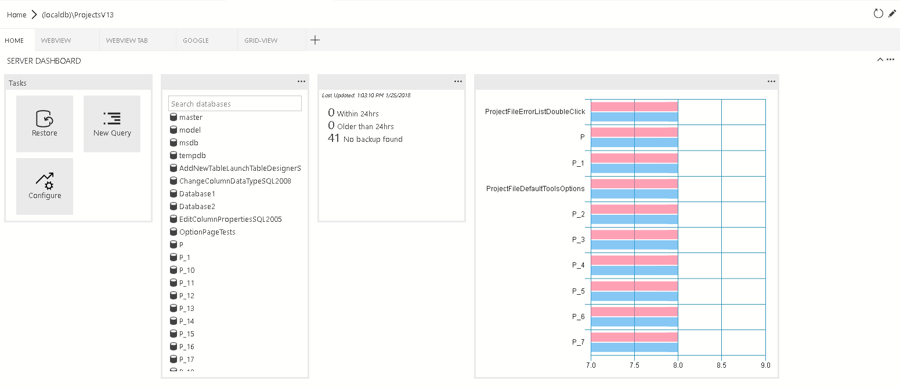
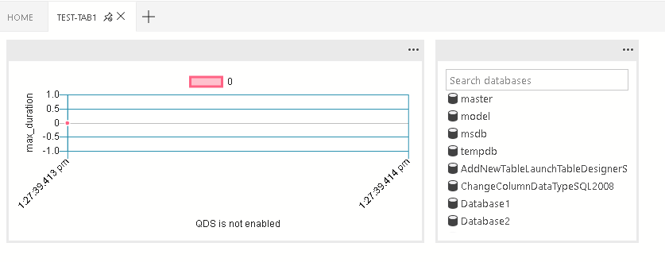
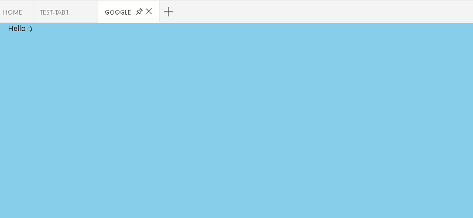
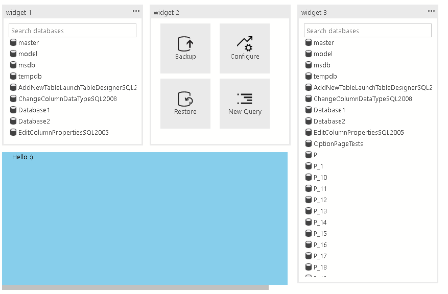
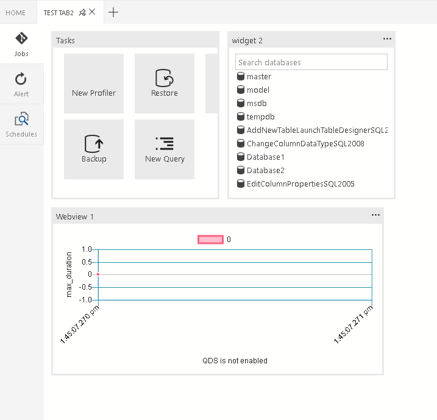

# Getting started with [!INCLUDE[name-sos](../includes/name-sos-short.md)] extensibility

[!INCLUDE[name-sos](../includes/name-sos.md)] has several extensibility mechanisms to customize the user experience and make those customizations available to the entire user community. The core [!INCLUDE[name-sos](../includes/name-sos.md)] platform is built upon Visual Studio Code, so most of the Visual Studio Code extensibility APIs are available. Additionally, we've provided additional extensibility points for data management-specific activities.

Some of the key extensibility points are:

- Visual Studio Code extensibility APIs
- Azure Data Studio extension authoring tools
- Manage Dashboard tab panel contributions
- Insights with Actions experiences
- Azure Data Studio extensibility APIs
- Custom Data Provider APIs

## Visual Studio Code extensibility APIs

Because the core [!INCLUDE[name-sos](../includes/name-sos.md)] platform is built upon Visual Studio Code, details about the Visual Studio Code extensibility APIs are found in the [Extension Authoring](https://code.visualstudio.com/docs/extensions/overview) and [Extension API](https://code.visualstudio.com/docs/extensionAPI/overview) documentation on the Visual Studio Code website.

## Manage Dashboard tab panel contributions

For details, see [Contribution Points](#contribution-points) and [Context Variables](#context-variables).

## Azure Data Studio extensibility APIs

For details, see [Extensibility APIs](extensibility-apis.md).


## Contribution points

This section covers the various contribution points that are defined in the package.json extension manifest.

The IntelliSense is supported inside azuredatastudio.

## Contributes dashboard

Contribute tab, container, insight widget to the dashboard.



`dashboard.tabs`

Dashboard.tabs creates the tab sections inside the dashboard page. It expects an object or an array of objects.  

```json
"dashboard.tabs": [
{
	"id": "test-tab1",
	"title": "Test 1",
	"description": "The test 1 displays a list of widgets.",
	"when": "connectionProvider == 'MSSQL' && !mssql:iscloud",
	"alwaysShow": true,
	"container": {
		...
	}
}
]
```

`dashboard.containers`

Instead of specifying dashboard container inline (inside the dashboard.tab). You can register containers using dashboard.containers. It accepts an object or an array of the object.

```json
"dashboard.containers": [
{
	"id": "innerTab1",
	"container": {
		...
	}
},
{
	"id": "innerTab2",
	"container": {
	   ...
	}
}
]
```

To refer to registered container, specify the id of the container

```json
"dashboard.tabs": [
{
	...
	"container": {
		"innerTab1": {             
		}
	}
}
]

```

`dashboard.insights`

You can register insights using dashboard.insights. This is similar to [Tutorial: Build a custom insight widget](https://docs.microsoft.com/sql/sql-operations-studio/tutorial-build-custom-insight-sql-server)

```json
"dashboard.insights": {
"id": "my-widget"
"type": {
	"count": {
		"dataDirection": "vertical",
		"dataType": "number",
		"legendPosition": "none",
           "labelFirstColumn": false,
		"columnsAsLabels": false
       }
   },
   "queryFile": "{your file folder}/activeSession.sql"
}
```


### Dashboard container types

There are currently four supported container types:

1. `widgets-container`

    

    The list of widgets that will be displayed in the container. It's a flow layout. It accepts the list of widgets.

    ```json
    "container": {
    	"widgets-container": [
    	{
    		"widget": {
    			"query-data-store-db-insight": {
    			}
    		}
    	},
    	{
    		"widget": {
    			"explorer-widget": {
    			}
    		}
    	}
      ]
    }
    ```

2. `webview-container`

    

    The webview will be displayed in the entire container. It expects webview id to be the same is tab ID

    ```json
    "container": {
    	"webview-container": null
    }
    ```

3. `grid-container`

   

   The list of widgets or webviews that will be displayed in the grid layout

	```json
	"container": {
		"grid-container": [
        {
        	"name": "widget 1",
        	"widget": {
        		"explorer-widget": {
        		}
        	},
        	"row":0,
        	"col":0
        },
        {
        	"name": "widget 2",
        	"widget": {
        		"tasks-widget": {
        			"backup", 
        			"restore",
        			"configureDashboard",
        			"newQuery"
        		}
        	},
        	"row":0,
        	"col":1
        },
        {
        	"name": "Webview 1",
        	"webview": {
        		"id": "google"
        	},
        	"row":1,
        	"col":0,
        	"colspan":2
        },
        {
        	"name": "widget 3",
        	"widget": {
        		"explorer-widget": {}
        	},
        	"row":0,
        	"col":3,
        	"rowspan":2
        },
    ]
    ```

4. 	`nav-section`

    

	The navigation section will be displayed in the container

	```json
	"container": {
		"nav-section": [
			{
				"id": "innerTab1",
				"title": "inner-tab1",
				"icon": {
					"light": "./icons/tab1Icon.svg",
					"dark": "./icons/tab1Icon_dark.svg"
				}
				"container": {
					...
				}
			},
			{
				"id": "innerTab2",
				"title": "inner-tab2",
				"icon": {
					"light": "./icons/tab2Icon.svg",
					"dark": "./icons/tab2Icon_dark.svg"
				}
				"container": {
					...
				}
			}
		]
	}
	```


## Context variables

For general information about context in Visual Studio Code and subsequently Azure Data Studio, see [Extensibility](https://code.visualstudio.com/docs/extensionAPI/extension-points#_example).

In Azure Data Studio, we have specific context around database connections available for extensions.

### Dashboard

In dashboard, we provide the following context variables:

|context variable| description|
|:---|:---|
|`connectionProvider` | A string of the identifier for the provider of the current connection. Ex. `connectionProvider == 'MSSQL'`.|
|`serverName`|A string of the server name of the current connection. Ex. `serverName == 'localhost'`.|
|`databaseName` | A string of the database name of the current connection. Ex. `databaseName == 'master'`.|
|`connection` | The full connection profile object for the current connection (IConnectionProfile)|
|`dashboardContext` | A string of the context of the page of the dashboard is currently on. Either 'database' or 'server'. Ex. `dashboardContext == 'database'`|
