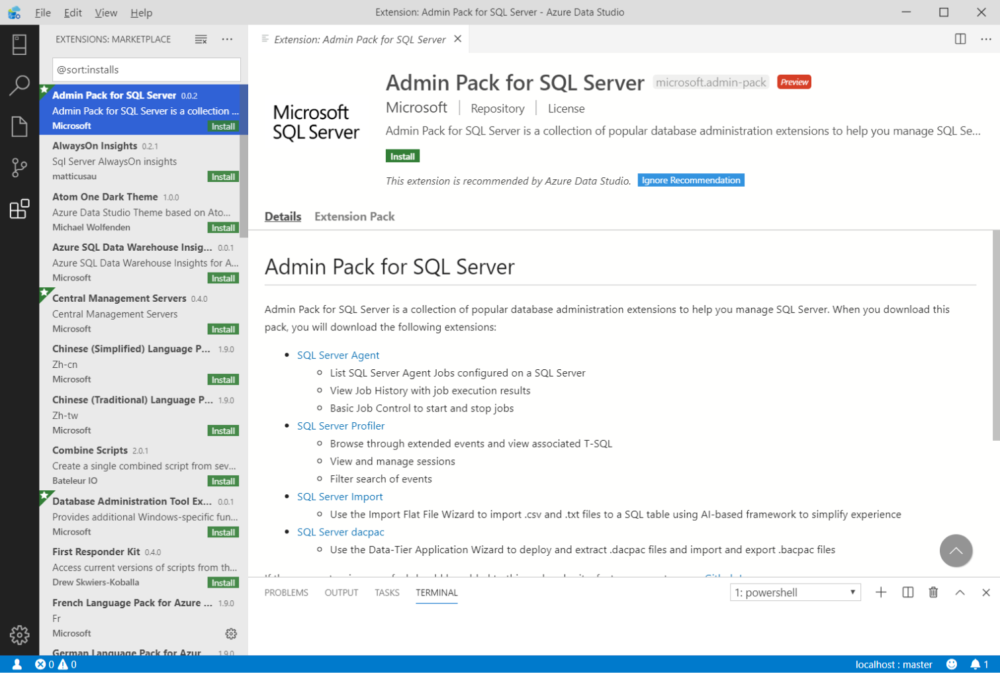

# Extend the functionality of [!INCLUDE[name-sos](../includes/name-sos-short.md)]

Extensions in [!INCLUDE[name-sos](../includes/name-sos-short.md)] provide an easy way to add more functionality to the base [!INCLUDE[name-sos](../includes/name-sos-short.md)] installation. 

Extensions are provided by the Azure Data Studio team (Microsoft), as well as the third-party community (you!). For more information about creating extensions, see [Extension authoring](extension-authoring.md).

## Add Azure Data Studio extensions

1. Access the available extensions by selecting the Extensions Icon, or by selecting **Extensions** in the **View** menu.

    

    You can also quickly access the extensions manager by pressing `Ctrl+Shift+X` (Windows/Linux) or `Command+Shift+X` (Mac).

2. Select an available extension to view its details.
    

3. Select the extension you want and **Install** it.

4. Once installed, **Reload** to enable the extension in Azure Data Studio (only required when installing an extension for the first time).

If you're having problems accessing the Extensions Manager on Azure Data Studio, you can download the extension you need on our [GitHub Wiki](https://github.com/microsoft/azuredatastudio/wiki/List-of-Extensions).

## Access Installed Azure Data Studio Extensions

Each extension enhances your experience in Azure Data Studio in a different way. As a result, the entry point for extensions can vary. Refer to your installed extension's individual documentation for information on how its features can be accessed once it's installed.
