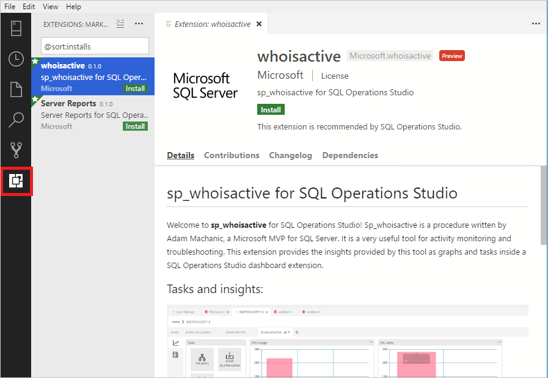

# Extend the functionality of [!INCLUDE[name-sos](../includes/name-sos-short.md)]

Extensions in [!INCLUDE[name-sos](../includes/name-sos-short.md)] provide an easy way to add more functionality to the base [!INCLUDE[name-sos](../includes/name-sos-short.md)] installation. 

Extensions are provided by the Azure Data Studio team (Microsoft), as well as the 3rd party community (you!). For details about creating extensions, see [Extension authoring](extension-authoring.md).

## Add Azure Data Studio extensions

1. To open the extensions manager and access the available extensions, select the extensions icon, or select **Extensions** in the **View** menu.
2. Select an available extension to view it's details.

   

3. Select the extension you want and **Install** it.
4. Select **Reload** to enable the extension (only required the first time you install an extension).
5. Navigate to your management dashboard by right-clicking your server or database and selecting **Manage**.
6. Installed extensions appear as tabs on your management dashboard:

   

