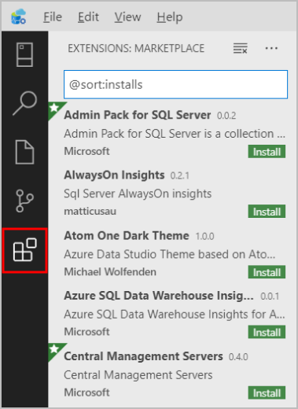
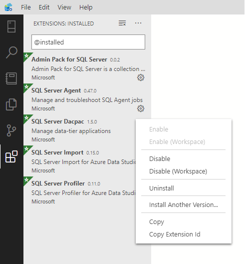
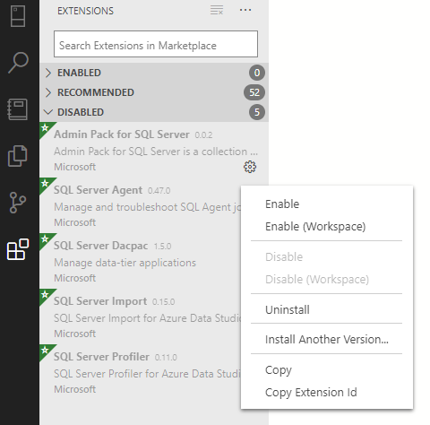

# Extend the functionality of Azure Data Studio

Extensions in Azure Data Studio provide an easy way to add more functionality to the base Azure Data Studio installation.

Extensions are provided by the Azure Data Studio team (Microsoft), as well as the third-party community (you!). For more information about creating extensions, see [Extension authoring](./extension-authoring.md).

## Add Azure Data Studio extensions

1. Access the available extensions by selecting the Extensions Icon, or by selecting **Extensions** in the **View** menu. You can use the **View: Show Extensions** command, available in the **Command Palette** (F1 or `Ctrl+Shift+P`).

    

    You can also quickly access the extensions manager by pressing `Ctrl+Shift+X` (Windows/Linux) or `Command+Shift+X` (Mac).

2. Select an available extension to view its details.

    

3. Select the extension you want and **Install** it.

4. Once installed, **Reload** to enable the extension in Azure Data Studio (only required when installing an extension for the first time).

If you're having problems accessing the Extensions Manager on Azure Data Studio, you can download the extension you need on our [GitHub Wiki](https://github.com/microsoft/azuredatastudio/wiki/List-of-Extensions).

## Manage extensions

### List installed extensions

The default Extensions view shows the extensions that are currently enabled, all extensions that are recommended for you, and a collapsed container of all currently disabled extensions. The **Extensions: Show Installed Extensions** command, available in the **Command Palette** or the **More Actions** `(...)` drop-down menu, shows a list of all installed extensions, including disabled extensions.

### Uninstall an extension

To uninstall an extension, click the gear icon on the right of an extension entry and choose **Uninstall** from the drop-down menu. This uninstalls the selected extension and will prompt you to reload Azure Data Studio.

 

### Disable an extension

You may temporarily disable an extension instead of permanently removing an extension. You can either disable an extension across all Azure Data Studio sessions (**Disable**) or just for your current Workspace (**Disable (Workspace)**). You can also disable all of your currently installed extensions through the **Command Palette** with the commands **Extensions: Disable All Extensions** and **Extensions: Disable All Extensions (Workspace)**.

### Enable an extension

If an extension has been disabled, it will be in the **Disabled** section of the extension list and marked as ***Disabled***. You can re-enable it with the **Enable** or **Enable (Workspace)** commands in the drop-down menu. The **Command Palette** also lets you enable all extensions with the commands **Extensions: Enable All Extensions** and **Extensions: Enable All Extensions (Workspace)**.

### Updating an extension

Azure Data Studio automatically checks for and installs updates for any of your installed extensions. 

[!INCLUDE [auto-update-extension](../../includes/auto-update-extension.md)]

## Install from a VSIX

You can manually install an Azure Data Studio extension packaged in a `.vsix` file using the **Install from VSIX** command in the Extensions view command drop-down, or the **Extensions: Install from VSIX command** in the Command Palette and point to the extension's `.vsix` file.

## Access installed Azure Data Studio extensions

Each extension enhances your experience in Azure Data Studio in a different way. As a result, the entry point for extensions can vary. Refer to your installed extension's individual documentation for information on how its features can be accessed once it's installed.

## Extensions view filters

The Extensions view search box supports filters to help you find and manage extensions. The commands **Show Installed Extensions** and **Show Recommended Extensions** use filters such as `@installed` and `@recommended` in the search box.

You can see a complete listing of all filters and sort commands by typing @ in the extensions search box and navigating through the suggestions:

Here are the Extensions view filters:

- `@builtin` - Show extensions that come with Azure Data Studio. Grouped by type (Programming Languages, Themes, etc.).
- `@disabled` - Show disabled installed extensions.
- `@enabled` - Show enabled installed extensions. Extensions can be individually enabled/disabled.
- `@installed` - Show installed extensions.
- `@outdated` - Show outdated installed extensions. A newer version is available on the Marketplace.
- `@recommended` - Show recommended extensions. Grouped as Workspace specific or general use.
- `@category` - Show extensions belonging to specified category. Below are a few of supported categories. For a complete list, type @category and follow the options in the suggestion list:
    - `@category:themes`
    - `@category:formatters`
    - `@category:snippets`
These filters can be combined as well. For example, `@installed @category:themes` displays all installed themes.

If no filter is provided, the Extensions view displays currently installed and recommended extensions.

### Sorting

You can sort extensions with the `@sort` filter, which can take the following values:

- `installs` - Sort by extension gallery installation count, in descending order.
- `rating` - Sort by extension gallery rating (1-5 stars), in descending order.
- `name` - Sort alphabetically by extension name.

## Common questions

### Where are extensions installed?

Extensions are installed in a per user extensions folder. Depending on your platform, the location is in the following folder:

- Windows `%USERPROFILE%\.azuredatastudio\extensions`
- macOS `~/.azuredatastudio/extensions`
- Linux `~/.azuredatastudio/extensions`
