# Convert Oracle database objects to Microsoft SQL

Once Database Schema Conversion Toolkit (Oracle to Microsoft SQL) extension is [installed](./install-remove-database-schema-conversion-toolkit-oracle-to-mssql.md), you can start converting your Oracle database objects to the Microsoft SQL platform.

## Create target SQL Database project

First step in the conversion process is to prepare the target SQL Database project, where generated T-SQL scripts will be stored. In order to do this:

1. Navigate to the **Projects** view and select **Crate new** to create new SQL Database project

   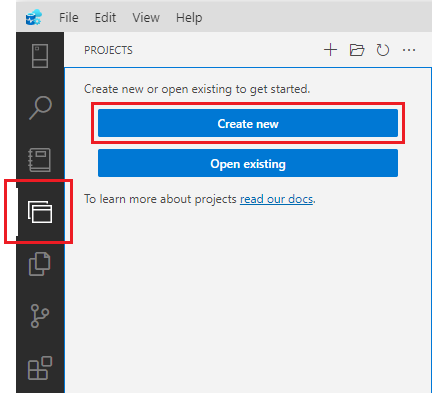

2. In the **Create new project** dialog, select **SQL Database** as a **Type**, provide the **Name** for your project, choose the **Location** where you want your project to be stored and select desired **Target Platform**

   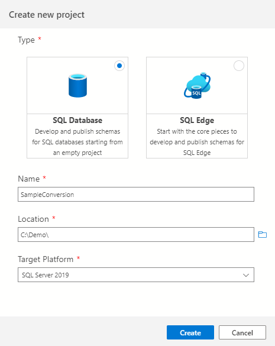

   > [!NOTE]
   > When targeting on-premises SQL Server, only SQL Server 2012 and above is supported by the **Database Schema Conversion Toolkit (Oracle to Microsoft SQL)**.

3. Select **Create** to complete the SQL Database project creation
   
   > [!NOTE]
   > At this point Azure Data Studio may need to restart for the project to be created and added to the workspace.

4. You should be able to see an empty SQL Database project under the **Projects** view

   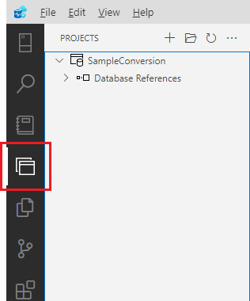

## Connect to the source Oracle database

Next step in the schema conversion process is to [connect to an Oracle database](../../../quickstart-oracle.md).

## Convert Oracle database objects

When connection to the Oracle database is established, you can start converting database objects.

1. In the **Connections** view, right-click an Oracle schema that you wish to convert to Microsoft SQL and select **Convert to Microsoft SQL**. If you want to convert multiple schemas at once, right-click the entire server element.

   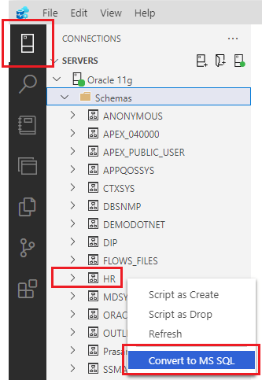

   > [!NOTE]
   > Conversion option is available at the server and schema levels only. If you need to convert individual objects, you will be able to narrow down the objects selection in the next step.

   The **Convert database objects** wizard dialog will appear.

2. On the **Select objects to convert** step, select schema objects that you wish to convert.

   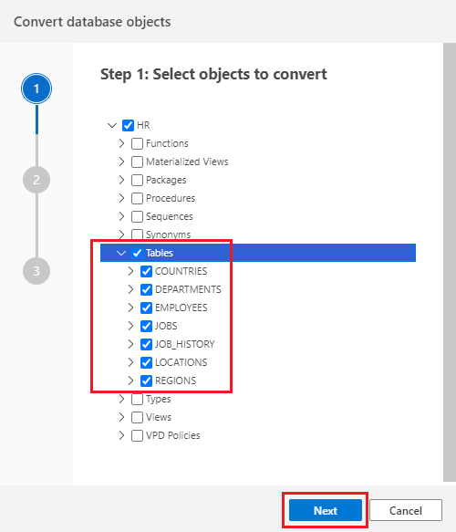

   > [!NOTE]
   > Parent objects will be automatically selected. For example, when selecting an index, parent table will also be included to make sure all necessary context is available to the conversion.

   Select **Next** when done to advance to the next step.

3. On the **Select target database project** step, select previously created SQL Database project, where you want converted T-SQL scripts to be stored.

   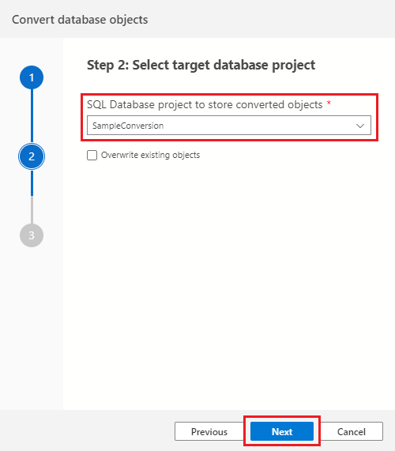

   If your SQL Database project already contains script files that were previously generated by the conversion, then you may consider selecting an **Overwrite existing objects** option to replace existing script files.

   Select **Next** when done to advance to the next step.

4. On the **Conversion settings** step you can optionally load a [conversion configuration file](./configure-conversion.md).

   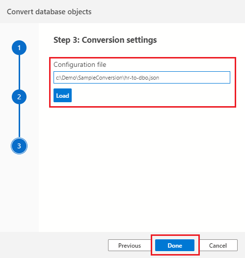

   Select **Done** to complete the wizard and start the schema conversion.

5. Conversion task will be started.

   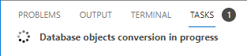

   You can track conversion progress by switching to **Database Schema Conversion Toolkit (Oracle to Microsoft SQL)** on the **Output** panel.

   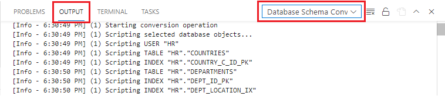

## Review converted scripts

Once conversion has completed, converted script files will be added to the target SQL Database project.

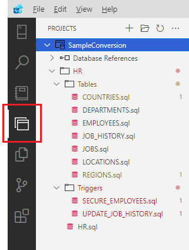

If there are any conversion messages, they will appear on the **Problems** panel and you can navigate to the conversion message location by selecting the message row.

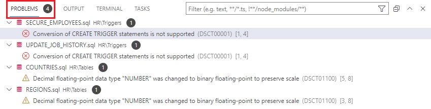

Conversion messages will also be embedded as comments in the converted SQL scripts. Once addressed, the comments can be removed.

> [!NOTE]
> You can close the Azure Data Studio at any time and reopen the SQL Database project later. In order to discover conversion messages in the SQL Database project that was converted previously, open **Command Palette...** from the **View** menu and run **DSCT (Oracle to Microsoft SQL): Discover problems** command.

## Deploy the target Microsoft SQL database

When all problems produced during conversion are addressed, you can [deploy your database](../../sql-database-project-extension-build.md) to the target server.

## Next steps

- [Extension for Oracle](../../extension-for-oracle.md)
- [SQL Database Projects extension](../../sql-database-project-extension.md)