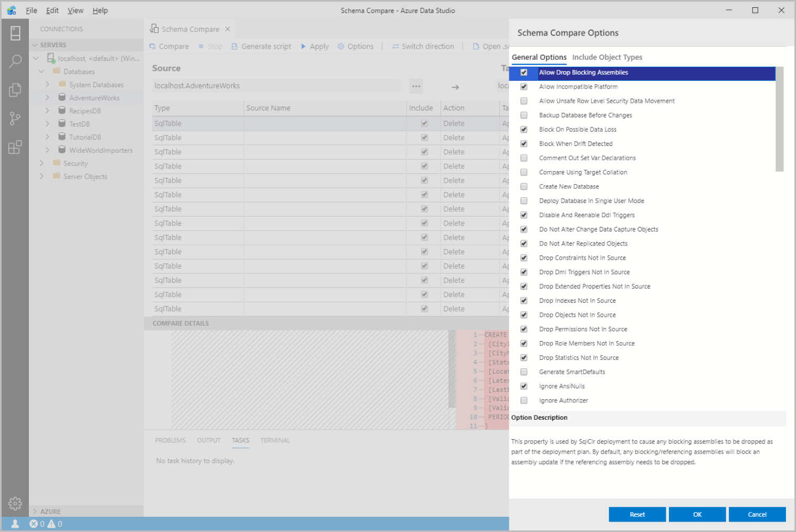
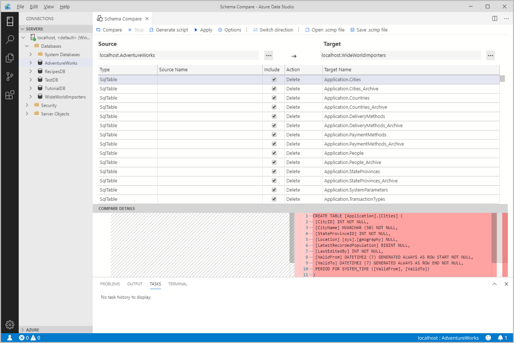

# Schema Compare extension

The Schema Compare extension provides an easy-to-use experience to compare two database definitions and apply the differences from the source to the target.  This includes active database connections, dacpac files, and [SQL projects](sql-database-project-extension.md).

It can be tedious to manually manage and synchronize different database versions. The Schema Compare extension simplifies the process of comparing databases and gives you full control when synchronizing them &mdash; you can selectively filter specific differences and categories of differences before applying the changes. The Schema Compare extension is a reliable tool that saves you time and code.

## Features

* Compare schemas between two dacpac files, databases, or SQL projects
* View results as a set of actions that must be taken against the target for it to match the source
* Selectively exclude actions listed in results
* Set options that control the scope of the comparison
* Apply changes to target or generate a script with the same effect
* Save the comparison

## Install the extension

1. Select the Extensions Icon to view the available extensions.

    :::image type="content" source="media/schema-compare-extension/schema-compare-marketplace-search.png" alt-text="marketplace search":::

2. Search for the **Schema Compare** extension and select it to view its details. Select **Install** to add the extension.

3. Once installed, **Reload** to enable the extension in Azure Data Studio (only required when installing an extension for the first time).

## Launch a schema comparison

1. To open the Schema Compare dialog, **right-click** a database in the Object Explorer and Select **Schema Compare**. The database you select is set as the Source database in the comparison.

    :::image type="content" source="media/schema-compare-extension/schema-compare-launch.png" alt-text="schema compare launch":::

2. Select one of the ellipses (...) to change the Source and Target of your Schema Compare and Select OK.

    :::image type="content" source="media/schema-compare-extension/schema-compare-select-source-target.png" alt-text="schema compare select source target":::

3. To customize your comparison, Select the **Options** button in the toolbar.

4. Select **Compare** to view the results of the comparison.

## Update an existing SQL project from a database

1. Install both the **Schema Compare** and **[SQL Database Project](sql-database-project-extension.md)** extensions.

2. From a **Database dashboard** select the **Update Project from Database** option in the toolbar.

3. Select the existing SQL project and the desired file structure for new objects.

4. Choose **View changes in Schema Compare** to review the changes before applying them to the SQL project.

## Next steps

- [Learn more about Schema Compare in SSDT](../../ssdt/how-to-use-schema-compare-to-compare-different-database-definitions.md)
- [Explore SQL database projects in Azure Data Studio](sql-database-project-extension.md)
