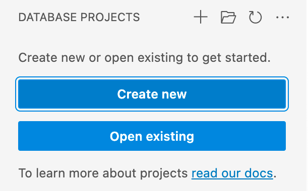

# Getting started with the SQL Database Projects extension (Preview)

This article describes three ways to get started with the SQL Database Projects extension:

1. Create a new database project by going to the **Projects** view or by searching for **New Database Project** in the command palette.
2. Existing database projects can be opened via **Open Database Project** in the command palette.
3. Start from an existing database by using **Import New Database Project** from the command palette.

    

## Create an empty database project

In the **Projects** view select the **New Project** button and enter a project name in the text input that appears.  In the "Select a Folder" dialog that appears, select a directory for the project's folder, .sqlproj file, and other contents to reside in.
The empty project is opened and visible in the **Projects** view for editing.

## Open an existing project

In the **Projects** view, select the **Open Project** button and open an existing *.sqlproj* file from the file picker that appears. Existing projects can originate from Azure Data Studio, VS Code or [Visual Studio SQL Server Data Tools](../../ssdt/sql-server-data-tools.md).

The existing project is opened and its contents are visible in the **Projects** view for editing.

## Create a database project from an existing database

In the **Project** view select the **Import Project from Database** button and connect to a SQL Server.  Once the connection is established, select a database from the list available databases and set the name of the project.

Finally, select a target structure of the extraction.  The new project is opened and contains SQL scripts for the contents of the selected database.

## Build and publish

Deploying the database project is achieved in the SQL Database Projects extension by building the project into a [data-tier application file](../../relational-databases/data-tier-applications/data-tier-applications.md) (DACPAC) and publishing to a supported platform. For more on this process, see [Build and Publish a Project](sql-database-project-extension-build.md).

## Schema compare

The SQL Database Projects extension interacts with the [Schema Compare extension](schema-compare-extension.md), if installed, to compare the contents of a project to a dacpac or existing database.  The resulting schema comparison can be used to view and apply the differences from source to target.

## Next steps

- [Build and Publish a project with SQL Database Projects extension ](sql-database-project-extension-build.md)
