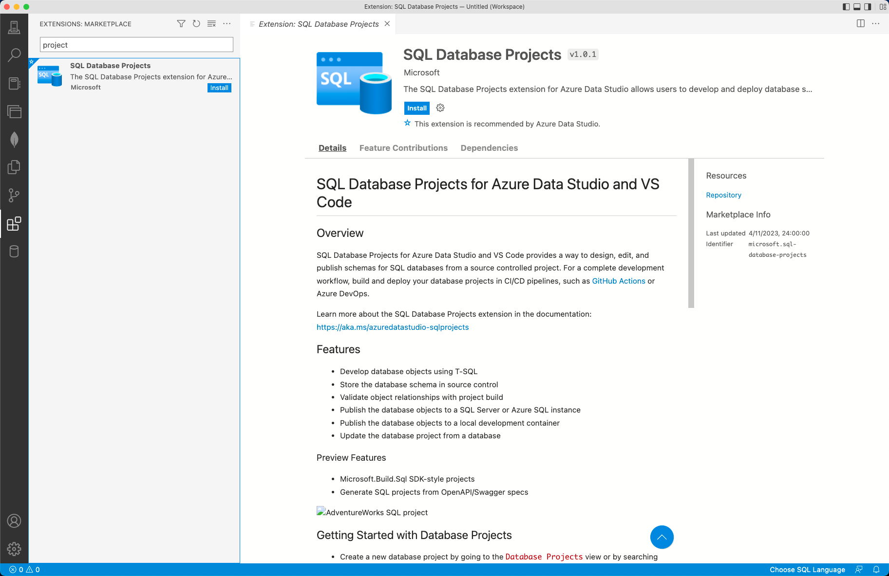

# SQL Database Projects extension (Preview)

The SQL Database Projects extension (preview) is an Azure Data Studio and VS Code extension for developing SQL databases including for SQL Server, Azure SQL Database, and Azure SQL Managed Instance in a project-based development environment.  A SQL project is a local representation of SQL objects that comprise the schema for a single database, such as tables, stored procedures, or functions.


## Extension features

The SQL Database Projects extension provides the following features: 

- Create a new blank project.
- Create a new project from a connected database or from an [OpenAPI](https://github.com/OAI/OpenAPI-Specification) specification file.
- Open a project previously created in [Azure Data Studio, VS Code](sql-database-project-extension-getting-started.md) or in [SQL Server Data Tools](../../ssdt/sql-server-data-tools.md).
- Edit a project by adding or removing objects (tables, views, stored procedures) or custom scripts in the project.
- Organize files/scripts in folders.
- Add references to system databases or a user dacpac.
- Build a single project.
- Deploy a single project.
- Load connection details (SQL Windows authentication) and SQLCMD variables from deployment profile.

Watch this short 10-minute video for an introduction to the SQL Database Projects extension in Azure Data Studio:

> [!VIDEO https://channel9.msdn.com/Shows/Data-Exposed/Build-SQL-Database-Projects-Easily-in-Azure-Data-Studio/player?WT.mc_id=dataexposed-c9-niner]

## Install

You can install the SQL Database Project extension in Azure Data Studio and VS Code. 

### Azure Data Studio

To install the SQL Database Project extension in Azure Data Studio, follow these steps: 

1. Open the extensions manager to access the available extensions.  To do so, either select the extensions icon or select **Extensions** in the **View** menu.
1. Identify the *SQL Database Projects* extension by typing all or part of the name in the extension search box. Select an available extension to view its details.

   

1. Select the extension you want and choose to **Install** it.
1. Select **Reload** to enable the extension (only required the first time you install an extension).
1. Select the **Projects** icon from the activity bar.


> [!NOTE]
> - It is recommended to install the [Schema Compare extension](schema-compare-extension.md) alongside the SQL Database Projects extension for full functionality.


### VS Code

The SQL Database Projects extension is installed with the [mssql](../../tools/visual-studio-code/sql-server-develop-use-vscode.md) extension for VS Code.

## Dependencies

The SQL Database Projects extension has a dependency on the .NET Core SDK and AutoRest.Sql

### .NET Core SDK

The .NET Core SDK is required for project build functionality and you will be prompted to install the .NET Core SDK if it cannot be detected by the extension.  The .NET Core SDK (v3.1.x) can be downloaded and installed from [https://dotnet.microsoft.com/download/dotnet-core/3.1](https://dotnet.microsoft.com/download/dotnet-core/3.1). 

If you would like to [check currently installed versions](/dotnet/core/install/how-to-detect-installed-versions) of the dotnet SDK, open a terminal and run the following command:

```dotnetcli
dotnet --list-sdks
```

To force the SQL Database Projects extension to use the v3.1.x version of the .NET Core SDK when multiple versions are installed, add a [package.json](/dotnet/core/tools/global-json?tabs=netcore3x) file to the folder that contains the SQL project. 

Unsupported .NET Core SDK versions may result in error messages such as:
- `error MSB4018: The "SqlBuildTask" task failed unexpectedly.`
- `error MSB4018: System.TypeInitializationException: The type initializer for 'SqlSchemaModelStaticState' threw an exception. ---> System.IO.FileNotFoundException: Could not load file or assembly 'System.Runtime, Version=4.2.2.0, Culture=neutral, PublicKeyToken=b03f5f7f11d50a3a'. The system cannot find the file specified. [c:\Users\ .sqlproj]_` (where the linked non-existing file has an unmatched closing square bracket). 


### AutoRest.Sql

The SQL extension for [AutoRest](https://github.com/Azure/autorest) is automatically downloaded and used by the SQL Database Projects extension when a SQL project is generated from an OpenAPI specification file.


## Limitations

Currently, the SQL Database Project extension has the following limitations: 

- Loading files as a link is not supported in Azure Data Studio today, however the files will be loaded at the top level in the tree and the build will incorporate these files as expected.
- SQLCLR objects in projects are not supported in the.NET Core version of DacFx.
- Tasks (build/publish) are not user-defined.
- Publish targets defined by DacFx.
- WSL environment support is limited.

## Workspace

SQL database projects are contained within a logical workspace in Azure Data Studio and VS Code. A workspace manages the folder(s) visible in the Explorer pane. **All SQL projects within the folders open in the current workspace are available in the SQL Database Projects view by default.**  

You can manually add and remove projects from a workspace through the interface in the **Projects** pane. The settings for a workspace can be manually edited in the `.code-workspace` file,  if necessary.

In the following example `.code-workspace` file, the `folders` array lists all folders included in the Explorer pane and the `dataworkspace.excludedProjects` array within `settings` lists all the SQL projects included in the **Projects** pane.

```json
{
	"folders": [
		{
			"path": "."
		},
		{
			"name": "WideWorldImportersDW",
			"path": "..\\WideWorldImportersDW"
		}
	],
	"settings": {
		"dataworkspace.excludedProjects": [
			"AdventureWorksLT.sqlproj"
		]
	}
}
```

## Next steps

- [Getting Started with the SQL Database Projects extension](sql-database-project-extension-getting-started.md)
- [Build and Publish a project with SQL Database Projects extension](sql-database-project-extension-build.md)
