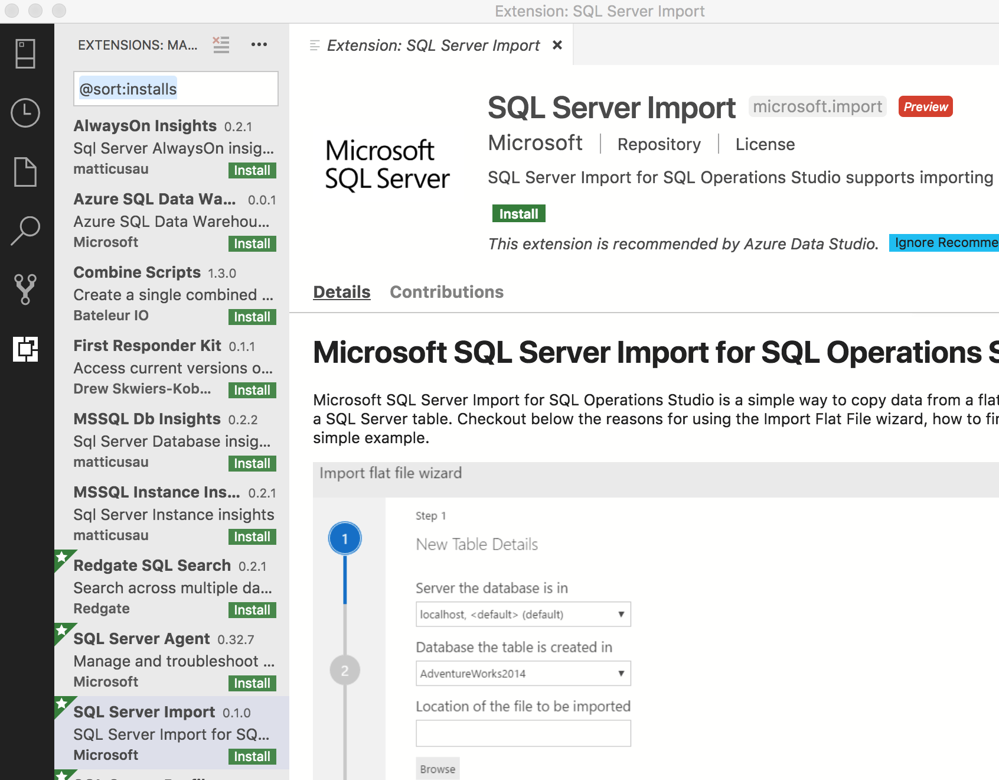
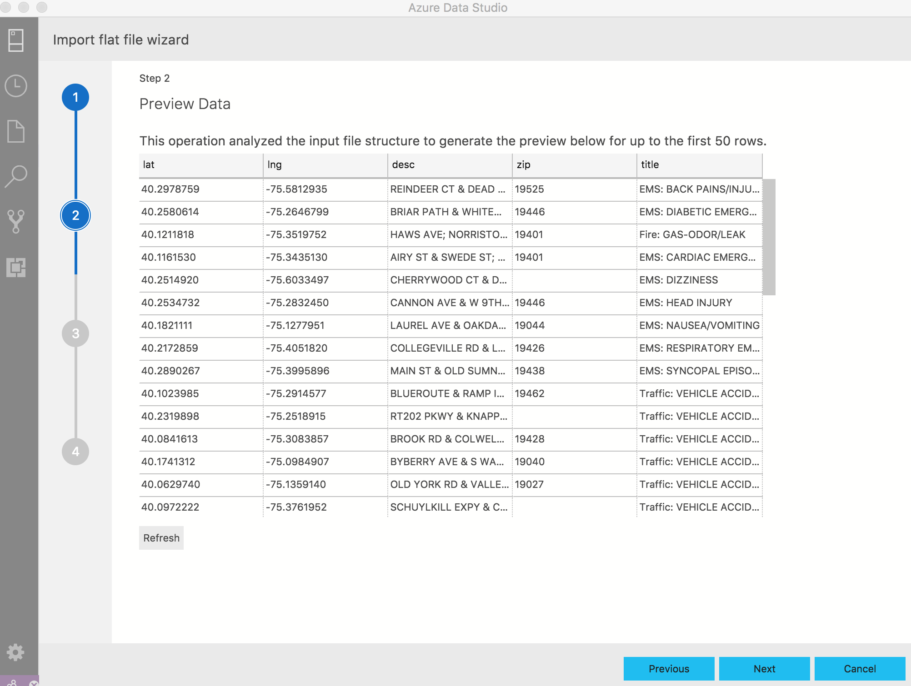

# SQL Server Import extension

The SQL Server Import extension converts .txt and .csv files into a SQL table. This wizard utilizes a Microsoft Research framework known as [Program Synthesis using Examples (PROSE)](https://microsoft.github.io/prose/) to intelligently parse the file with minimal user input. It's a powerful framework for data wrangling, and it's the same technology that powers Flash Fill-in Microsoft Excel

To learn more about the SSMS version of this feature, you can read [this article](../../relational-databases/import-export/import-flat-file-wizard.md).

## Install the SQL Server Import extension

1. To open the extensions manager and access the available extensions, select the extensions icon, or select **Extensions** in the **View** menu.
2. In the search box, search for **SQL Server Import**. Select the extension to view its details.

   

3. Select **Install**.

## Start Import Wizard

1. To start SQL Server Import, first make a connection to a server in the Servers tab.
2. After you make a connection, drill down to the target database that you want to import a file into a SQL table.
3. Right-click on the database and select **Import Wizard**.

    

## Importing a file

1. When you Right-click to launch the wizard, the server and database are already autofilled. If there are other active connections, you can select in the dropdown. 

    Select a file by selecting **Browse.** It should autofill the table name based on the file name, but you can also change it yourself.

    By default, the schema will be dbo but you can change it. select **Next** to proceed.

    

2. The wizard will generate a preview based on the first 50 rows. Select **Next** to proceed or create new columns calculated based on the contents of existing columns by selecting **Create derived column**.  For more information, see the section on [Derived columns](#derived-columns).

    

3. On this page, you can make changes to column name, data type, whether it's a primary key, or to allow nulls. You can make as many changes as you like. select **Import Data** to proceed.

    

4. This page gives a summary of the actions chosen. You can also see whether your table inserted successfully or not.

    You can either select **Done, Previous** if you need to make changes, or **Import new file** to quickly import another file.

    

5. Verify if your table successfully imported by refreshing your target database or running a SELECT query on the table name.

## Derived columns

Columns can be added dynamically based on the contents of existing columns. This functionality is especially useful when you want to create a new column based on the contents of another column during the data import. This functionality also uses the [Program Synthesis](https://microsoft.github.io/prose/) framework.

When you enter the **Create derived column** portion of the Import Wizard, you will begin by selecting one or more columns that the new column will be based on.  Following the column selection you can enter the name of the new column and begin providing one or more values to be used in determining the calculation of the new column.  As you enter values, you can pause and select **Preview Transformation** to assess the results of the transformation against a sample of the data.

When you are satisfied with the data transformation displayed, select **Done** to return to the primary Import Wizard and proceed to the next step or continue to add derived columns.

## Next steps

- To learn more about the Import Wizard, read the [initial blog post](https://cloudblogs.microsoft.com/sqlserver/2018/08/30/the-august-release-of-sql-operations-studio-is-now-available/).
- To learn more about PROSE, read the [documentation.](https://microsoft.github.io/prose/)
