# Notebooks with SQL Server in Azure Data Studio

[!INCLUDE[tsql-appliesto-ssver15-xxxx-xxxx-xxx](../includes/tsql-appliesto-ssver15-xxxx-xxxx-xxx.md)]

This article describes how to launch the Notebook experience in the latest release of [**Azure Data Studio**](../azure-data-studio/download.md) and how to start authoring your own notebooks. It also shows how to write Notebooks using different kernels.

Watch this short 5-minute video for an introduction into notebooks in Azure Data Studio:

> [!VIDEO https://channel9.msdn.com/Shows/Data-Exposed/Introduction-to-Azure-Data-Studio-Notebooks/player?WT.mc_id=dataexposed-c9-niner]

## Connect to SQL Server

You can connect to the Microsoft SQL Server connection type in Azure Data Studio.
In Azure Data Studio, you can also press F1, and select **New Connection** and connect to your SQL Server.


## Launch Notebooks

There are multiple ways to launch a new notebook.

- Go to the **File Menu** in Azure Data Studio and then select **New Notebook**.

    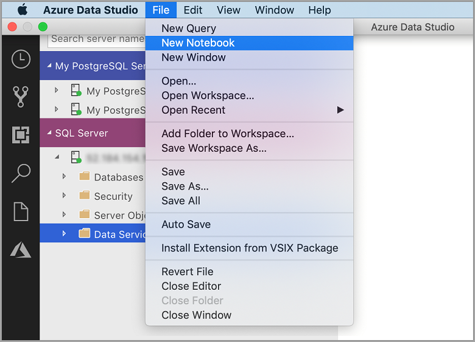

- Right select the **SQL Server** connection and then launch **New Notebook**.

    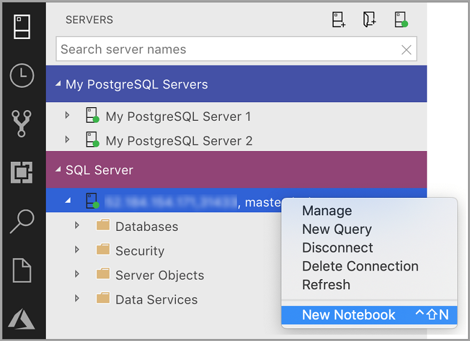

- Open the command palette (**Ctrl+Shift+P**)) and then type in **New Notebook**. A new file named `Notebook-1.ipynb` opens.

## Supported kernels and attach to context

The Notebook Installation in Azure Data Studio natively supports SQL Kernel. If you're a SQL developer, and want to use Notebooks, the SQL Kernel is your chosen Kernel.

The SQL Kernel can also be used to connect to PostgreSQL server instances. If you're a PostgreSQL developer and want to connect the notebooks to your PostgreSQL Server, then download the [**PostgreSQL extension**](../azure-data-studio/postgres-extension.md) in the Azure Data Studio extension Marketplace and then launch **New Notebook** to open a notebook instance to connect to the PostgreSQL server.

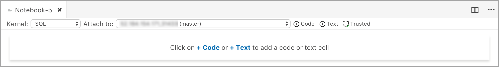

### SQL Kernel

In the code cells within the Notebook, similar to our query editor, we support modern SQL coding experience that makes your everyday tasks easier with built-in features such as a rich SQL editor, IntelliSense, and built-in code snippets. Code snippets allow you to generate the proper SQL syntax to create databases, tables, views, stored procedures, and to update existing database objects. Use code snippets to quickly create copies of your database for development or testing purposes and to generate and execute scripts.

Select **Run** to execute each cell.

SQL Kernel to connect to SQL Server instance


Query Results


SQL Kernel to connect to PostgreSQL Server instance


Query Results


If you want to add text cells to your existing Notebook attached to the SQL Kernel, select the **+Text** command in the toolbar.


The cell changes to edit mode and now type markdown and you can see the preview at the same time

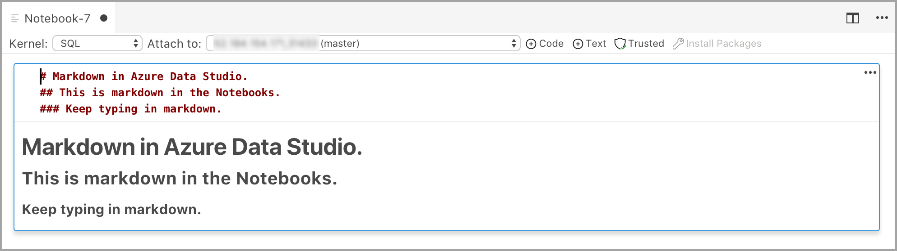

Selecting outside the text cell shows the markdown text.


### Configure Python for Notebooks

When you select any of the other kernels apart from SQL from the kernel dropdown, then you get prompted to **Configure Python for Notebooks**. The Notebook dependencies get installed in a specified location but you can decide whether to set the installation location. This installation can take some time and it's recommended to not close the application until the installation is complete. Once the installation finishes, you can start writing code in the supported language.

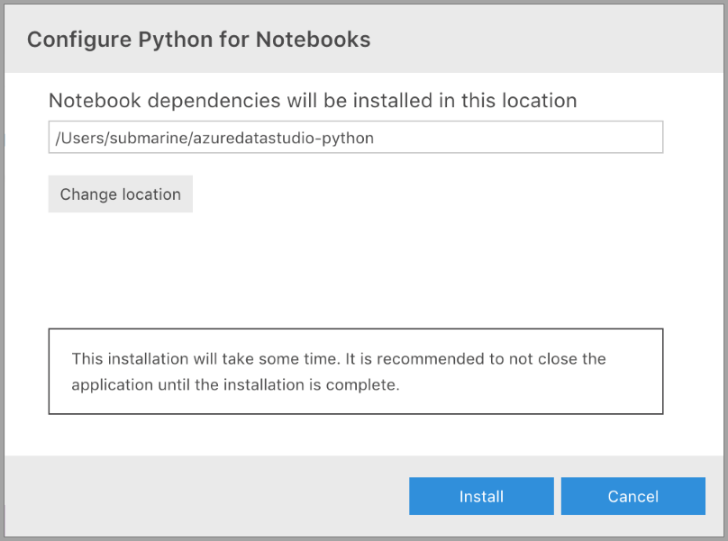

Once the installation succeeds, there's a notification in the Task History along with the location of the Jupyter backend server running in the Output Terminal.

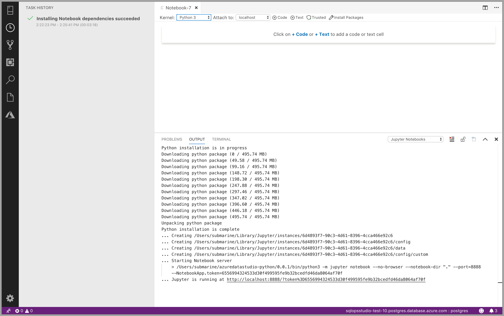

|Kernel|Description
|:-----|:-----
| SQL Kernel | Write SQL Code targeted at your relational database.
|PySpark3 and PySpark Kernel| Write Python code using Spark compute from the cluster.
|Spark Kernel|Write Scala and R code using Spark compute from the cluster.
|Python Kernel|Write Python code for local development.

`Attach to` provides the context for the Kernel to attach. If you're using SQL Kernel, then you can `Attach to` any of your SQL Server instances.

If you're using Python3 Kernel the `Attach to` is `localhost`. You can use this kernel for your local Python development.

When you're connected to SQL Server 2019 big data cluster, the default `Attach to` is that end point of the cluster and lets you submit Python, Scala, and R code using the Spark compute of the cluster.

### Code Cells and Markdown Cells

Add a new code cell by selecting the **+Code** command in the toolbar.

Add a new text cell by selecting the **+Text** command in the toolbar.


The cell changes to edit mode and now type markdown and you can see the preview at the same time


Selecting outside the text cell shows the markdown text.


### Trusted and Non Trusted

The Notebooks open in Azure Data Studio are defaulted to **Trusted**.

If you open a Notebook from some other source, it opens in **Non-Trusted** mode and then you can make it **Trusted**.

### Run Cells

If you want to run all cells in the Notebook, then select the **Run Cells** button in the toolbar.

### Clear Results

If you want to clear the results of all the executed cells in the Notebook, then you can select the **Clear Results** button in the toolbar.

### Save

To save the notebook, do one of the following.

- Select Ctrl+S
- Select **File** > **Save**
- Select **File** > **Save As...**
- Select **File** > **Save All**
- In the command palette, enter **File: Save**

### Pyspark3/PySpark kernel

Choose the `PySpark Kernel` and in the cell type in the following code.

Select **Run**.

The Spark Application is started and returns the following output:

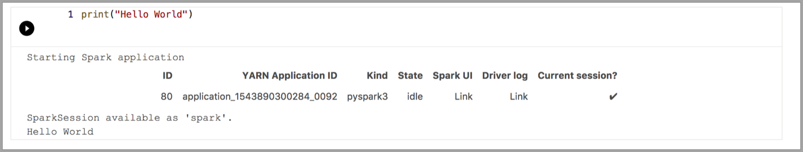

### Spark kernel | Scala language

Choose the `Spark|Scala Kernel` and in the cell type in the following code.

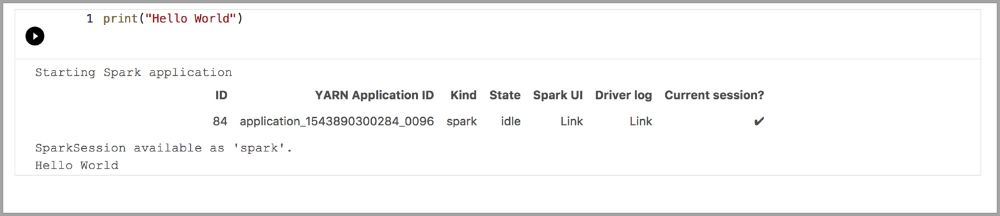

You can also view the "Cell Options" when you select the options icon below –

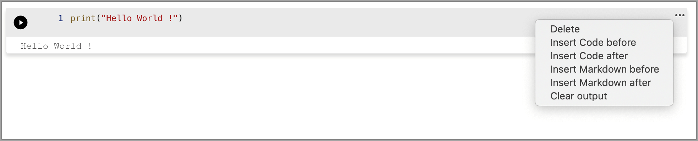

### Spark kernel | R language

Choose the Spark | R in the dropdown for the kernels. In the cell, type or paste in the code. Select **Run** to see the following output.

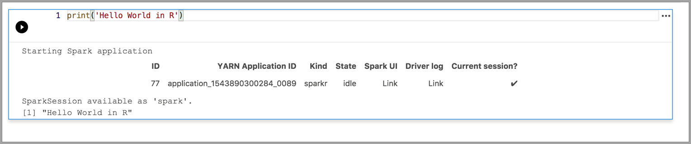

### Local Python kernel

Choose the local Python Kernel and in the cell type in -

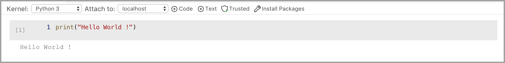

## Manage Packages

One of the things we optimized for local Python development was to include the ability to install packages which customers would need for their scenarios. By default, we include the common packages like `pandas`, `numpy` etc., but if you're expecting a package that isn't included then write the following code in the notebook cell:

```python
import <package-name>
```

When you run this command, `Module not found` is returned. If your package exists, then there's no error.

If it returns a `Module not Found` error, then select **Manage Packages** to launch the terminal. You can now install packages locally. Use the following commands to install the packages:

```bash
./pip install <package-name>
```

   > [!Tip]
   > On Mac please follow the instructions in the Terminal window for installing packages.

After the package is installed, you should be able to go in the Notebook cell and type in following command:

```python
import <package-name>
```

To uninstall a package, use the following command from your terminal:

```bash
./pip uninstall <package-name>
```

## Next steps

To learn how to work with an existing notebook, see [How to manage notebooks in Azure Data Studio](notebooks-manage-sql-server.md).