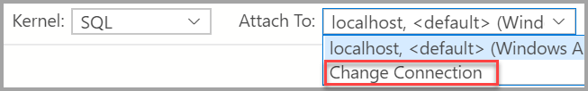

# How to manage notebooks in Azure Data Studio

[!INCLUDE[tsql-appliesto-ssver15-xxxx-xxxx-xxx](../includes/tsql-appliesto-ssver15-xxxx-xxxx-xxx.md)]

This article shows you how to open and save notebook files in Azure Data Studio with SQL Server. It also demonstrates how to change your connection to your SQL Server.

## Open a notebook

There are several ways to open the **Open Notebook** dialog. You can use the File menu, the Dashboard, and the Command Palette. The following sections describe each method.

### File menu

Select **File Open** from the File menu Ctrl+O (in Windows) and Cmd+O (in Mac).

### Dashboard

Click **Open Notebook** in the dashboard to open the File Open dialog.

 

### Command Palette

Use command **File: Open** from command palette by typing Ctrl+Shift+P (in Windows) and Cmd+Shift+P (in Mac).

## Save a notebook

There is currently one way to save a notebook. You must select **Save** from the notebook toolbar.

> [!NOTE]
> The following methods currently do not save changes to notebooks:
>
> - **File Save**, **File Save As...** and **File Save All** commands from the File menu.
> - **File: Save** commands entered in the command palette.

## Change the SQL Server

To change the SQL Server big data cluster for a notebook:

1. Select the **Attach to** menu from the notebook toolbar amd then select **Change Connection**.

   

2. Now you can either select a recent connection server or enter new connection details to connect.

   

## Next steps

For more information about notebooks in Azure Data Studio, see [How to use notebooks in SQL Server 2019](notebooks-guidance.md).
