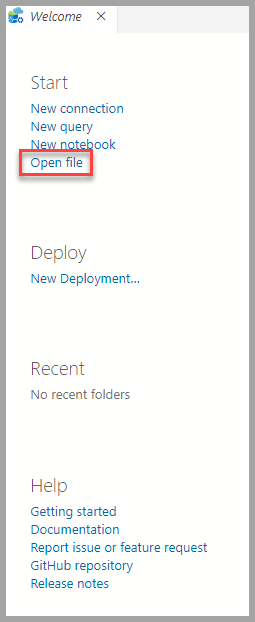
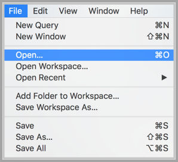
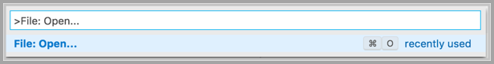
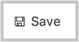

# How to manage notebooks in Azure Data Studio

[!INCLUDE[SQL Server 2019](../includes/applies-to-version/_ss2019.md)]

This article shows you how to open and save notebook files in Azure Data Studio. It also demonstrates how to change your connection to your SQL Server or Python kernel.

## Open a notebook

There are several ways to open the **Open Notebook** dialog. You can use the File menu, the Dashboard, and the Command Palette. The following sections describe each method.

### File menu

Select **File Open** from the File menu Ctrl+O (in Windows) and Cmd+O (in Mac).



### Dashboard

Click **Open Notebook** in the dashboard to open the File Open dialog.

 

### Command Palette

Use command **File: Open** from command palette by typing Ctrl+Shift+P (in Windows) and Cmd+Shift+P (in Mac).



## Save a notebook

There's currently one way to save a notebook. Select **Save** from the notebook toolbar.



> [!NOTE]
> The following methods currently do not save changes to notebooks:
>
> - **File Save**, **File Save As...** and **File Save All** commands from the File menu.
> - **File: Save** commands entered in the command palette.

## Change the SQL connection

To change the SQL connection for a notebook:

1. Select the **Attach to** menu from the notebook toolbar and then select **Change Connection**.

   

2. Now you can either select a recent connection server or enter new connection details to connect.

   

## Change the Python kernel

The first time you open Azure Data Studio, the **Configure Python for Notebooks** page is displayed. You can select either:

- **New Python installation** to install a new copy of Python for Azure Data Studio, or
- **Use existing Python installation** to specify the path to an existing Python installation for Azure Data Studio to use

To view the location and version of the active Python kernel, create a code cell and run the following Python commands:

```python
import os
import sys
print(sys.version_info)
print(os.path.dirname(sys.executable))
```

To change to a different installation of Python:

1. From the **File** menu, select **Preferences** and then **Settings**.
1. Scroll to **Notebook configuration** under **Extensions**.
1. Under **Use Existing Python**, uncheck the option "Local path to a preexisting python installation used by Notebooks."
1. Restart Azure Data Studio.

When the **Configure Python for Notebooks** page is displayed, you can choose to create a new Python installation or specify a path to an existing installation.

## Next steps

For more information about SQL notebooks in Azure Data Studio, see [How to use notebooks in SQL Server 2019](notebooks-guidance.md).
