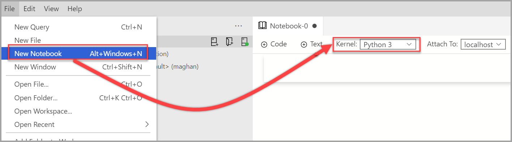
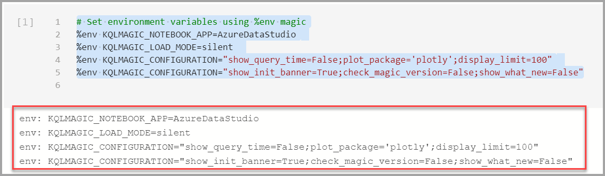

# Create and run a notebook with KQL magic

[!INCLUDE[tsql-appliesto-ssver15-xxxx-xxxx-xxx](../includes/tsql-appliesto-ssver15-xxxx-xxxx-xxx.md)]

This tutorial demonstrates how to create and run a notebook in Azure Data Studio using the KQL magic extension.

## Prerequisites

- [Azure Data Studio](download-azure-data-studio.md)
- [Python installed](https://www.python.org/downloads/)
- [Azure Data Explorer cluster and database](https://docs.microsoft.com/azure/data-explorer/create-cluster-database-portal)

## Set up environment

1. Create a new notebook and change the **Kernel** to *Python 3*.

   

2. When asked, select **Yes** to upgrade Python packages.

   

3. Verify that Kqlmagic is installed

   ```python
   !pip list
   ```

   If Kqlmagic isn't listed, then run the command below.

   ```python
   !pip install Kqlmagic --no-cache-dir --upgrade
   ```

   

4. Environment variables

   Setup environment variables, including such that Kqlmagic can render the charts using plotly.

   ```python
   # Set environment variables using %env magic
   %env KQLMAGIC_NOTEBOOK_APP=AzureDataStudio
   %env KQLMAGIC_LOAD_MODE=silent
   %env KQLMAGIC_CONFIGURATION="show_query_time=False;plot_package='plotly';display_limit=100"
   %env KQLMAGIC_CONFIGURATION="show_init_banner=True;check_magic_version=False;show_what_new=False"
   ```

   

5. Setup Azure Data Explorer connection

   ```python
   %env KQLMAGIC_CONNECTION_STR=AzureDataExplorer://username='anyone@domain.com';cluster='help';database='Samples'
   ```

6. Load Kqlmagic

   ```python
   %reload_ext Kqlmagic
   ```

   

   If this step fails, close the file and reopen.

   If Samples@help is asking for password, leave it blank and press [Enter].

   > [!Note]
   > Test to ensure that Kqlmagic works by browsing the help documentation.

   > ```python
   > %kql --help "help"
   > ```

   

## Next steps

Learn more about notebooks:

- [How to use notebooks with SQL Server](notebooks-guidance.md)

- [How to manage notebooks in Azure Data Studio](notebooks-manage-sql-server.md)

- [Run a sample notebook using Spark](../big-data-cluster/notebooks-tutorial-spark.md)